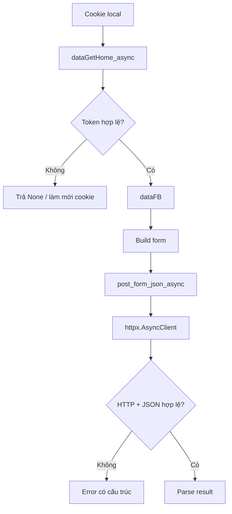
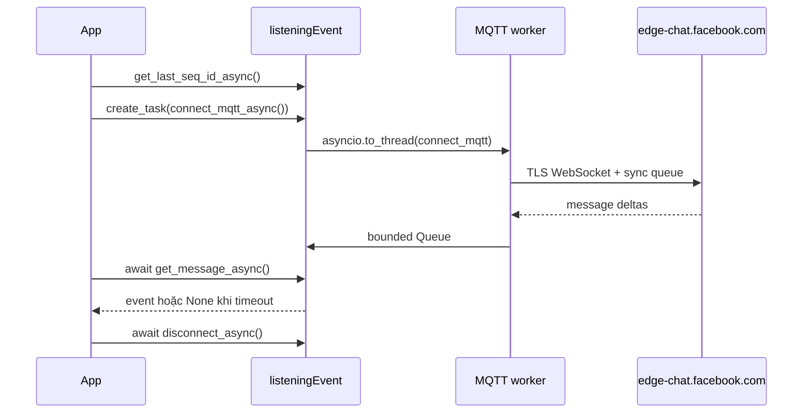
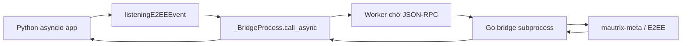
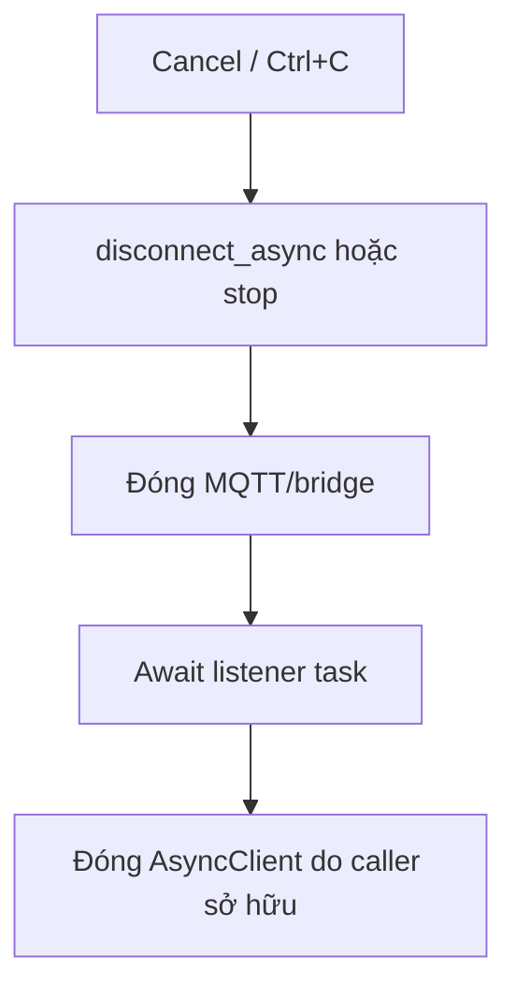

# fbchat-v2 — async flowchart

## Session và HTTP feature

```mermaid
flowchart TD
    A[Cookie local] --> B[dataGetHome_async]
    B --> C{Token hợp lệ?}
    C -- Không --> D[Trả None / làm mới cookie]
    C -- Có --> E[dataFB]
    E --> F[Build form]
    F --> G[post_form_json_async]
    G --> H[httpx.AsyncClient]
    H --> I{HTTP + JSON hợp lệ?}
    I -- Không --> J[Error có cấu trúc]
    I -- Có --> K[Parse result]
```

## Bot và MQTT

```mermaid
sequenceDiagram
    participant App
    participant Listener as listeningEvent
    participant Worker as MQTT worker
    participant FB as edge-chat.facebook.com

    App->>Listener: get_last_seq_id_async()
    App->>Listener: create_task(connect_mqtt_async())
    Listener->>Worker: asyncio.to_thread(connect_mqtt)
    Worker->>FB: TLS WebSocket + sync queue
    FB-->>Worker: message deltas
    Worker->>Listener: bounded Queue
    App->>Listener: await get_message_async()
    Listener-->>App: event hoặc None khi timeout
    App->>Listener: await disconnect_async()
```

Worker thread chỉ là adapter cho `paho-mqtt` blocking. HTTP async không đi qua worker thread.

## E2EE

```mermaid
flowchart LR
    A[Python asyncio app] --> B[listeningE2EEEvent]
    B --> C[_BridgeProcess.call_async]
    C --> D[Worker chờ JSON-RPC]
    D --> E[Go bridge subprocess]
    E --> F[mautrix-meta / E2EE]
    F --> E
    E --> C
    C --> A
```

## Shutdown

```mermaid
flowchart TD
    A[Cancel / Ctrl+C] --> B[disconnect_async hoặc stop]
    B --> C[Đóng MQTT/bridge]
    C --> D[Await listener task]
    D --> E[Đóng AsyncClient do caller sở hữu]
```
