# fbchat-v2 - Sơ đồ luồng async

[README](README.md) | [Tài liệu API](DOCS.md) | [Mindmap](mindmap-mermaid.md)

Tài liệu này mô tả đường đi của dữ liệu trong runtime hiện tại. Worker thread chỉ xuất hiện ở boundary thư viện blocking; HTTP feature chạy native async qua `httpx`.

## 1. 🛤️ Luồng thư mục và dependency

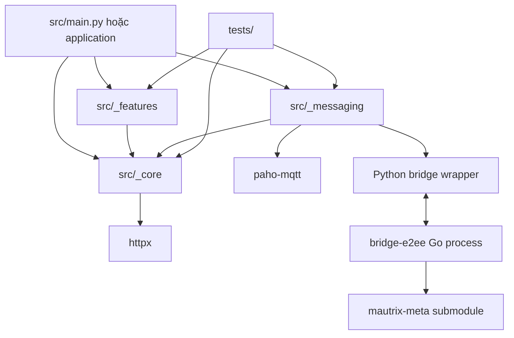

Dependency phải đi một chiều. `_core` không import ngược `_features` hoặc `_messaging`.

## 2. 💾 Session bootstrap

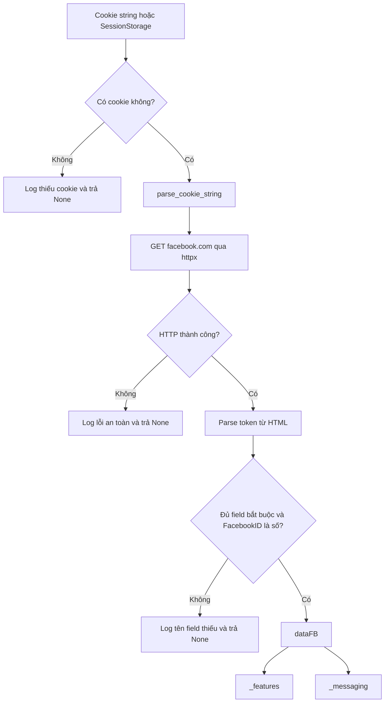

`dataFB` chứa cookie và CSRF token. Mọi nhánh sau đó phải coi object này là secret.

## 3. 🌍 HTTP feature async

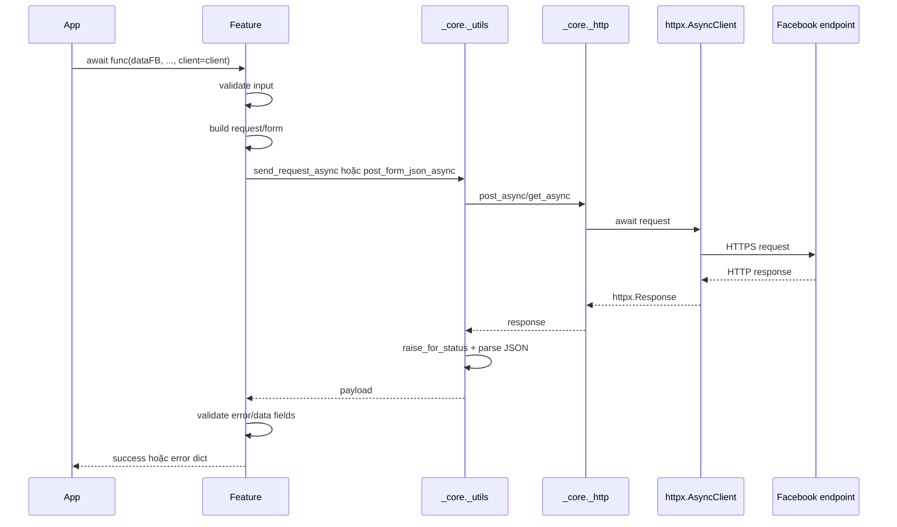

Nếu caller không truyền client, transport tạo client tạm và đóng sau call. Với workflow nhiều request, caller nên sở hữu một `AsyncClient` dùng chung.

## 4. 💬 Gửi tin thường

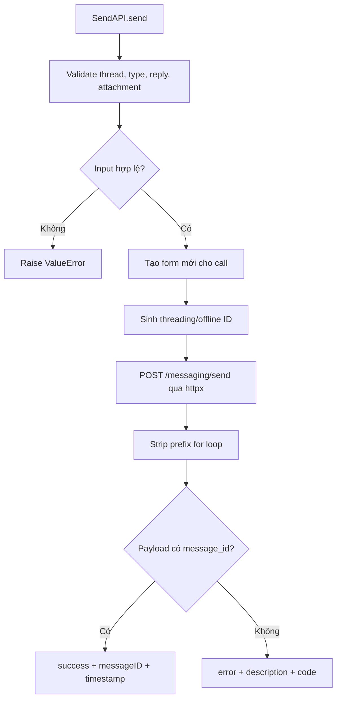

Form không được lưu làm mutable state dùng chung. `sender.results` chỉ là snapshot compatibility.

## 5. 📎 Upload attachment

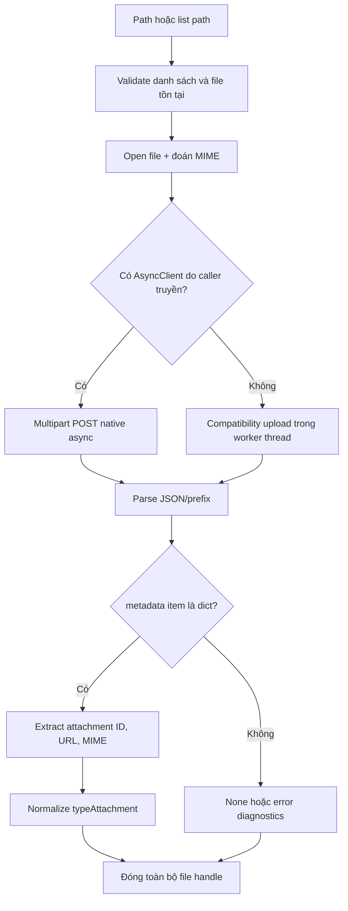

`uploadID` và `attachmentID` là hai giá trị khác nhau. Chỉ `attachmentID` hợp lệ mới được đưa vào send.

## 6. 📡 Listener MQTT thường

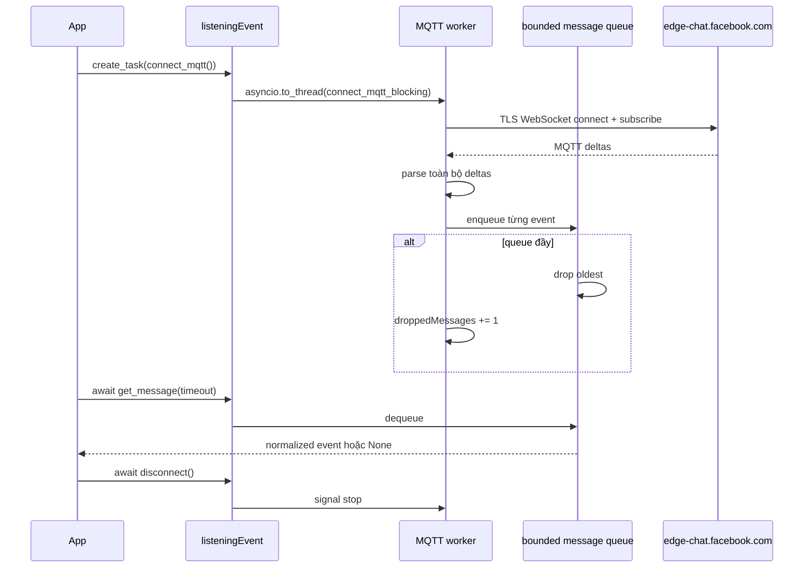

Reconnect xảy ra ở vòng ngoài của listener. Callback chỉ signal state; không tự gọi đệ quy connection setup.

## 7. 🔐 E2EE startup

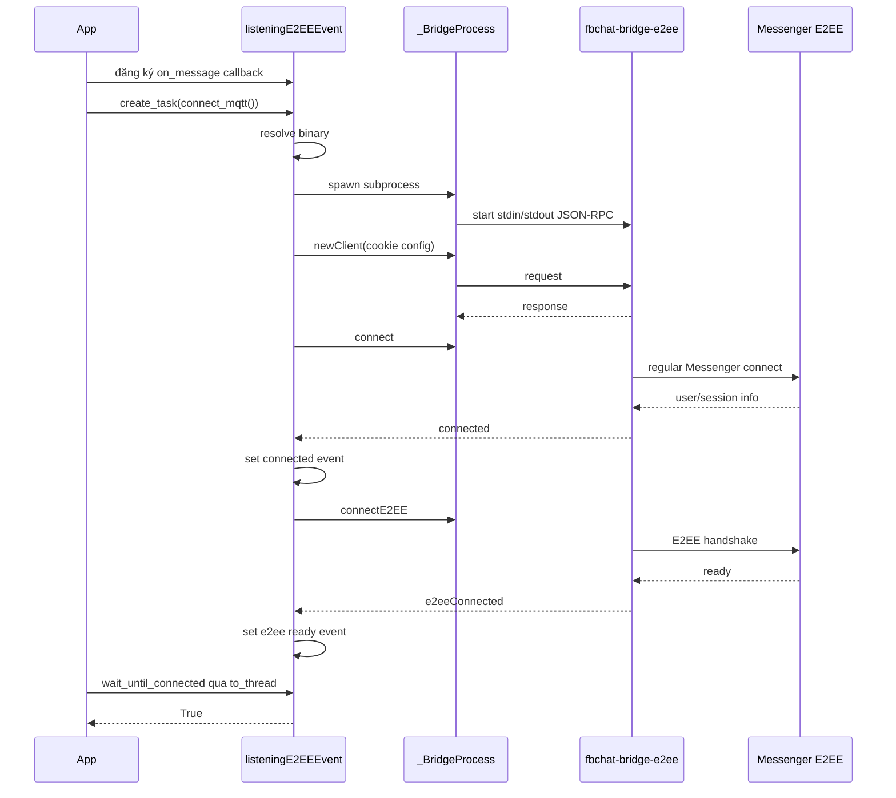

Send trước bước readiness là race. `wait_until_connected` là blocking event wait nên application async gọi nó qua `asyncio.to_thread`.

## 8. 🔐 E2EE event delivery

```mermaid
sequenceDiagram
    participant FB as Messenger
    participant Go as Go bridge
    participant Reader as Python reader thread
    participant Poll as bridge poll loop
    participant Callback as on_message callback
    participant Loop as asyncio loop
    participant Queue as asyncio.Queue
    participant Bot

    FB-->>Go: encrypted/regular event
    Go->>Go: decrypt + normalize
    Go-->>Reader: JSON line with event
    Reader->>Poll: thread-safe event queue
    Poll->>Callback: callback(event)
    Callback->>Loop: call_soon_threadsafe(enqueue)
    Loop->>Queue: put_nowait
    Bot->>Queue: await get()
    Queue-->>Bot: event
    Bot->>Bot: filter, dedupe, dispatch command
```

Callback không `await` handler. Việc chuyển về event loop là responsibility của application, như pattern trong `src/main.py`.

## 9. 🔐 E2EE send/action

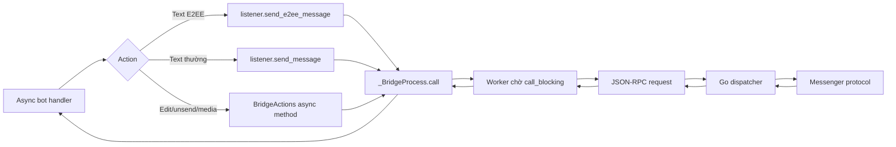

Binary media được base64 tại RPC boundary. JSON-RPC request bị giới hạn 150 MiB.

## 10. 🌉 Bridge watchdog

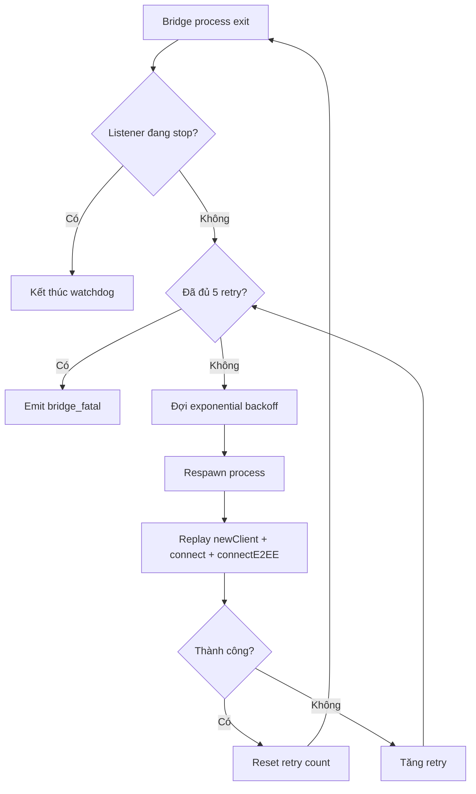

Application vẫn phải monitor listener task và `bridge_fatal`; watchdog không biến lỗi credential hoặc binary hỏng thành kết nối khỏe.

## 11. 🤖 Bot command flow

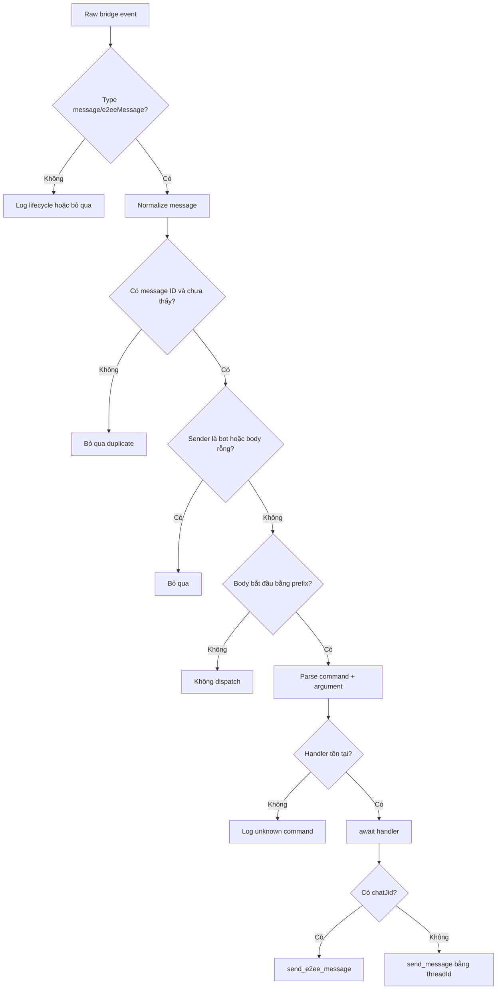

## 12. 📌 Shutdown

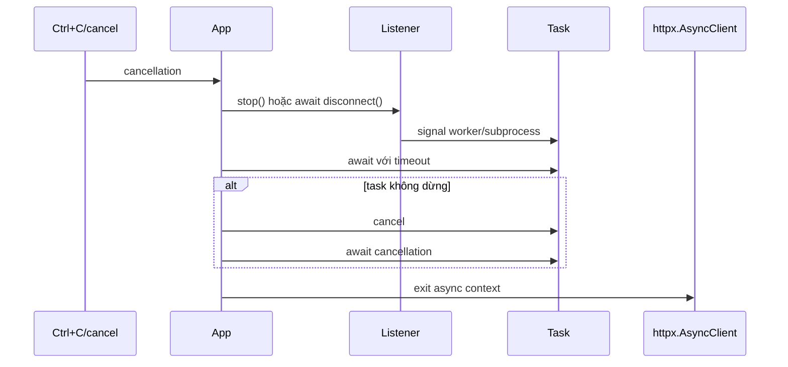

Không đóng client trước khi handler đang dùng xong. Không bỏ listener task chạy nền sau khi event loop kết thúc.

## 13. 🩺 Error boundary

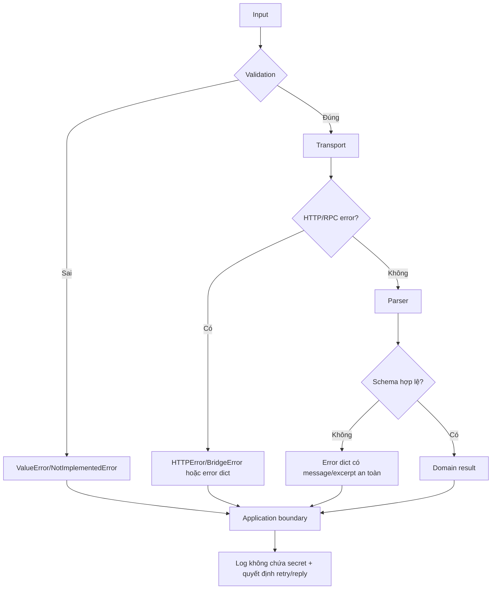

Không catch `Exception` rồi trả `{}`. Error boundary phải giữ đủ thông tin để caller phân biệt input, network, auth và schema failure.
