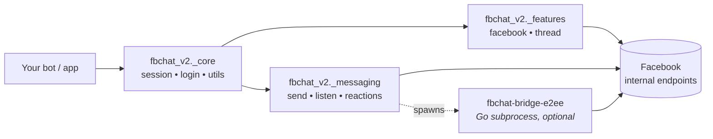

# fbchat-v2

[](https://pypi.org/project/fbchat-v2/)
[](https://pypi.org/project/fbchat-v2/)
[](https://pypi.org/project/fbchat-v2/)
[](https://github.com/MinhHuyDev/fbchat-v2/blob/main/LICENSE)
[](https://github.com/MinhHuyDev/fbchat-v2)
[](https://t.me/MinhHuyDev)

> **A modern, unofficial Python library for the Facebook Messenger API — driven by a real user account (cookies / login).**
> Now with **End-to-End Encryption (E2EE)** support for 1-on-1 Messenger chats via a Go bridge.

- **Repository:** <https://github.com/MinhHuyDev/fbchat-v2>
- **Documentation:** [DOCS.md](https://github.com/MinhHuyDev/fbchat-v2/blob/main/DOCS.md) · [FLOWCHART.md](https://github.com/MinhHuyDev/fbchat-v2/blob/main/FLOWCHART.md)
- **Changelog:** [CHANGELOG.md](https://github.com/MinhHuyDev/fbchat-v2/blob/main/CHANGELOG.md)
- **Issues:** <https://github.com/MinhHuyDev/fbchat-v2/issues>

---

## ⚠️ Disclaimer

This is **not** an official Facebook product. Facebook provides an official Messenger Platform API [here](https://developers.facebook.com/docs/messenger-platform/). `fbchat-v2` differs in that it authenticates as a **real user account** via cookies or username/password, which carries inherent risks (account flags, rate-limits, ToS considerations). **Use at your own risk and never share your cookies/tokens.**

Since November 2024, all 1-on-1 Messenger chats are End-to-End Encrypted by default. `fbchat-v2` v2.1.0 ships an E2EE listener (`listeningE2EEEvent`) that decrypts those messages by spawning a Go subprocess (`fbchat-bridge-e2ee`); group chats continue to use the MQTT WebSocket listener (`listeningEvent`).

---

## ✨ Features

### Authentication
- 🔐 Login via **username/password** (with optional 2FA TOTP) or **session cookies**
- 🍪 Session reuse — no re-login on every run

### Messaging
- 📥 Receive messages from both **users** and **group threads**
- 🔒 **E2EE listener** for 1-on-1 Messenger chats (Secret Conversations / Labyrinth) via Go bridge
- 📤 Send text, **attachments**, **stickers**, **user mentions**
- 🔍 Search messages and threads
- ↩️ Reactions, unsend, message-request handling
- 📡 Real-time event listener

### Threads & Groups
- 👥 Create groups, add admins, change name / emoji / nickname
- 📊 Polls, full thread metadata

### Facebook actions (`_features._facebook`)
- 📝 Create posts, edit bio, profile registration
- 👤 User search, profile info, notification management
- 🚫 Block/unblock, Marketplace and Professional mode

---

## 📦 Installation

### Default install (group chats only)

```bash
pip install fbchat-v2
```

This pulls in `requests`, `paho-mqtt`, `attrs`, and `pyotp`. The MQTT-based group-message listener (`listeningEvent`) works out of the box.

### Optional: enable E2EE for 1-on-1 chats

The E2EE listener requires a separate **Go binary** (`fbchat-bridge-e2ee`) that PyPI cannot ship. Build it once from source:

```bash
# 1) Install Go ≥ 1.24 from https://go.dev/dl/
# 2) Clone the bridge from the upstream repo
git clone https://github.com/MinhHuyDev/fbchat-v2
cd fbchat-v2/bridge-e2ee
git clone https://github.com/mautrix/meta.git ./meta
go mod tidy

# Windows
go build -ldflags="-s -w" -o fbchat-bridge-e2ee.exe .

# Linux / macOS
go build -ldflags="-s -w" -o fbchat-bridge-e2ee .
```

Then point the library at the binary via an environment variable:

```bash
# Windows (PowerShell)
$env:FBCHAT_E2EE_BIN = "C:\path\to\fbchat-bridge-e2ee.exe"

# Linux / macOS
export FBCHAT_E2EE_BIN=/path/to/fbchat-bridge-e2ee
```

The `[e2ee]` extra is reserved for a future automatic-download helper:

```bash
pip install "fbchat-v2[e2ee]"   # currently a no-op placeholder
```

> **Roadmap:** v2.2.0 plans to publish prebuilt bridge binaries on GitHub Releases and auto-download them on first use.

---

## 🚀 Quick Start

> `dataGetHome(setCookies)` takes a **single positional cookie string** —
> exactly the value of the `Cookie:` header you would copy from your browser
> DevTools (e.g. `"c_user=...; xs=...; fr=...; datr=...;"`). It is **not** a
> dict and there is **no** `cookies=` keyword.

### Group chat listener (no Go required)

```python
import threading
from fbchat_v2 import dataGetHome, listeningEvent

COOKIE = "c_user=100012345678; xs=...; fr=...; datr=...;"

# 1) Bootstrap the session (scrapes fb_dtsg, jazoest, FacebookID, … from facebook.com)
dataFB = dataGetHome(COOKIE)

# 2) Start the MQTT listener
listener = listeningEvent(dataFB)
listener.get_last_seq_id()
threading.Thread(target=listener.connect_mqtt, daemon=True).start()

# listener.bodyResults is mutated in place — poll it from the main thread.
```

### 1-on-1 E2EE listener (requires Go bridge)

```python
import threading
from fbchat_v2 import dataGetHome, listeningE2EEEvent

COOKIE = "c_user=100012345678; xs=...; fr=...; datr=...;"

dataFB = dataGetHome(COOKIE)

listener = listeningE2EEEvent(
    dataFB,
    log_level="warn",          # "none" | "error" | "warn" | "info" | "debug"
    e2ee_memory_only=True,     # set False + device_path="./device.json" to persist keys
    enable_e2ee=True,
    binary_path=None,          # auto-resolves; or pass an explicit path
)
listener.get_last_seq_id()
threading.Thread(target=listener.connect_mqtt, daemon=True).start()

# listener.bodyResults uses the SAME schema as listeningEvent —
# you can swap the import without changing your event handler.
```

#### Decorator-style handler (E2EE)

```python
@listener.on_message
def on_msg(evt):                    # evt = {"type": "...", "data": {...}, "timestamp": ms}
    if evt["type"] == "e2eeMessage" and evt["data"].get("text") == "ping":
        listener.send_e2ee_message(
            chat_jid=evt["data"]["chatJid"],
            text="pong",
            reply_to_id=evt["data"]["id"],
            reply_to_sender_jid=evt["data"]["senderJid"],
        )
```

#### Demo — receiving decrypted 1-on-1 E2EE messages

<p align="center">
  
</p>

---

## 📂 Package Layout

Installed Python package (importable as `fbchat_v2`):

```text
fbchat_v2/
├── __init__.py                 # Re-exports: dataGetHome, listeningEvent, listeningE2EEEvent
├── py.typed                    # PEP 561 marker
├── _core/                      # Session, login, low-level helpers
│   ├── _facebookLogin.py
│   ├── _session.py
│   └── _utils.py
├── _features/
│   ├── _facebook/              # Posts, bio, search, notifications, blocking, marketplace, …
│   │   ├── _blocking.py
│   │   ├── _changeBio.py
│   │   ├── _createPost.py
│   │   ├── _get_user_info.py
│   │   ├── _marketplace.py
│   │   ├── _notification.py
│   │   ├── _professional.py
│   │   ├── _registerOnProfile.py
│   │   └── _search.py
│   └── _thread/                # Group/thread admin operations
│       ├── _addAdmin.py
│       ├── _all_thread_data.py
│       ├── _changeEmoji.py
│       ├── _changeNameThread.py
│       └── _changeNickname.py
└── _messaging/
    ├── _attachments.py
    ├── _listening.py           # MQTT — group messages
    ├── _listening_e2ee.py      # Go bridge — 1-on-1 E2EE messages
    ├── _message_requests.py
    ├── _reactions.py
    ├── _send.py
    └── _unsend.py
```

### Public API

The top-level `fbchat_v2` namespace re-exports the most common entry points:

| Symbol | Source | Purpose |
|---|---|---|
| `dataGetHome` | `fbchat_v2._core._session` | Build the session object from cookies / login |
| `listeningEvent` | `fbchat_v2._messaging._listening` | MQTT listener for **group** messages |
| `listeningE2EEEvent` | `fbchat_v2._messaging._listening_e2ee` | E2EE listener for **1-on-1** messages |
| `__version__` | `fbchat_v2` | Package version string |

Submodules (`fbchat_v2._features._facebook._createPost`, etc.) can be imported directly for fine-grained access.

---

## 🔧 System Requirements

| Component | Minimum | Recommended | Notes |
|---|---|---|---|
| Python | 3.10 | 3.11 / 3.12 | Required |
| Go toolchain | 1.24 | 1.24+ | **Only for E2EE** — to build `fbchat-bridge-e2ee` |
| Git | any | latest | Needed for `go mod tidy` to fetch `mautrix/meta` |
| OS | Windows / Linux / macOS | — | — |
| RAM | 256 MB | 1 GB+ | Bridge process uses ~80–150 MB when active |
| Network | Stable connection to `facebook.com` and `edge-chat.facebook.com` | — | — |

Python dependencies (auto-installed by pip):

```text
requests   >= 2.31.0   # HTTP client
paho-mqtt  >= 1.6.1    # MQTT WebSocket for listeningEvent
attrs      >= 23.2.0   # Data classes
pyotp      >= 2.9.0    # 2FA TOTP for username/password login
```

---

## 🏗 Architecture



Three clear layers:

| Layer | Path | Responsibility |
|---|---|---|
| **Core** | `fbchat_v2._core` | Session management, login, request helpers, low-level utilities |
| **Features** | `fbchat_v2._features` | Facebook & thread business logic (posts, groups, profile, …) |
| **Messaging** | `fbchat_v2._messaging` | Send / receive / react / listen / unsend |

Full request flow diagrams live in [FLOWCHART.md](https://github.com/MinhHuyDev/fbchat-v2/blob/main/FLOWCHART.md).

---

## 🗺 Roadmap

- [x] E2EE decryption for 1-on-1 Messenger chats *(v2.1.0 — Go bridge)*
- [ ] Native `async` / `await` API
- [ ] Prebuilt bridge binaries published on GitHub Releases (auto-download)
- [ ] Full type hints across the public API
- [ ] Pluggable storage backend for sessions
- [ ] Integration test suite & CI

Have an idea? Open an [issue](https://github.com/MinhHuyDev/fbchat-v2/issues).

---

## 🤝 Contributing

Contributions are welcome! See [CONTRIBUTING guide](https://github.com/MinhHuyDev/fbchat-v2) and [CODE_OF_CONDUCT.md](https://github.com/MinhHuyDev/fbchat-v2/blob/main/CODE_OF_CONDUCT.md).

1. Fork the repo and create a feature branch (`feat/<name>`).
2. Follow the existing 3-layer architecture (`_core` → `_features` / `_messaging`).
3. Use [Conventional Commits](https://www.conventionalcommits.org/) — `feat:`, `fix:`, `docs:`, `refactor:`, …
4. Open a PR with a clear description and reproduction steps for bug fixes.
5. **Never** commit secrets — `config.json`, cookies, tokens, `.venv`, etc.

---

## 🌟 Acknowledgements

After **4 years** of development, this project would not exist without its community.

### Community contributors
[tomdev112](https://github.com/tomdev211) · [syrex1013](https://github.com/syrex1013) · [Kheir Eddine](https://www.facebook.com/61557637127396/) · 陶世玉 · Jihadi John · [Bắc Trịnh](https://www.facebook.com/1228855777/) · [Quang Trần](https://www.facebook.com/100005048402622/) · [Minh Trần Ngọc](https://www.facebook.com/100000277273223/) · Victor Knutsenberger · [Hoàng Lân](https://www.facebook.com/100026754347158/) · Kareem Adel Abomandor · @lluevy · @phuncnheo · @minhphatnw · @khanh235a · @chapesh1 · @klongg13 · @seafibrahem · @agent1047 · @stefekdziura

### Upstream open-source projects powering v2.1.0 (E2EE)
- [`mautrix/meta`](https://github.com/mautrix/meta) — Meta Labyrinth / Lightspeed implementation in Go
- [`tulir/whatsmeow`](https://github.com/tulir/whatsmeow) — Signal Protocol (Curve25519, Double Ratchet, Sender Keys, Noise XX) in Go
- [`yumi-team/meta-messenger.js`](https://github.com/yumi-team/meta-messenger.js) — design reference for the JSON-RPC bridge
- [`mautrix/go`](https://github.com/mautrix/go) — Matrix/Meta client utilities

### AI assistants
- *Claude Opus 4.7* (Anthropic) — code review, documentation, refactoring
- *Codex 5.3* (OpenAI) — boilerplate and RPC prototyping

> If you have contributed and are missing from this list, please open an issue or PR.

---

## 📜 License

Distributed under the **MIT License**. See [LICENSE](https://github.com/MinhHuyDev/fbchat-v2/blob/main/LICENSE) for details.

---

<p align="center">
  Made with ❤️ by <a href="https://github.com/MinhHuyDev">MinhHuyDev</a> · <a href="https://t.me/MinhHuyDev">Telegram</a>
</p>
