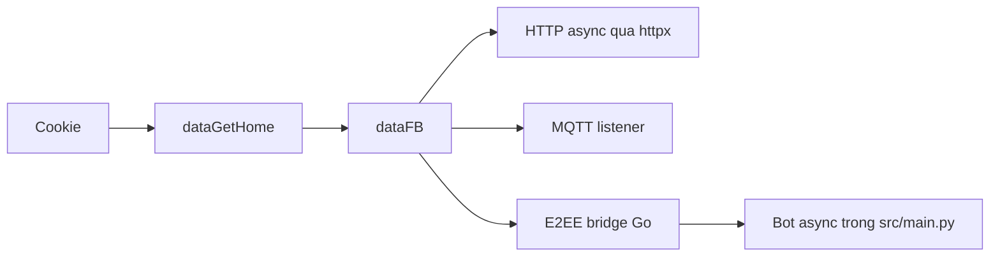
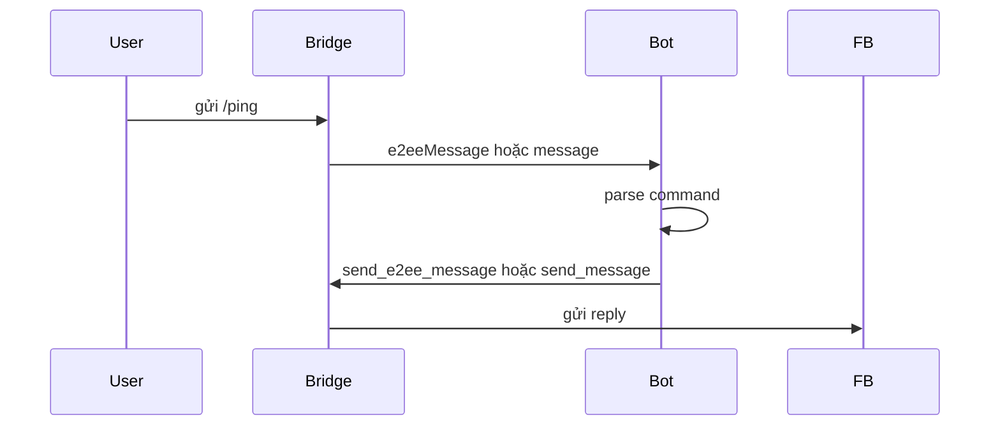

<div align="center">

# FBChat-Remake - Mã nguồn mở

### Thư viện Python async-first cho Facebook Messenger API không chính thức

[](https://github.com/MinhHuyDev/fbchat-v2)
[](https://pypi.org/project/fbchat-v2/)
[](https://www.python.org/)
[](https://github.com/MinhHuyDev/fbchat-v2/releases)
[](https://github.com/MinhHuyDev/fbchat-v2/issues)
[](LICENSE)
[](https://t.me/MinhHuyDev)

[🇬🇧 English](README_EN.md) · [📦 PyPI](https://pypi.org/project/fbchat-v2/) · [📖 Tài liệu API](DOCS.md) · [📊 Sơ đồ luồng](FLOWCHART.md) · [🐛 Báo lỗi](https://github.com/MinhHuyDev/fbchat-v2/issues)

</div>

---

## Thông báo quan trọng

> [!IMPORTANT]
> Kể từ tháng 11/2024, Facebook đã triển khai mã hoá đầu cuối (E2EE) cho phần lớn cuộc trò chuyện cá nhân trên Messenger.
>
> Nhánh `beta-async/await` dùng `async`/`await` làm API chính. HTTP chạy qua `httpx`, bot mẫu trong [`src/main.py`](src/main.py) nghe sự kiện bằng [`_messaging/_listening_e2ee.py`](src/_messaging/_listening_e2ee.py), gửi E2EE bằng bridge Go [`bridge-e2ee/`](bridge-e2ee/) và fallback gửi thường khi bridge trả event `message`.
>
> Tin nhắn cá nhân nên dùng `_listening_e2ee.py`; tin nhắn nhóm hoặc event thường vẫn có thể đi qua MQTT/WebSocket cũ khi Facebook còn trả event `message`.

> [!WARNING]
> Đây không phải SDK chính thức của Facebook. Thư viện xác thực bằng cookie hoặc credential của tài khoản người dùng thật, nên cookie, token và `dataFB` phải được xem như secret.
>
> Không commit, không ghi log, không chia sẻ cookie/token và không gửi TOTP secret sang dịch vụ bên thứ ba.

---

## Giới thiệu

`fbchat-v2` là thư viện Python cho các workflow Messenger không chính thức: lấy session từ cookie, gửi tin nhắn, nghe tin nhắn real-time, thao tác thread, upload attachment, đổi theme, tạo Messenger Notes và chạy bridge E2EE cho chat cá nhân.

Bản trên nhánh `beta-async/await` tập trung vào 3 việc:

- API public ưu tiên `async`/`await`, tên hàm gọn như `func`, `send`, `connect_mqtt`.
- HTTP dùng `httpx.AsyncClient`; các đoạn blocking legacy chỉ nằm ở boundary cần thiết.
- Bot mẫu trong `src/main.py` dùng E2EE listener làm transport chính cho receive/send command.

---

## Mục lục

- [Tính năng](#tính-năng)
- [Kiến trúc tổng quan](#kiến-trúc-tổng-quan)
- [Cấu trúc dự án](#cấu-trúc-dự-án)
- [Yêu cầu hệ thống](#yêu-cầu-hệ-thống)
- [Cài đặt](#cài-đặt)
- [Cấu hình](#cấu-hình)
- [Bắt đầu nhanh](#bắt-đầu-nhanh)
- [Ví dụ async/await](#ví-dụ-asyncawait)
- [E2EE listener](#e2ee-listener)
- [Bot mẫu](#bot-mẫu)
- [Kiểm tra chất lượng](#kiểm-tra-chất-lượng)
- [Bảo mật](#bảo-mật)
- [Đóng góp](#đóng-góp)
- [Bản quyền](#bản-quyền)

---

## Tính năng

### Core

- Lấy `dataFB` từ cookie bằng `_core._session.dataGetHome`.
- Storage local qua `FileSessionStorage` và storage qua biến môi trường.
- Login credential legacy FB4A với 2FA TOTP xử lý cục bộ bằng `pyotp`.
- Helper HTTP async dùng `httpx`.

### Messaging

- Gửi tin nhắn thường qua `_messaging._send`.
- Upload attachment, gửi reaction, thu hồi, sửa tin nhắn.
- Đổi theme thread, tạo Messenger Notes, xử lý message requests.
- Listener MQTT cho event thường.
- Listener E2EE qua bridge Go cho chat cá nhân Messenger.

### Facebook features

- Đăng bài, đổi bio, tìm kiếm người dùng.
- Quản lý profile, notification, block/unblock.
- Marketplace và Professional mode.

---

## Kiến trúc tổng quan

Codebase giữ cấu trúc 3 tầng giống main branch, nhưng runtime mới ưu tiên async.

| Tầng | Đường dẫn | Trách nhiệm |
|---|---|---|
| Core | `src/_core/` | Session, login, storage, HTTP helper, utility |
| Features | `src/_features/` | Nghiệp vụ Facebook và thread |
| Messaging | `src/_messaging/` | Gửi, nhận, E2EE, attachment, theme, notes, reaction |



---

## Cấu trúc dự án

```text
fbchat-v2/
├── src/
│   ├── main.py                    # Bot mẫu async-first, dùng E2EE listener
│   ├── config.example.json        # Template cấu hình an toàn
│   ├── config.json                # Cấu hình local, không commit
│   ├── _core/                     # Session, login, storage, utils
│   ├── _features/                 # Tính năng Facebook và thread
│   └── _messaging/                # Send, listen, E2EE, attachment, theme, notes
├── bridge-e2ee/                   # Bridge Go cho Messenger E2EE
├── build/                         # Binary bridge sau khi build hoặc tải về
├── tests/                         # Test async-first và compatibility
├── DOCS.md
├── FLOWCHART.md
├── README.md
├── README_EN.md
└── pyproject.toml
```

---

## Yêu cầu hệ thống

| Thành phần | Tối thiểu | Ghi chú |
|---|---:|---|
| Python | 3.10+ | CI hiện test Python 3.11 |
| Go | 1.24+ | Chỉ cần khi tự build bridge E2EE |
| Git | bất kỳ | Cần khi clone submodule `bridge-e2ee/meta` |
| Cookie Facebook | bắt buộc | Cần `c_user`, `xs`, `fr`, `datr` |

Phụ thuộc chính:

```toml
httpx>=0.27.0
paho-mqtt>=1.6.1
pyotp>=2.9.0
requests>=2.32.0
```

---

## Cài đặt

### 1. Clone repo

```bash
git clone https://github.com/MinhHuyDev/fbchat-v2
cd fbchat-v2
```

Nếu cần bridge E2EE và repo có submodule:

```bash
git submodule update --init --recursive
```

### 2. Tạo virtual environment

```bash
python -m venv .venv
```

Windows PowerShell:

```powershell
.\.venv\Scripts\Activate.ps1
```

Linux hoặc macOS:

```bash
source .venv/bin/activate
```

### 3. Cài dependency

```bash
python -m pip install --upgrade pip
python -m pip install -e ".[dev]"
```

### 4. Kiểm tra import

```bash
python -c "import httpx, pyotp, requests, paho.mqtt.client; print('OK')"
```

---

## Cấu hình

Sao chép template:

```bash
cp src/config.example.json src/config.json
```

Windows PowerShell:

```powershell
Copy-Item src\config.example.json src\config.json
```

Ví dụ `src/config.json`:

```json
{
  "botName": "fbchat-v2 demo bot",
  "prefix": "/",
  "cookies": "c_user=...; xs=...; fr=...; datr=...;",
  "admins": [
    "1000xxxxxxxxxx"
  ],
  "version": "0.0.1"
}
```

`src/config.json` phải nằm local và không được commit. Nếu cookie lộ, hãy đăng xuất phiên Facebook hoặc đổi cookie ngay.

---

## Bắt đầu nhanh

Chạy bot mẫu:

```bash
python src/main.py
```

Sau khi bot báo E2EE listener sẵn sàng, nhắn các lệnh sau vào chat:

```text
/ping
/id
/help
/echo hello
/search Minh
/unsend
```

`/unsend` chỉ thu hồi tin E2EE cuối mà bot gửi trong chat hiện tại. Với chat thường không có `chatJid`, lệnh này sẽ báo không hỗ trợ.

---

## Ví dụ async/await

### Lấy session từ cookie

```python
import asyncio

from _core._session import dataGetHome


async def main() -> None:
    data_fb = await dataGetHome("c_user=...; xs=...; fr=...; datr=...;")
    if data_fb is None:
        raise RuntimeError("Cookie hết hạn hoặc Facebook đã đổi token HTML.")
    print(data_fb["FacebookID"])


asyncio.run(main())
```

Nếu đang ở FastAPI, Jupyter, Discord bot hoặc một event loop đã chạy, không gọi `asyncio.run()`. Hãy `await dataGetHome(...)` trực tiếp.

### Gửi tin nhắn thường

```python
import asyncio

from _core._session import dataGetHome
from _messaging._send import api as SendAPI


async def main() -> None:
    data_fb = await dataGetHome("c_user=...; xs=...; fr=...; datr=...;")
    sender = SendAPI()
    result = await sender.send(
        data_fb,
        "Xin chào từ async/await",
        threadID="100012345678",
        typeChat="user",
    )
    print(result)


asyncio.run(main())
```

### Tái sử dụng HTTP client

```python
import httpx

from _features._facebook import _search


async with httpx.AsyncClient(timeout=30) as client:
    result = await _search.func(data_fb, "Minh", client=client)
    print(result)
```

---

## E2EE listener

Chat cá nhân Messenger cần E2EE bridge. Bridge mặc định được tìm tại:

```text
build/fbchat-bridge-e2ee.exe      # Windows
build/fbchat-bridge-e2ee          # Linux/macOS
```

Tự build:

```bash
git submodule update --init --recursive bridge-e2ee/meta
cd bridge-e2ee
go mod tidy
go build -ldflags="-s -w" -o ../build/fbchat-bridge-e2ee .
```

Windows:

```powershell
git submodule update --init --recursive bridge-e2ee/meta
Set-Location bridge-e2ee
go mod tidy
go build -ldflags="-s -w" -o ..\build\fbchat-bridge-e2ee.exe .
```

Nếu binary nằm chỗ khác:

```bash
export FBCHAT_E2EE_BIN=/path/to/fbchat-bridge-e2ee
```

Windows PowerShell:

```powershell
$env:FBCHAT_E2EE_BIN = "C:\path\to\fbchat-bridge-e2ee.exe"
```

Ví dụ listener E2EE:

```python
import asyncio

from _messaging._listening_e2ee import listeningE2EEEvent


async def main(data_fb: dict) -> None:
    listener = listeningE2EEEvent(data_fb)

    @listener.on_message
    def on_event(event: dict) -> None:
        print(event)

    task = asyncio.create_task(listener.connect_mqtt())
    try:
        ready = await asyncio.to_thread(
            listener.wait_until_connected,
            90,
            require_e2ee=True,
        )
        if not ready:
            raise RuntimeError("E2EE listener chưa sẵn sàng.")

        await listener.send_e2ee_message(
            "100012345678@msgr",
            "Xin chào E2EE",
        )
    finally:
        listener.stop()
        await task
```

Event đáng chú ý:

| Event | Ý nghĩa |
|---|---|
| `ready` | Bridge đã nhận session |
| `e2eeConnected` | E2EE handshake xong |
| `e2eeMessage` | Tin nhắn cá nhân đã giải mã |
| `message` | Tin nhắn thường |
| `error` | Bridge hoặc transport báo lỗi |

---

## Bot mẫu

[`src/main.py`](src/main.py) là bot demo async-first:

- Đọc `src/config.json` bằng `FileSessionStorage`.
- Lấy `dataFB` qua `await dataGetHome(...)`.
- Tạo `listeningE2EEEvent`.
- Đưa callback bridge vào `asyncio.Queue` để xử lý lệnh an toàn trong event loop.
- Gửi reply bằng `send_e2ee_message` nếu event có `chatJid`.
- Fallback `send_message` nếu event là `message` thường.
- Không để log Unicode làm crash console Windows.

Luồng chính:



---

## Kiểm tra chất lượng

Chạy đúng command CI:

```bash
pytest tests/ -v --tb=short
```

Lint:

```bash
ruff check src tests
```

Compile nhanh:

```bash
python -m py_compile src/main.py src/_core/_facebookLogin.py
```

Kiểm tra whitespace trước khi commit:

```bash
git diff --check
```

---

## Bảo mật

- Không commit `src/config.json`, `.env`, cookie, password, token, `dataFB`.
- Không in request form login ra terminal vì form có password và access token.
- Không gửi TOTP secret sang dịch vụ bên thứ ba. Module login dùng `pyotp` để tạo OTP cục bộ.
- Nếu dùng credential login, ưu tiên OTP 6-8 số hoặc TOTP secret hợp lệ.
- Các endpoint Facebook private có thể đổi bất kỳ lúc nào. Luôn xử lý timeout, response thiếu field và lỗi dạng `error`.

---

## Đóng góp

1. Fork repo và tạo branch riêng.
2. Giữ kiến trúc 3 tầng: `_core`, `_features`, `_messaging`.
3. Code mới nên dùng `async`/`await` và giữ tên public API ngắn gọn.
4. Dùng Conventional Commits, ví dụ `fix(bot): handle e2ee commands`.
5. Chạy test trước khi mở PR.
6. Không commit secret.

---

## Vinh danh

Cảm ơn cộng đồng đã đóng góp bug report, ý tưởng và upstream code để `fbchat-v2` tiếp tục sống sót sau các lần Messenger đổi giao thức.

Upstream quan trọng cho E2EE:

- [`mautrix/meta`](https://github.com/mautrix/meta)
- [`tulir/whatsmeow`](https://github.com/tulir/whatsmeow)
- [`yumi-team/meta-messenger.js`](https://github.com/yumi-team/meta-messenger.js)

---

## Bản quyền

Dự án được phân phối theo điều khoản trong [LICENSE](LICENSE). Hãy cân nhắc kỹ trước khi dùng cho production vì đây là API không chính thức.

<div align="center">

Được làm bởi [MinhHuyDev](https://github.com/MinhHuyDev) · [Telegram](https://t.me/MinhHuyDev)

</div>
