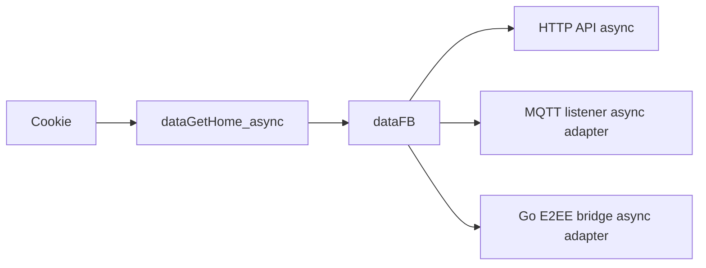

# fbchat-v2

Thư viện Python async-first để tự động hóa Facebook Messenger bằng cookie phiên đăng nhập. Dự án dùng `httpx.AsyncClient` cho HTTP, MQTT/WebSocket cho tin nhắn thường và bridge Go riêng cho E2EE.

> Đây là API Facebook không chính thức. Cookie và token có quyền truy cập tài khoản; không commit, không ghi log và không gửi chúng cho dịch vụ bên thứ ba.

[English](README_EN.md) · [Tài liệu API](DOCS.md) · [Lịch sử thay đổi](CHANGELOG.md)

## Điểm chính

- API hiện hành ưu tiên `async`/`await`; các hàm mạng có hậu tố `_async` dùng I/O bất đồng bộ thật.
- Gửi, trả lời, thu hồi, sửa, reaction, upload, note, theme và message requests.
- Tính năng tài khoản: bio, bài viết, tìm kiếm, chặn, chế độ chuyên nghiệp, hồ sơ bổ sung và Marketplace.
- Listener MQTT có queue giới hạn, chống mất tin khi nhiều delta đến cùng lúc và reconnect không đệ quy.
- E2EE chạy qua subprocess Go; bridge crash không kéo tiến trình Python chết theo.
- TOTP được tạo cục bộ bằng `pyotp`; app access token lấy từ biến môi trường.

## Yêu cầu

- Python 3.10+
- Go 1.26.5+ chỉ khi tự build bridge E2EE (mức tối thiểu đã vá các advisory stdlib hiện hành)
- Cookie Facebook còn hiệu lực với tối thiểu `c_user`, `xs`, `fr`, `datr`

## Cài đặt

```bash
git clone --recurse-submodules https://github.com/MinhHuyDev/fbchat-v2.git
cd fbchat-v2
python -m pip install -e ".[dev]"
```

Nếu đã clone mà thiếu submodule:

```bash
git submodule update --init --recursive
```

## Bắt đầu bằng async/await

```python
import asyncio

from _core._session import dataGetHome_async
from _messaging._send import api as SendAPI


async def main() -> None:
    data_fb = await dataGetHome_async("c_user=...; xs=...; fr=...; datr=...;")
    if data_fb is None:
        raise RuntimeError("Cookie hết hạn hoặc Facebook đã đổi token HTML.")

    sender = SendAPI()
    result = await sender.send_async(
        data_fb,
        "Xin chào từ asyncio",
        threadID="100012345678",
        typeChat="user",
    )
    print(result)


asyncio.run(main())
```

Không gọi `asyncio.run()` bên trong event loop đã chạy (FastAPI, Jupyter, Discord bot). Trong các môi trường đó, gọi thẳng `await main()` hoặc `await ..._async(...)`.

## Listener MQTT async

```python
import asyncio

from _core._session import dataGetHome_async
from _messaging._listening import listeningEvent


async def main() -> None:
    data_fb = await dataGetHome_async("c_user=...; xs=...; fr=...; datr=...;")
    if data_fb is None:
        raise RuntimeError("Không tạo được phiên Facebook.")

    listener = listeningEvent(data_fb)
    listener_task = asyncio.create_task(listener.connect_mqtt_async())
    try:
        while True:
            message = await listener.get_message_async(timeout=30)
            if message is not None:
                print(message)
    finally:
        await listener.disconnect_async()
        await listener_task


asyncio.run(main())
```

`connect_mqtt_async()` đưa vòng lặp blocking của `paho-mqtt` sang worker thread dành riêng. Đây là adapter đúng cho một thư viện MQTT đồng bộ; các request HTTP vẫn chạy trực tiếp bằng `httpx.AsyncClient`.

## E2EE async

```python
import asyncio

from _messaging._listening_e2ee import listeningE2EEEvent


async def consume(data_fb: dict) -> None:
    listener = listeningE2EEEvent(data_fb)
    task = asyncio.create_task(listener.connect_mqtt_async())
    try:
        await listener.send_e2ee_message_async(
            "100012345678@msgr",
            "Tin nhắn E2EE",
        )
    finally:
        listener.stop()
        await task
```

Bridge được tìm tại `build/fbchat-bridge-e2ee(.exe)`. Có thể chỉ định binary đã kiểm tra bằng `FBCHAT_E2EE_BIN`.

## Đăng nhập bằng tài khoản và 2FA

Cookie là luồng nên dùng. Nếu buộc phải dùng login credentials, cấu hình app token qua môi trường và không hardcode:

```powershell
$env:FBCHAT_APP_ACCESS_TOKEN = "<app-id>|<app-secret>"
```

```python
import asyncio

from _core._facebookLogin import loginFacebook


async def main() -> None:
    login = loginFacebook(
        "email@example.com",
        "password",
        AuthenticationGoogleCode="JBSWY3DPEHPK3PXP",
    )
    print(await login.main_async())


asyncio.run(main())
```

TOTP secret chỉ được xử lý trên máy bằng `pyotp`, không gửi đến `2fa.live` hay endpoint bên thứ ba.

## Cấu trúc

```text
src/
├── _core/       # transport httpx, session, login, storage, utility
├── _features/   # nghiệp vụ Facebook và quản lý thread
├── _messaging/  # gửi/nhận, MQTT, E2EE, note, theme, attachment
└── main.py      # bot mẫu async-first
bridge-e2ee/     # JSON-RPC bridge Go cho Messenger E2EE
tests/           # test sync compatibility và async workflow
```

Luồng chính:



## Quy ước API

- Trong code mới, dùng `dataGetHome_async`, `func_async`, `send_async`, `connect_mqtt_async` và `get_message_async`.
- Truyền một `httpx.AsyncClient` bằng keyword `client=` khi gọi nhiều request để tái sử dụng connection pool.
- API sync vẫn tồn tại để tương thích, nhưng không nên gọi trong event loop.
- `dataFB` chứa token CSRF và cookie; coi toàn bộ dict là secret.
- Các endpoint private có thể đổi bất kỳ lúc nào. Luôn xử lý `None`, `error`, timeout và response thiếu field.

## Kiểm tra chất lượng

```bash
python -m pytest -q
python -m ruff check src tests
python -m ruff format --check src tests
go test ./...
```

## Cấu hình bot mẫu

Sao chép `src/config.example.json` thành `src/config.json`, điền cookie rồi chạy:

```bash
python src/main.py
```

`src/config.json` được ignore và không được đưa lên Git. Xem [DOCS.md](DOCS.md) để biết đầy đủ API và workflow.
