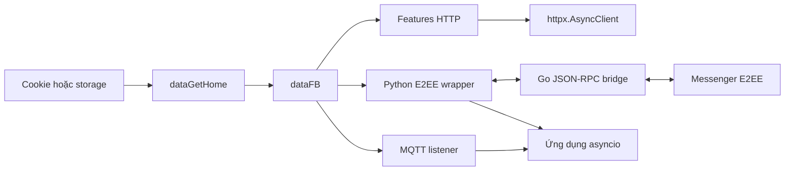

<div align="center">

# FBChat-Remake - Mã nguồn mở

### Thư viện Python async-first cho Facebook Messenger API không chính thức

[](https://github.com/MinhHuyDev/fbchat-v2)
[](https://pypi.org/project/fbchat-v2/)
[](https://www.python.org/)
[](https://github.com/MinhHuyDev/fbchat-v2/releases)
[](https://github.com/MinhHuyDev/fbchat-v2/issues)
[](LICENSE)
[](https://t.me/MinhHuyDev)

[🇬🇧 English](README_EN.md) · [📖 Tài liệu](DOCS.md) · [📦 PyPI](https://pypi.org/project/fbchat-v2/) · [ 📊 Sơ đồ luồng](FLOWCHART.md) · [🐛 Báo lỗi](https://github.com/MinhHuyDev/fbchat-v2/issues)

</div>

---

> [!IMPORTANT]
> Đây là phiên bản `v2.2.0` sử dụng *httpx.Client* thay vì *requests* như cũ và đã trang bị **async/await** nên systax code có thể bị thay đổi hoặc xung đột với bản của bạn đang dùng. Nếu bạn vẫn muốn dùng **requests** (*no async/await*), hãy bấm vào đây: [v2.1.4](https://github.com/m008v/fbchat-v2/tree/v2.1.4)

> [!WARNING]
> **Tuyên bố miễn trừ trách nhiệm** - Đây **không** phải là sản phẩm chính thức của Facebook. Facebook đã có sẵn API chatbot chính thức [tại đây](https://developers.facebook.com/docs/messenger-platform/). `fbchat-v2` khác biệt ở chỗ nó xác thực bằng **tài khoản / cookie người dùng Facebook thực**, vốn tiềm ẩn rủi ro. Hãy cân nhắc kỹ trước khi sử dụng.

---

## 👋 Giới thiệu
Xin chào, mình là **MinhHuyDev** (*m008v*) - tác giả và người duy trì dự án này.

Trước hết, mình xin chân thành cảm ơn tất cả người dùng trong và ngoài nước đã đóng góp ý tưởng và báo lỗi cho dự án. Trong **bản cập nhật lớn v2.2.0** này, codebase đã được **tái cấu trúc hoàn toàn**, xử lý phần lớn các lỗi nhỏ tồn đọng và trang bị *async/await* mạnh mẽ!

Tất nhiên vẫn sẽ còn những lỗi vặt khó tìm ra, hoặc các đoạn code chưa thật sự đồng bộ. Nếu bạn phát hiện ra ***vấn đề***, hãy mở issue trên [GitHub](https://github.com/MinhHuyDev/fbchat-v2/issues) hoặc nhắn trực tiếp cho mình qua [Telegram](https://t.me/MinhHuyDev).

---

## 📚 Mục lục

- [Tính năng](#tính-năng)
- [Kiến trúc tổng quan](#kiến-trúc-tổng-quan)
- [Cấu trúc dự án](#cấu-trúc-dự-án)
- [Yêu cầu hệ thống](#yêu-cầu-hệ-thống)
- [Cài đặt](#cài-đặt)
- [Cấu hình](#cấu-hình)
- [Bắt đầu nhanh](#bắt-đầu-nhanh)
- [Sử dụng API async](#sử-dụng-api-async)
- [Listener E2EE](#listener-e2ee)
- [Bot mẫu](#bot-mẫu)
- [Tài liệu từng module](#tài-liệu-từng-module)
- [Kiểm tra chất lượng](#kiểm-tra-chất-lượng)
- [Bảo mật và giới hạn](#bảo-mật-và-giới-hạn)
- [Đóng góp](#đóng-góp)
- [Vinh danh](#vinh-danh)
- [Bản quyền](#bản-quyền)

---

## ✨ Tính năng

`fbchat-v2` đi theo một hướng hoàn toàn khác so với SDK chính thức: thay vì chỉ chạy trên một fanpage với `access_token`, thư viện điều khiển một **tài khoản Facebook thật** thông qua cookie hoặc thông tin đăng nhập, mở khoá toàn bộ bề mặt của Messenger.

### Xác thực
- 🔐 Đăng nhập bằng **username / password** hoặc **cookie phiên** (*)
- 🍪 Tái sử dụng phiên đăng nhập - không cần đăng nhập lại mỗi lần chạy

### Nhắn tin
- 📥 Đọc tin nhắn từ cả **người dùng** lẫn **nhóm chat (thread)**
- 🔐 **E2EE listener** cho tin nhắn cá nhân Messenger (Secret Conversations / Labyrinth) qua bridge Go
- 📤 Gửi văn bản, **tệp đính kèm**, **nhãn dán (sticker)**, **mention người dùng**
- 🔍 Tìm kiếm tin nhắn và chuỗi hội thoại
- ✏️ Sửa tin nhắn đã gửi, thả cảm xúc, thu hồi tin, xử lý message requests
- 🎨 Đổi theme / nền thread Messenger và quản lý **Messenger Notes** 24h
- 📡 **Listener real-time** - phản hồi lệnh người dùng tức thì

### Thread & Nhóm
- 👥 Tạo nhóm, thêm admin, đổi tên / emoji / biệt danh trong nhóm
- 📊 Tạo cuộc thăm dò ý kiến (poll) và lấy toàn bộ metadata của thread

### Tính năng Facebook (`_features._facebook`)
- 📝 Đăng bài, đổi tiểu sử, đăng ký mục trên hồ sơ
- 👤 Tìm kiếm người dùng, lấy thông tin profile, quản lý thông báo
- 🚫 Chặn / bỏ chặn, quản lý Marketplace và chế độ Professional

### Mới cập nhật
- ⚡ Hỗ trợ **`async` / `await`** đầy đủ
- 📦 Phát hành bridge E2EE dưới dạng binary prebuilt cho Windows / Linux / macOS

> [!CAUTION]
> (*) Có thể tiềm ảnh nguy cơ bảo mật;

---

## 📂 Kiến trúc tổng quan

Codebase chia thành 3 tầng. Feature không được tự quản session và messaging không được hardcode credential.

| Tầng | Đường dẫn | Trách nhiệm |
|---|---|---|
| Core | `src/_core/` | HTTP transport, session, storage, login và utility |
| Features | `src/_features/` | Nghiệp vụ Facebook và quản trị thread |
| Messaging | `src/_messaging/` | Send, listen, E2EE, attachment, reaction, theme và notes |



📊 Sơ đồ luồng đầy đủ có tại [FLOWCHART.md](FLOWCHART.md).


---

## 🗂️ Cấu trúc dự án

```text
fbchat-v2/
├── src/
│   ├── main.py                       # Bot mẫu async dùng listener E2EE
│   ├── config.example.json           # Template cấu hình được phép commit
│   ├── config.json                   # Cấu hình local, bị gitignore
│   ├── _core/
│   │   ├── _http.py                  # Transport httpx sync/async dùng chung
│   │   ├── _session.py               # Cookie -> dataFB
│   │   ├── _storage.py               # File/Env session storage
│   │   ├── _facebookLogin.py         # Credential login và 2FA
│   │   ├── _utils.py                 # Form, parser, cookie và ID helper
│   │   └── README.md
│   ├── _features/
│   │   ├── _facebook/                # Account, profile, Marketplace
│   │   ├── _thread/                  # Thread và group administration
│   │   └── README.md
│   └── _messaging/
│       ├── _send.py                  # Gửi tin thường qua HTTP
│       ├── _attachments.py           # Upload file
│       ├── _listening.py             # MQTT listener thường
│       ├── _listening_e2ee.py        # E2EE listener và bridge process
│       ├── _bridge_actions.py        # Action async qua bridge
│       ├── _send_e2ee.py             # Compatibility sender standalone
│       ├── _changeTheme.py
│       ├── _createNotes.py
│       ├── _editMessage.py
│       ├── _message_requests.py
│       ├── _reactions.py
│       ├── _unsend.py
│       └── README.md
├── bridge-e2ee/
│   ├── main.go                       # JSON-RPC dispatcher
│   ├── bridge/                       # Messenger/E2EE operations
│   ├── meta/                         # Git submodule mautrix-meta
│   ├── go.mod
│   └── README.md
├── build/                            # Binary bridge local
├── tests/                            # Unit và async contract tests
├── DOCS.md                           # Hướng dẫn API đầy đủ
├── FLOWCHART.md                      # Runtime flow
├── mindmap-mermaid.md                # Bản đồ codebase
├── CHANGELOG.md
└── pyproject.toml
```

---

## 🔧 Yêu cầu hệ thống

| Thành phần | Tối thiểu | Khuyến nghị | Ghi chú |
|---|---|---|---|
| Python | 3.10 | 3.11 / 3.12 | Bắt buộc |
| Go (toolchain) | 1.24 | 1.24+ | **Chỉ cần cho E2EE** - để build `fbchat-bridge-e2ee` |
| Git | bất kỳ | latest | Cần cho `go mod tidy` kéo `mautrix/meta` |
| Hệ điều hành | Windows / Linux / macOS | - | - |
| RAM | 256 MB | 1 GB+ | Bridge E2EE chiếm ~80–150 MB khi chạy |
| Mạng | Kết nối ổn định, không bị chặn `facebook.com` và `edge-chat.facebook.com` | - | - |

Phụ thuộc Python chính trong `pyproject.toml`:

```toml
dependencies = [
    "httpx>=0.27.0",
    "paho-mqtt>=1.6.1",
    "pyotp>=2.9.0",
    "requests>=2.32.0",
]
```

`httpx` là transport chính cho session và feature async. `requests` chỉ còn ở boundary blocking của credential login và compatibility upload.

---

## 📦 Cài đặt

> Tóm tắt: **Bước 1–4 bắt buộc** cho mọi user. **Bước 5 chỉ cần nếu bạn muốn nhận tin nhắn 1-1 (E2EE)**.

### 1. Clone mã nguồn

```bash
git clone https://github.com/MinhHuyDev/fbchat-v2
cd fbchat-v2
```

> Cách khác: `Code → Download ZIP` trên GitHub.

### 2. Tạo môi trường ảo *(không bắt buộc nhưng khuyến nghị)*

```bash
python -m venv .venv
```

Kích hoạt môi trường:

```bash
# Windows (PowerShell)
.venv\Scripts\activate

# macOS / Linux
source .venv/bin/activate
```

### 3. Cài đặt phụ thuộc Python

```bash
pip install --upgrade pip
pip install -e .
```

Kiểm tra nhanh:

```bash
python -c "import requests, paho.mqtt.client, attr, pyotp; print('OK')"
```

### 4. Cho phép import từ `src/`

Khi chạy script ở thư mục gốc dự án, hãy expose `src/` để các module `_core`, `_features`, `_messaging` được import đúng:

```bash
# Windows (PowerShell)
$env:PYTHONPATH = "src"

# macOS / Linux
export PYTHONPATH=src
```

Hoặc bạn có thể import thủ công với prefix đầy đủ `src.`.

### 5. *(Tuỳ chọn)* Build bridge E2EE - cho tin nhắn 1-1

Nếu bạn chỉ cần nhận tin nhắn nhóm, **bỏ qua bước này**. Ngược lại, tin nhắn cá nhân (E2EE) cần binary Go `fbchat-bridge-e2ee`.

#### 5.1. Cài Go toolchain

- Tải về: <https://go.dev/dl/> (Go ≥ 1.24).
- Sau khi cài, mở terminal mới và kiểm tra:

  ```bash
  go version
  ```

#### 5.2. Kéo source `mautrix/meta`

Repo đã khai báo `bridge-e2ee/meta` trong `.gitmodules`, nên ưu tiên dùng submodule:

```bash
git submodule update --init --recursive bridge-e2ee/meta
```

Nếu bạn chỉ build thủ công từ một bản source không có `.gitmodules`, clone fallback:

```bash
cd bridge-e2ee
git clone https://github.com/mautrix/meta.git ./meta
```

> `go.mod` của `bridge-e2ee/` dùng directive `replace` trỏ tới thư mục `./meta`, nên path `bridge-e2ee/meta` phải tồn tại trước khi `go mod tidy` / `go build`.

#### 5.3. Tải dep & build

```bash
go mod tidy

# Windows
go build -ldflags="-s -w" -o ../build/fbchat-bridge-e2ee.exe .

# Linux / macOS
go build -ldflags="-s -w" -o ../build/fbchat-bridge-e2ee .
```

Lần build đầu mất vài phút (~300 MB cache Go module). Sau đó binary khoảng 25–40 MB nằm ở `fbchat-v2/build/`.

#### 5.4. Verify

```bash
cd ..
# Windows
.\build\fbchat-bridge-e2ee.exe --help
# Linux/macOS
./build/fbchat-bridge-e2ee --help
```

Nếu binary không nằm ở vị trí mặc định, set biến môi trường:

```bash
# Windows
$env:FBCHAT_E2EE_BIN = "C:\path\to\fbchat-bridge-e2ee.exe"
# Linux/macOS
export FBCHAT_E2EE_BIN=/path/to/fbchat-bridge-e2ee
```

Chi tiết thêm: [`bridge-e2ee/README.md`](bridge-e2ee/README.md).

### 6. Cấu hình cookie

Sao chép [`src/config.example.json`](src/config.example.json) thành `src/config.json`, rồi dán cookie phiên Facebook vào trường `cookies`. Xem chi tiết ở mục [Cấu hình](#-cấu-hình).

### 7. Smoke test

```bash
python src/main.py
```

Nếu console in ra thông tin tài khoản + `last_seq_id`, cài đặt đã hoàn tất.

---

## ⚙️ Cấu hình

Sao chép template local:

```powershell
Copy-Item src\config.example.json src\config.json
```

```bash
cp src/config.example.json src/config.json
```

Ví dụ:

```json
{
  "botName": "fbchat-v2 demo bot",
  "prefix": "/",
  "cookies": "c_user=...; xs=...; fr=...; datr=...;",
  "admins": [
    "1000xxxxxxxxxx"
  ],
  "version": "0.0.1"
}
```

| Khóa | Bắt buộc | Ý nghĩa |
|---|---|---|
| `cookies` | Có | Cookie phiên Facebook dạng chuỗi |
| `prefix` | Không | Tiền tố lệnh, mặc định `/` |
| `admins` | Không | Danh sách Facebook ID được dùng lệnh quản trị |
| `botName` | Không | Metadata cho config, bot mẫu hiện không dùng |
| `version` | Không | Metadata cho config, bot mẫu hiện không dùng |

`src/config.json` đã bị gitignore. Không dùng `config.example.json` để chứa cookie thật.

---

## 🚀 Bắt đầu nhanh

Sau khi cấu hình cookie và bridge:

```bash
python src/main.py
```

Bot đợi cả kết nối thường và E2EE sẵn sàng trước khi xử lý lệnh. Các lệnh mẫu:

```text
/ping
/help
/id
/echo xin chào
/search Minh
/unsend
```

`/unsend` chỉ thu hồi tin E2EE cuối do bot gửi trong chat hiện tại. Chat thường không có `chatJid` sẽ được từ chối rõ ràng.

---

## ⚡ Sử dụng API async

### Tạo session từ cookie

```python
import asyncio

from _core._session import dataGetHome


async def main() -> None:
    data_fb = await dataGetHome("c_user=...; xs=...; fr=...; datr=...;")
    if data_fb is None:
        raise RuntimeError("Cookie hết hạn hoặc Facebook đã đổi token HTML.")
    print(data_fb["FacebookID"])


asyncio.run(main())
```

Trong FastAPI, Jupyter hoặc bot framework đã có event loop, gọi `await dataGetHome(...)` trực tiếp. Không lồng thêm `asyncio.run()`.

### Gửi tin nhắn thường

```python
from _messaging._send import api as SendAPI

sender = SendAPI()
result = await sender.send(
    data_fb,
    "Xin chào từ fbchat-v2",
    threadID="100012345678"
)
if result.get("error"):
    raise RuntimeError(result["payload"]["error-decription"])
```

`threadID` có thể là một ID hoặc danh sách ID khi `typeChat="user"`. Khi gửi attachment, `typeAttachment` và `attachmentID` phải đi cùng nhau.

### Tái sử dụng HTTP connection

```python
import asyncio
import httpx

from _features._facebook import _notification, _search

async with httpx.AsyncClient(timeout=30) as client:
    notifications, users = await asyncio.gather(
        _notification.func(data_fb, client=client),
        _search.func(data_fb, "Minh", client=client),
    )
```

Client do caller tạo thì caller chịu trách nhiệm đóng. Không dùng chung một client đã đóng và không truyền `httpx.Client` sync vào tham số `client=` của API async.

### Upload attachment

```python
from _messaging import _attachments
from _messaging._send import api as SendAPI

uploaded = await _attachments.func("photo.jpg", data_fb, include_error=True)
if not uploaded or not uploaded.get("attachmentID"):
    raise RuntimeError(f"Upload thất bại: {uploaded}")

await SendAPI().send(
    data_fb,
    "Ảnh đính kèm (file path)",
    threadID="100012345678",
    typeAttachment=uploaded["typeAttachment"],
    attachmentID=uploaded["attachmentID"],
)
```

### Listener MQTT thường

```python
import asyncio

from _messaging._listening import listeningEvent

listener = listeningEvent(data_fb, message_queue_maxsize=1000)
listener_task = asyncio.create_task(listener.connect_mqtt())
try:
    while True:
        event = await listener.get_message(timeout=30)
        if event is not None:
            print(event)
finally:
    await listener.disconnect()
    await listener_task
```

Đọc từng event qua `get_message()`. `bodyResults` chỉ là snapshot tương thích và có thể bỏ lỡ burst.

---

## 🔐 Listener E2EE

`listeningE2EEEvent` spawn bridge Go và trao đổi JSON-RPC qua stdin/stdout. Callback bridge chạy ngoài event loop, vì vậy ứng dụng asyncio nên chuyển event vào `asyncio.Queue` bằng `loop.call_soon_threadsafe`.

```python
import asyncio

from _messaging._listening_e2ee import listeningE2EEEvent


async def run_listener(data_fb: dict) -> None:
    listener = listeningE2EEEvent(data_fb)
    loop = asyncio.get_running_loop()
    events: asyncio.Queue[dict] = asyncio.Queue(maxsize=1000)

    def enqueue(event: dict) -> None:
        if events.full():
            events.get_nowait()
        events.put_nowait(event)

    listener.on_message(
        lambda event: loop.call_soon_threadsafe(enqueue, event)
    )
    listener_task = asyncio.create_task(listener.connect_mqtt())

    try:
        ready = await asyncio.to_thread(
            listener.wait_until_connected,
            90,
            require_e2ee=True,
        )
        if not ready:
            raise TimeoutError("E2EE handshake chưa hoàn tất.")

        await listener.send_e2ee_message(
            "100012345678@msgr",
            "Xin chào E2EE",
        )

        while True:
            event = await events.get()
            if event.get("type") in {"e2eeMessage", "message"}:
                print(event["data"])
    finally:
        listener.stop()
        await listener_task
```

Event chính:

| Type | Dữ liệu đáng chú ý | Ý nghĩa |
|---|---|---|
| `ready` | `isNewSession` | Bridge đã tạo client |
| `e2eeConnected` | trạng thái handshake | Signal/Labyrinth đã sẵn sàng |
| `e2eeMessage` | `chatJid`, `senderJid`, `id`, `text` | Tin cá nhân đã giải mã |
| `message` | `threadId`, `senderId`, `id`, `text` | Tin thường |
| `error` | lỗi bridge/transport | Cần log và giám sát |
| `bridge_fatal` | số lần retry | Watchdog đã bỏ cuộc |

Action nâng cao như edit, unsend, typing, mark-read, gửi ảnh/audio và download media nằm trong `BridgeActions`. Xem [tài liệu messaging](src/_messaging/README.md).

---

## 🤖 Bot mẫu

[`src/main.py`](src/main.py) là ví dụ hoàn chỉnh cho lifecycle async:

1. Đọc config bằng `FileSessionStorage`.
2. Gọi `await dataGetHome(...)` và validate các field bắt buộc.
3. Mở một `httpx.AsyncClient` dùng chung cho command HTTP.
4. Start `listeningE2EEEvent.connect_mqtt()` thành task.
5. Chuyển callback bridge sang `asyncio.Queue` thread-safe.
6. Parse command và bỏ qua message do chính bot gửi.
7. Reply bằng E2EE khi có `chatJid`, fallback thường khi chỉ có `threadId`.
8. Stop bridge, await task và đóng HTTP client khi shutdown.

Queue của bot có giới hạn 1000 event và drop event cũ nhất khi đầy. Đây là chính sách giữ bot sống dưới burst, không phải đảm bảo giao nhận tuyệt đối.

---

## 📖 Tài liệu từng module

| Tài liệu | Nội dung |
|---|---|
| [DOCS.md](DOCS.md) | Hướng dẫn API và workflow đầy đủ |
| [Core](src/_core/README.md) | Session, HTTP, storage và login |
| [Features](src/_features/README.md) | Facebook feature và thread |
| [Messaging](src/_messaging/README.md) | Send, listener, attachment và E2EE |
| [Bridge E2EE](bridge-e2ee/README.md) | Build, binary discovery và JSON-RPC |
| [Flowchart](FLOWCHART.md) | Luồng session, HTTP, MQTT, E2EE và shutdown |
| [Mindmap](mindmap-mermaid.md) | Bản đồ module toàn dự án |

---

## ✅ Kiểm tra chất lượng

Chạy đúng command CI:

```bash
pytest tests/ -v --tb=short
```

Các gate nên chạy trước commit:

```bash
python -m compileall -q src tests
ruff check src tests
ruff format --check src tests
git diff --check
```

Với bridge:

```bash
cd bridge-e2ee
go test ./...
go vet ./...
```

Tài liệu tiếng Việt phải là UTF-8 thực. Nếu PowerShell hiển thị ký tự lạ, kiểm tra codepoint hoặc đọc file với `encoding="utf-8"` trước khi sửa hàng loạt.

---

## 🌟 Vinh danh người đóng góp

Sau **4 năm** phát triển, dự án sẽ không thể tồn tại nếu thiếu cộng đồng. Cảm ơn từ tận đáy lòng tới mọi người đã đóng góp ý tưởng, báo lỗi và giữ cho `fbchat` còn sống tới ngày hôm nay.

### 👥 Cộng đồng đóng góp

- [tomdev112](https://github.com/tomdev211)
- [syrex1013](https://github.com/syrex1013)
- [Kheir Eddine](https://www.facebook.com/61557637127396/)
- 陶世玉
- Jihadi John
- [Bắc Trịnh](https://www.facebook.com/1228855777/)
- [Quang Trần](https://www.facebook.com/100005048402622/)
- [Minh Trần Ngọc](https://www.facebook.com/100000277273223/)
- Victor Knutsenberger
- [Hoàng Lân](https://www.facebook.com/100026754347158/)
- Kareem Adel Abomandor
- @lluevy · @phuncnheo · @minhphatnw · @khanh235a · @chapesh1 · @klongg13 · @seafibrahem · @agent1047 · @stefekdziura

> Nếu bạn đã từng đóng góp mà chưa thấy tên ở đây, hãy mở issue hoặc PR - mình rất vinh hạnh được bổ sung bạn vào danh sách.

---

## 📜 Bản quyền

Dự án được phân phối theo điều khoản trong [LICENSE](LICENSE). Phần bridge có thành phần upstream với giấy phép riêng; xem [bridge-e2ee/README.md](bridge-e2ee/README.md) trước khi phân phối binary.

<div align="center">

[MinhHuyDev](https://github.com/MinhHuyDev) | [Telegram](https://t.me/MinhHuyDev)

</div>
