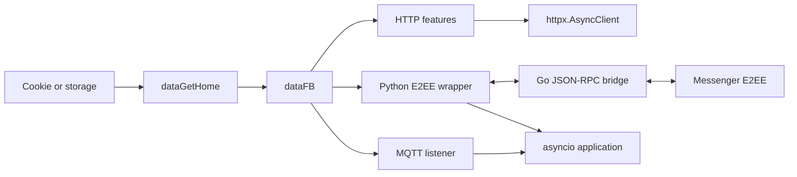

<div align="center">

# FBChat-Remake - Open Source

### Async-first Python library for the unofficial Facebook Messenger API

[](https://github.com/MinhHuyDev/fbchat-v2)
[](https://pypi.org/project/fbchat-v2/)
[](https://www.python.org/)
[](https://github.com/MinhHuyDev/fbchat-v2/releases)
[](https://github.com/MinhHuyDev/fbchat-v2/issues)
[](LICENSE)
[](https://t.me/MinhHuyDev)

[🇻🇳 Tiếng Việt](README.md) · [📖 Documents](DOCS.md) · [📦 PyPI](https://pypi.org/project/fbchat-v2/) · [ 📊 Flowchart](FLOWCHART.md) · [🐛 Report bugs](https://github.com/MinhHuyDev/fbchat-v2/issues)

</div>

---


> [!IMPORTANT]
> This is version `v2.2.0`, which uses *httpx.Client* instead of the old *requests* flow and now ships with **async/await** support. Because of that, code syntax may change or conflict with the version you are currently using. If you still want to use **requests** (*no async/await*), click here: [v2.1.4](https://github.com/m008v/fbchat-v2/tree/v2.1.4)

> [!WARNING]
> **Disclaimer** - This is **not** an official Facebook product. Facebook already provides an official chatbot API [here](https://developers.facebook.com/docs/messenger-platform/). `fbchat-v2` is different because it authenticates with a **real Facebook user account / cookie**, which comes with security risks. Think carefully before using it.

---

## 👋 Introduction

Hello, I am **MinhHuyDev** (*m008v*) - the author and maintainer of this project.

First of all, thank you sincerely to all users in Vietnam and abroad who have contributed ideas and reported bugs for this project. In this **major v2.2.0 update**, the codebase has been **fully restructured**, most small legacy bugs have been addressed, and strong *async/await* support has been added.

Of course, there may still be small bugs that are hard to find, or parts of the code that are not fully consistent yet. If you discover a ***problem***, open an issue on [GitHub](https://github.com/MinhHuyDev/fbchat-v2/issues) or message me directly on [Telegram](https://t.me/MinhHuyDev).

---

## 📚 Table of Contents

- [Features](#-features)
- [Architecture Overview](#-architecture-overview)
- [Project Structure](#️-project-structure)
- [System Requirements](#-system-requirements)
- [Installation](#-installation)
- [Configuration](#️-configuration)
- [Quick Start](#-quick-start)
- [Using the Async API](#-using-the-async-api)
- [E2EE Listener](#-e2ee-listener)
- [Sample Bot](#-sample-bot)
- [Module Documentation](#-module-documentation)
- [Quality Checks](#-quality-checks)
- [Security and Limits](#security-and-limits)
- [Contributing](#contributing)
- [Credits](#-credits)
- [License](#-license)

---

## ✨ Features

`fbchat-v2` takes a completely different direction from the official SDK. Instead of running only on a fan page with an `access_token`, this library controls a **real Facebook account** through cookies or login credentials, unlocking the full Messenger surface.

### Authentication

- 🔐 Log in with **username / password** or a **session cookie** (*)
- 🍪 Reuse login sessions - no need to log in again every time the program starts

### Messaging

- 📥 Read messages from both **users** and **group chats (threads)**
- 🔐 **E2EE listener** for Messenger personal messages (Secret Conversations / Labyrinth) through the Go bridge
- 📤 Send text, **attachments**, **stickers**, and **user mentions**
- 🔍 Search messages and conversation threads
- ✏️ Edit sent messages, react, unsend, and handle message requests
- 🎨 Change Messenger thread theme / background and manage 24-hour **Messenger Notes**
- 📡 **Real-time listener** - respond to user commands instantly

### Threads & Groups

- 👥 Create groups, add admins, change group names / emojis / nicknames
- 📊 Create polls and fetch full thread metadata

### Facebook Features (`_features._facebook`)

- 📝 Create posts, update bio, and register profile sections
- 👤 Search users, fetch profile information, and manage notifications
- 🚫 Block / unblock, manage Marketplace, and manage Professional Mode

### Recently Updated

- ⚡ Full **`async` / `await`** support
- 📦 E2EE bridge released as prebuilt binaries for Windows / Linux / macOS

> [!CAUTION]
> (*) May present potential security risks;

---

## 📂 Architecture Overview

The codebase is split into 3 layers. Feature modules must not manage sessions by themselves, and messaging modules must not hardcode credentials.

| Layer | Path | Responsibility |
|---|---|---|
| Core | `src/_core/` | HTTP transport, session, storage, login, and utilities |
| Features | `src/_features/` | Facebook business features and thread administration |
| Messaging | `src/_messaging/` | Send, listen, E2EE, attachment, reaction, theme, and notes |



📊 The full flowchart is available in [FLOWCHART.md](FLOWCHART.md).

---

## 🗂️ Project Structure

```text
fbchat-v2/
├── src/
│   ├── main.py                       # Sample async bot using the E2EE listener
│   ├── config.example.json           # Configuration template safe to commit
│   ├── config.json                   # Local configuration, gitignored
│   ├── _core/
│   │   ├── _http.py                  # Shared sync/async httpx transport
│   │   ├── _session.py               # Cookie -> dataFB
│   │   ├── _storage.py               # File/env session storage
│   │   ├── _facebookLogin.py         # Credential login and 2FA
│   │   ├── _utils.py                 # Form, parser, cookie, and ID helpers
│   │   └── README.md
│   ├── _features/
│   │   ├── _facebook/                # Account, profile, Marketplace
│   │   ├── _thread/                  # Thread and group administration
│   │   └── README.md
│   └── _messaging/
│       ├── _send.py                  # Send regular messages through HTTP
│       ├── _attachments.py           # Upload files
│       ├── _listening.py             # Regular MQTT listener
│       ├── _listening_e2ee.py        # E2EE listener and bridge process
│       ├── _bridge_actions.py        # Async actions through the bridge
│       ├── _send_e2ee.py             # Standalone compatibility sender
│       ├── _changeTheme.py
│       ├── _createNotes.py
│       ├── _editMessage.py
│       ├── _message_requests.py
│       ├── _reactions.py
│       ├── _unsend.py
│       └── README.md
├── bridge-e2ee/
│   ├── main.go                       # JSON-RPC dispatcher
│   ├── bridge/                       # Messenger/E2EE operations
│   ├── meta/                         # mautrix-meta Git submodule
│   ├── go.mod
│   └── README.md
├── build/                            # Local bridge binary
├── tests/                            # Unit and async contract tests
├── DOCS.md                           # Full API guide
├── FLOWCHART.md                      # Runtime flow
├── mindmap-mermaid.md                # Codebase map
├── CHANGELOG.md
└── pyproject.toml
```

---

## 🔧 System Requirements

| Component | Minimum | Recommended | Notes |
|---|---|---|---|
| Python | 3.10 | 3.11 / 3.12 | Required |
| Go (toolchain) | 1.24 | 1.24+ | **Only required for E2EE** - used to build `fbchat-bridge-e2ee` |
| Git | any | latest | Needed for `go mod tidy` to pull `mautrix/meta` |
| OS | Windows / Linux / macOS | - | - |
| RAM | 256 MB | 1 GB+ | The E2EE bridge uses about 80-150 MB while running |
| Network | Stable connection, not blocked from `facebook.com` and `edge-chat.facebook.com` | - | - |

Main Python dependencies in `pyproject.toml`:

```toml
dependencies = [
    "httpx>=0.27.0",
    "paho-mqtt>=1.6.1",
    "pyotp>=2.9.0",
    "requests>=2.32.0",
]
```

`httpx` is the main transport for sessions and async features. `requests` remains only at the blocking boundary for credential login and compatibility upload.

---

## 📦 Installation

> Summary: **Steps 1-4 are required** for every user. **Step 5 is only required if you want to receive 1-1 messages (E2EE)**.

### 1. Clone the source

```bash
git clone https://github.com/MinhHuyDev/fbchat-v2
cd fbchat-v2
```

> Alternative: use `Code -> Download ZIP` on GitHub.

### 2. Create a virtual environment *(optional but recommended)*

```bash
python -m venv .venv
```

Activate the environment:

```bash
# Windows (PowerShell)
.venv\Scripts\activate

# macOS / Linux
source .venv/bin/activate
```

### 3. Install Python dependencies

```bash
pip install --upgrade pip
pip install -e .
```

Quick check:

```bash
python -c "import httpx, requests, paho.mqtt.client, pyotp; print('OK')"
```

### 4. Allow imports from `src/`

When running scripts from the project root, expose `src/` so modules such as `_core`, `_features`, and `_messaging` import correctly:

```bash
# Windows (PowerShell)
$env:PYTHONPATH = "src"

# macOS / Linux
export PYTHONPATH=src
```

You can also import manually with the full `src.` prefix.

### 5. *(Optional)* Build the E2EE bridge - for 1-1 messages

If you only need to receive group messages, **skip this step**. Personal messages (E2EE) require the Go binary `fbchat-bridge-e2ee`.

#### 5.1. Install the Go toolchain

- Download it from: <https://go.dev/dl/> (Go >= 1.24).
- After installation, open a new terminal and check:

  ```bash
  go version
  ```

#### 5.2. Pull the `mautrix/meta` source

The repo already declares `bridge-e2ee/meta` in `.gitmodules`, so prefer using the submodule:

```bash
git submodule update --init --recursive bridge-e2ee/meta
```

If you are building manually from a source copy without `.gitmodules`, use this fallback clone:

```bash
cd bridge-e2ee
git clone https://github.com/mautrix/meta.git ./meta
```

> `bridge-e2ee/go.mod` uses a `replace` directive pointing to `./meta`, so the path `bridge-e2ee/meta` must exist before `go mod tidy` / `go build`.

#### 5.3. Download dependencies & build

```bash
go mod tidy

# Windows
go build -ldflags="-s -w" -o ../build/fbchat-bridge-e2ee.exe .

# Linux / macOS
go build -ldflags="-s -w" -o ../build/fbchat-bridge-e2ee .
```

The first build may take a few minutes and about 300 MB of Go module cache. After that, the binary is about 25-40 MB and is placed in `fbchat-v2/build/`.

#### 5.4. Verify

```bash
cd ..
# Windows
.\build\fbchat-bridge-e2ee.exe --help
# Linux/macOS
./build/fbchat-bridge-e2ee --help
```

If the binary is not in the default location, set the environment variable:

```bash
# Windows
$env:FBCHAT_E2EE_BIN = "C:\path\to\fbchat-bridge-e2ee.exe"
# Linux/macOS
export FBCHAT_E2EE_BIN=/path/to/fbchat-bridge-e2ee
```

More details: [`bridge-e2ee/README.md`](bridge-e2ee/README.md).

### 6. Configure cookies

Copy [`src/config.example.json`](src/config.example.json) to `src/config.json`, then paste your Facebook session cookie into the `cookies` field. See the [Configuration](#️-configuration) section for details.

### 7. Smoke test

```bash
python src/main.py
```

If the console prints account information plus `last_seq_id`, the setup is complete.

---

## ⚙️ Configuration

Copy the local template:

```powershell
Copy-Item src\config.example.json src\config.json
```

```bash
cp src/config.example.json src/config.json
```

Example:

```json
{
  "botName": "fbchat-v2 demo bot",
  "prefix": "/",
  "cookies": "c_user=...; xs=...; fr=...; datr=...;",
  "admins": [
    "1000xxxxxxxxxx"
  ],
  "version": "0.0.1"
}
```

| Key | Required | Meaning |
|---|---|---|
| `cookies` | Yes | Facebook session cookie as a string |
| `prefix` | No | Command prefix, defaults to `/` |
| `admins` | No | List of Facebook IDs allowed to use admin commands |
| `botName` | No | Config metadata, currently unused by the sample bot |
| `version` | No | Config metadata, currently unused by the sample bot |

`src/config.json` is gitignored. Do not use `config.example.json` to store real cookies.

---

## 🚀 Quick Start

After configuring cookies and the bridge:

```bash
python src/main.py
```

The bot waits until both the regular connection and E2EE connection are ready before processing commands. Sample commands:

```text
/ping
/help
/id
/echo hello
/search Minh
/unsend
```

`/unsend` only recalls the latest E2EE message sent by the bot in the current chat. Regular chats without `chatJid` are rejected with a clear message.

---

## ⚡ Using the Async API

### Create a session from cookies

```python
import asyncio

from fbchat_v2._core._session import dataGetHome


async def main() -> None:
    data_fb = await dataGetHome("c_user=...; xs=...; fr=...; datr=...;")
    if data_fb is None:
        raise RuntimeError("Cookie expired or Facebook changed the HTML token flow.")
    print(data_fb["FacebookID"])


asyncio.run(main())
```

In FastAPI, Jupyter, or any bot framework that already has an event loop, call `await dataGetHome(...)` directly. Do not nest another `asyncio.run()`.

### Send a regular message

```python
from fbchat_v2._messaging._send import api as SendAPI

sender = SendAPI()
result = await sender.send(
    data_fb,
    "Hello from fbchat-v2",
    threadID="100012345678"
)
if result.get("error"):
    raise RuntimeError(result["payload"]["error-decription"])
```

`threadID` can be a single ID or a list of IDs when `typeChat="user"`. When sending an attachment, `typeAttachment` and `attachmentID` must be passed together.

### Reuse HTTP connections

```python
import asyncio
import httpx

from fbchat_v2._features._facebook import _notification, _search

async with httpx.AsyncClient(timeout=30) as client:
    notifications, users = await asyncio.gather(
        _notification.func(data_fb, client=client),
        _search.func(data_fb, "Minh", client=client),
    )
```

If the caller creates the client, the caller is responsible for closing it. Do not reuse a closed client, and do not pass a sync `httpx.Client` into the `client=` parameter of an async API.

### Upload an attachment

```python
from fbchat_v2._messaging import _attachments
from fbchat_v2._messaging._send import api as SendAPI

uploaded = await _attachments.func("photo.jpg", data_fb, include_error=True)
if not uploaded or not uploaded.get("attachmentID"):
    raise RuntimeError(f"Upload failed: {uploaded}")

await SendAPI().send(
    data_fb,
    "Attached image (file path)",
    threadID="100012345678",
    typeAttachment=uploaded["typeAttachment"],
    attachmentID=uploaded["attachmentID"],
)
```

### Regular MQTT listener

```python
import asyncio

from fbchat_v2._messaging._listening import listeningEvent

listener = listeningEvent(data_fb, message_queue_maxsize=1000)
listener_task = asyncio.create_task(listener.connect_mqtt())
try:
    while True:
        event = await listener.get_message(timeout=30)
        if event is not None:
            print(event)
finally:
    await listener.disconnect()
    await listener_task
```

Read each event through `get_message()`. `bodyResults` is only a compatibility snapshot and may miss bursts.

---

## 🔐 E2EE Listener

`listeningE2EEEvent` spawns the Go bridge and exchanges JSON-RPC through stdin/stdout. Bridge callbacks run outside the event loop, so asyncio applications should move events into an `asyncio.Queue` with `loop.call_soon_threadsafe`.

```python
import asyncio

from fbchat_v2._messaging._listening_e2ee import listeningE2EEEvent


async def run_listener(data_fb: dict) -> None:
    listener = listeningE2EEEvent(data_fb)
    loop = asyncio.get_running_loop()
    events: asyncio.Queue[dict] = asyncio.Queue(maxsize=1000)

    def enqueue(event: dict) -> None:
        if events.full():
            events.get_nowait()
        events.put_nowait(event)

    listener.on_message(
        lambda event: loop.call_soon_threadsafe(enqueue, event)
    )
    listener_task = asyncio.create_task(listener.connect_mqtt())

    try:
        ready = await asyncio.to_thread(
            listener.wait_until_connected,
            90,
            require_e2ee=True,
        )
        if not ready:
            raise TimeoutError("E2EE handshake did not complete.")

        await listener.send_e2ee_message(
            "100012345678@msgr",
            "Hello E2EE",
        )

        while True:
            event = await events.get()
            if event.get("type") in {"e2eeMessage", "message"}:
                print(event["data"])
    finally:
        listener.stop()
        await listener_task
```

Main events:

| Type | Notable data | Meaning |
|---|---|---|
| `ready` | `isNewSession` | Bridge client has been created |
| `e2eeConnected` | handshake status | Signal/Labyrinth is ready |
| `e2eeMessage` | `chatJid`, `senderJid`, `id`, `text` | Decrypted personal message |
| `message` | `threadId`, `senderId`, `id`, `text` | Regular message |
| `error` | bridge/transport error | Should be logged and monitored |
| `bridge_fatal` | retry count | Watchdog gave up |

Advanced actions such as edit, unsend, typing, mark-read, sending images/audio, and downloading media live in `BridgeActions`. See the [messaging documentation](src/_messaging/README.md).

---

## 🤖 Sample Bot

[`src/main.py`](src/main.py) is a complete example of an async lifecycle:

1. Read config with `FileSessionStorage`.
2. Call `await dataGetHome(...)` and validate required fields.
3. Open one shared `httpx.AsyncClient` for HTTP commands.
4. Start `listeningE2EEEvent.connect_mqtt()` as a task.
5. Move bridge callbacks into a thread-safe `asyncio.Queue`.
6. Parse commands and ignore messages sent by the bot itself.
7. Reply through E2EE when `chatJid` exists, and fall back to regular sending when only `threadId` exists.
8. Stop the bridge, await the task, and close the HTTP client during shutdown.

The bot queue is limited to 1000 events and drops the oldest event when full. This policy keeps the bot alive under bursts; it is not an absolute delivery guarantee.

---

## 📖 Module Documentation

| Documentation | Content |
|---|---|
| [DOCS.md](DOCS.md) | Full API and workflow guide |
| [Core](src/_core/README.md) | Session, HTTP, storage, and login |
| [Features](src/_features/README.md) | Facebook features and threads |
| [Messaging](src/_messaging/README.md) | Send, listener, attachment, and E2EE |
| [Bridge E2EE](bridge-e2ee/README.md) | Build, binary discovery, and JSON-RPC |
| [Flowchart](FLOWCHART.md) | Session, HTTP, MQTT, E2EE, and shutdown flow |
| [Mindmap](mindmap-mermaid.md) | Codebase-wide module map |

---

## ✅ Quality Checks

Run the same command as CI:

```bash
pytest tests/ -v --tb=short
```

Recommended gates before committing:

```bash
python -m compileall -q src tests
ruff check src tests
ruff format --check src tests
git diff --check
```

For the bridge:

```bash
cd bridge-e2ee
go test ./...
go vet ./...
```

Vietnamese documentation must be real UTF-8. If PowerShell displays strange characters, inspect codepoints or read the file with `encoding="utf-8"` before doing bulk edits.

---

## 🌟 Credits

After **4 years** of development, this project could not exist without the community. Thank you from the bottom of my heart to everyone who contributed ideas, reported bugs, and kept `fbchat` alive until today.

### 👥 Community Contributors

- [tomdev112](https://github.com/tomdev211)
- [syrex1013](https://github.com/syrex1013)
- [Kheir Eddine](https://www.facebook.com/61557637127396/)
- 陶世玉
- Jihadi John
- [Bắc Trịnh](https://www.facebook.com/1228855777/)
- [Quang Trần](https://www.facebook.com/100005048402622/)
- [Minh Trần Ngọc](https://www.facebook.com/100000277273223/)
- Victor Knutsenberger
- [Hoàng Lân](https://www.facebook.com/100026754347158/)
- Kareem Adel Abomandor
- @lluevy · @phuncnheo · @minhphatnw · @khanh235a · @chapesh1 · @klongg13 · @seafibrahem · @agent1047 · @stefekdziura

> If you have contributed before but do not see your name here, open an issue or PR. I would be honored to add you to the list.

---

## 📜 License

This project is distributed under the terms in [LICENSE](LICENSE). The bridge includes upstream components with separate licenses; review [bridge-e2ee/README.md](bridge-e2ee/README.md) before distributing binaries.

<div align="center">

[MinhHuyDev](https://github.com/MinhHuyDev) | [Telegram](https://t.me/MinhHuyDev)

</div>
