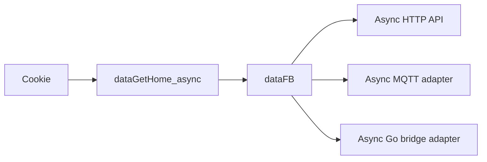

# fbchat-v2

An async-first Python library for automating Facebook Messenger through an authenticated cookie session. It uses `httpx.AsyncClient` for HTTP, MQTT/WebSocket for regular messages, and a separate Go bridge for E2EE.

> This is an unofficial Facebook API. Cookies and tokens grant account access: never commit, log, or send them to third-party services.

[Tiếng Việt](README.md) · [API documentation](DOCS.md) · [Changelog](CHANGELOG.md)

## Highlights

- Current APIs prioritize `async`/`await`; network functions suffixed with `_async` perform real asynchronous I/O.
- Send, reply, unsend, edit, react, upload, notes, themes, and message requests.
- Account features: bio, posts, search, blocking, professional mode, additional profiles, and Marketplace.
- Bounded MQTT queue, burst-safe consumption, and non-recursive reconnect handling.
- E2EE runs in a Go subprocess so a bridge crash does not crash Python.
- TOTP is generated locally with `pyotp`; the app access token comes from the environment.

## Requirements

- Python 3.10+
- Go 1.26.5+ only when building the E2EE bridge locally (the minimum patched toolchain for current standard-library advisories)
- A valid Facebook cookie containing at least `c_user`, `xs`, `fr`, and `datr`

## Installation

```bash
git clone --recurse-submodules https://github.com/MinhHuyDev/fbchat-v2.git
cd fbchat-v2
python -m pip install -e ".[dev]"
```

For an existing clone without its submodule:

```bash
git submodule update --init --recursive
```

## Async quick start

```python
import asyncio

from _core._session import dataGetHome_async
from _messaging._send import api as SendAPI


async def main() -> None:
    data_fb = await dataGetHome_async("c_user=...; xs=...; fr=...; datr=...;")
    if data_fb is None:
        raise RuntimeError("The cookie expired or Facebook changed its HTML tokens.")

    sender = SendAPI()
    result = await sender.send_async(
        data_fb,
        "Hello from asyncio",
        threadID="100012345678",
        typeChat="user",
    )
    print(result)


asyncio.run(main())
```

Do not call `asyncio.run()` inside an already running event loop such as FastAPI, Jupyter, or a Discord bot. In those environments, directly `await main()` or the relevant `_async` API.

## Async MQTT listener

```python
import asyncio

from _core._session import dataGetHome_async
from _messaging._listening import listeningEvent


async def main() -> None:
    data_fb = await dataGetHome_async("c_user=...; xs=...; fr=...; datr=...;")
    if data_fb is None:
        raise RuntimeError("Could not create a Facebook session.")

    listener = listeningEvent(data_fb)
    listener_task = asyncio.create_task(listener.connect_mqtt_async())
    try:
        while True:
            message = await listener.get_message_async(timeout=30)
            if message is not None:
                print(message)
    finally:
        await listener.disconnect_async()
        await listener_task


asyncio.run(main())
```

`connect_mqtt_async()` moves `paho-mqtt`'s blocking loop to a dedicated worker thread. That is the correct adapter for a synchronous MQTT library; HTTP requests still run directly through `httpx.AsyncClient`.

## Async E2EE

```python
import asyncio

from _messaging._listening_e2ee import listeningE2EEEvent


async def consume(data_fb: dict) -> None:
    listener = listeningE2EEEvent(data_fb)
    task = asyncio.create_task(listener.connect_mqtt_async())
    try:
        await listener.send_e2ee_message_async(
            "100012345678@msgr",
            "Encrypted message",
        )
    finally:
        listener.stop()
        await task
```

The bridge is discovered at `build/fbchat-bridge-e2ee(.exe)`. Set `FBCHAT_E2EE_BIN` to use a verified binary at another path.

## Credential login and 2FA

Cookies are the recommended flow. If credential login is unavoidable, configure the app token through the environment and never hardcode it:

```powershell
$env:FBCHAT_APP_ACCESS_TOKEN = "<app-id>|<app-secret>"
```

```python
import asyncio

from _core._facebookLogin import loginFacebook


async def main() -> None:
    login = loginFacebook(
        "email@example.com",
        "password",
        AuthenticationGoogleCode="JBSWY3DPEHPK3PXP",
    )
    print(await login.main_async())


asyncio.run(main())
```

The TOTP secret is processed locally with `pyotp`; it is never sent to `2fa.live` or another third-party endpoint.

## Layout

```text
src/
├── _core/       # httpx transport, session, login, storage, utilities
├── _features/   # Facebook and thread-management business features
├── _messaging/  # send/receive, MQTT, E2EE, notes, themes, attachments
└── main.py      # async-first example bot
bridge-e2ee/     # Go JSON-RPC bridge for Messenger E2EE
tests/           # sync compatibility and async workflow tests
```



## API conventions

- New code should use `dataGetHome_async`, `func_async`, `send_async`, `connect_mqtt_async`, and `get_message_async`.
- Pass an `httpx.AsyncClient` through `client=` for multi-request workflows to reuse its connection pool.
- Sync compatibility APIs remain available, but do not call them inside an event loop.
- `dataFB` contains CSRF tokens and cookies; treat the entire object as a secret.
- Private endpoints can change without notice. Handle `None`, error results, timeouts, and missing response fields.

## Quality checks

```bash
python -m pytest -q
python -m ruff check src tests
python -m ruff format --check src tests
go test ./...
```

## Example bot configuration

Copy `src/config.example.json` to `src/config.json`, provide the cookie, and run:

```bash
python src/main.py
```

`src/config.json` is ignored and must never be committed. See [DOCS.md](DOCS.md) for the full API and workflows.
