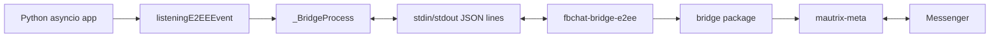

# fbchat-v2 - Bridge E2EE

Bridge Go cho Facebook Messenger thường và chat cá nhân E2EE. Binary chạy như subprocess, nhận JSON-RPC từng dòng qua stdin, trả response/event từng dòng qua stdout.

[](../README.md)
[](../src/_messaging/README.md)
[](../FLOWCHART.md)

> [!IMPORTANT]
> Application Python nên dùng `await listeningE2EEEvent.connect_mqtt()`, `await listener.send_e2ee_message()` và các method async của `BridgeActions`. Giao thức stdin/stdout bên dưới dành cho việc tích hợp và debug bridge.

## 📋 Mục lục

- [Kiến trúc](#kiến-trúc)
- [Yêu cầu](#yêu-cầu)
- [Build từ source](#build-từ-source)
- [Binary discovery và auto-download](#binary-discovery-và-auto-download)
- [Cấu hình client](#cấu-hình-client)
- [Giao thức JSON-RPC](#giao-thức-json-rpc)
- [Method hỗ trợ](#method-hỗ-trợ)
- [Event](#event)
- [Python integration](#python-integration)
- [Watchdog và shutdown](#watchdog-và-shutdown)
- [Bảo mật](#bảo-mật)
- [Test](#test)
- [Khắc phục sự cố](#khắc-phục-sự-cố)
- [Giấy phép](#giấy-phép)

---

## 🏗️ Kiến trúc



Mục tiêu của boundary subprocess:

- Tách state và protocol E2EE khỏi Python process.
- Crash Go không làm sập ngay event loop Python.
- Giao tiếp đơn giản, dễ mock bằng JSON line.
- Cho phép watchdog respawn và replay connection state.

`bridge-e2ee/meta` là Git submodule. `go.mod` dùng:

```go
replace go.mau.fi/mautrix-meta => ./meta
```

Thiếu thư mục `meta` thì build sẽ fail.

---

## 📦 Yêu cầu

| Thành phần | Yêu cầu |
|---|---|
| Go | 1.26.5 theo directive trong `go.mod` |
| Git | Có hỗ trợ submodule |
| Hệ điều hành | Windows, Linux hoặc macOS |
| Cookie | `c_user`, `xs`, `datr`, `fr` |

Kiểm tra toolchain:

```bash
go version
git --version
```

Go version thấp hơn directive trong `go.mod` có thể từ chối build hoặc tự tải toolchain tùy cấu hình `GOTOOLCHAIN`.

---

## 🔨 Build từ source

### Clone có submodule

```bash
git clone --recurse-submodules https://github.com/MinhHuyDev/fbchat-v2.git
cd fbchat-v2
```

Repo đã clone nhưng thiếu submodule:

```bash
git submodule update --init --recursive bridge-e2ee/meta
```

### Windows PowerShell

```powershell
Set-Location bridge-e2ee
go mod download
go test ./...
New-Item -ItemType Directory -Force ..\build | Out-Null
go build -ldflags="-s -w" -o ..\build\fbchat-bridge-e2ee.exe .
Set-Location ..
```

### Linux hoặc macOS

```bash
cd bridge-e2ee
go mod download
go test ./...
mkdir -p ../build
go build -ldflags="-s -w" -o ../build/fbchat-bridge-e2ee .
cd ..
chmod +x build/fbchat-bridge-e2ee
```

Không cần chạy `go mod tidy` mỗi lần build. `go mod download` giữ `go.mod`/`go.sum` ổn định; chỉ dùng `tidy` khi dependency graph thật sự thay đổi và review diff sau đó.

### Build từ source archive không có `.gitmodules`

Fallback:

```bash
cd bridge-e2ee
git clone https://github.com/mautrix/meta.git ./meta
go mod download
mkdir -p ../build
go build -o ../build/fbchat-bridge-e2ee .
```

Pin revision phù hợp với submodule của repository nếu muốn build reproducible.

---

## 🔍 Binary discovery và auto-download

Python wrapper resolve binary theo thứ tự:

1. `binary_path=` trong `listeningE2EEEvent`.
2. Biến môi trường `FBCHAT_E2EE_BIN`.
3. `build/fbchat-bridge-e2ee.exe` trên Windows.
4. `build/fbchat-bridge-e2ee` trên Linux/macOS.
5. Auto-download release asset nếu path mặc định chưa tồn tại.

Override:

```powershell
$env:FBCHAT_E2EE_BIN = "C:\tools\fbchat-bridge-e2ee.exe"
```

```bash
export FBCHAT_E2EE_BIN=/opt/fbchat/fbchat-bridge-e2ee
```

Khi `binary_path` hoặc env override được đặt mà file không tồn tại, wrapper raise `FileNotFoundError`. Nó không lặng lẽ tải một binary khác.

Auto-download hiện có các guard:

- Chỉ gọi GitHub Releases API qua HTTPS.
- Reject initial host không mong đợi.
- Stream response thay vì load cả file vào RAM.
- Giới hạn 200 MiB.
- Ghi file tạm rồi atomic replace.
- Kiểm tra SHA-256 khi GitHub trả digest.

Production nên pin binary do chính bạn build hoặc xác minh.

---

## ⚙️ Cấu hình client

RPC `newClient` nhận:

```json
{
  "cookies": {
    "c_user": "...",
    "xs": "...",
    "datr": "...",
    "fr": "..."
  },
  "platform": "facebook",
  "logLevel": "none",
  "e2eeMemoryOnly": true,
  "devicePath": "optional/path/to/device-state"
}
```

| Field | Ý nghĩa |
|---|---|
| `cookies` | Cookie cần thiết, không phải toàn bộ header raw |
| `platform` | `facebook` cho wrapper hiện tại |
| `logLevel` | `debug`, `trace`, `warn`, `error`, `none` |
| `e2eeMemoryOnly` | Không persist E2EE device state khi `true` |
| `devicePath` | Path state khi persistence được bật |

Nếu dùng `devicePath`, file này là secret vì có thể chứa device/session state. Không commit hoặc chia sẻ nó.

---

## 📡 Giao thức JSON-RPC

Mỗi request là một JSON object trên đúng một dòng:

```json
{"id":1,"method":"isConnected","params":{}}
```

Success response:

```json
{"id":1,"ok":true,"data":{"connected":true}}
```

Error response:

```json
{"id":1,"ok":false,"error":"not connected"}
```

Async event không có request ID:

```json
{"event":{"type":"e2eeMessage","data":{"id":"...","text":"ping"}}}
```

Protocol rules:

- UTF-8 JSON.
- Một object mỗi dòng.
- Request ID là số và được echo trong response.
- Response có `ok: true` hoặc `ok: false`.
- Event nằm trong key `event` và không có `id`.
- Không in log thường lên stdout vì sẽ phá JSON stream; log đi stderr.

Python `_BridgeProcess` giới hạn request JSON-RPC ở 150 MiB. Media base64 làm payload lớn hơn source bytes.

---

## 🛠️ Method hỗ trợ

### Lifecycle

| Method | Mục đích |
|---|---|
| `newClient` | Tạo client với cookie/config |
| `connect` | Kết nối Messenger transport thường |
| `connectE2EE` | Bật E2EE session |
| `isConnected` | Kiểm tra trạng thái |
| `disconnect` | Đóng client và context |

### Send thường

| Method | Mục đích |
|---|---|
| `sendMessage` | Gửi text thường |
| `sendReaction` | Reaction thường |
| `sendImage` | Gửi ảnh thường |
| `sendFile` | Gửi file thường |

### Send E2EE

| Method | Mục đích |
|---|---|
| `sendE2EEMessage` | Gửi text E2EE |
| `sendE2EEReaction` | Reaction E2EE |
| `sendE2EESticker` | Sticker E2EE |
| `sendE2EEVideo` | Video E2EE |
| `sendE2EEDocument` | Document E2EE |
| `sendE2EEAudio` | Audio/voice E2EE |
| `sendE2EEImage` | Image E2EE |

### Mutation và state

| Method | Mục đích |
|---|---|
| `editMessage` | Sửa tin thường |
| `unsendMessage` | Thu hồi tin thường |
| `editE2EEMessage` | Sửa tin E2EE |
| `unsendE2EEMessage` | Thu hồi tin E2EE |
| `sendTypingIndicator` | Typing thường |
| `markRead` | Mark read thường |
| `sendE2EETyping` | Typing E2EE |

### Media download

| Method | Mục đích |
|---|---|
| `downloadMedia` | Tải media thường và trả base64 |
| `downloadE2EEMedia` | Tải, verify và giải mã media E2EE |

Không phải mọi Go RPC đều có public convenience method Python. `BridgeActions` hiện expose nhóm edit, unsend, typing, mark-read, E2EE image/audio và download media; các method khác có thể cần wrapper mới.

---

## 📨 Event

Event lifecycle:

| Type | Ý nghĩa |
|---|---|
| `ready` | Client đã sẵn sàng |
| `e2eeConnected` | E2EE handshake hoàn tất |
| `reconnected` | Transport reconnect |
| `disconnected` | Mất kết nối |
| `error` | Lỗi protocol/transport |

Message event:

| Type | Ý nghĩa |
|---|---|
| `message` | Tin thường |
| `e2eeMessage` | Tin cá nhân đã giải mã |

Ví dụ `e2eeMessage`:

```json
{
  "event": {
    "type": "e2eeMessage",
    "data": {
      "id": "message-id",
      "text": "ping",
      "timestampMs": 1710000000000,
      "senderId": "100012345678",
      "threadId": "thread-id",
      "chatJid": "100012345678@msgr",
      "senderJid": "100012345678@msgr",
      "attachments": [],
      "mentions": []
    }
  }
}
```

Bridge áp dụng backpressure khi đẩy event sang Python reader thay vì silently drop trong Go channel. Application Python vẫn cần queue bounded và overflow policy riêng.

---

## 🐍 Python integration

### Listener async

```python
import asyncio

from _messaging._listening_e2ee import listeningE2EEEvent

listener = listeningE2EEEvent(data_fb)
task = asyncio.create_task(listener.connect_mqtt())
try:
    ready = await asyncio.to_thread(
        listener.wait_until_connected,
        90,
        require_e2ee=True,
    )
    if not ready:
        raise TimeoutError("Bridge chưa sẵn sàng.")

    await listener.send_e2ee_message(
        "100012345678@msgr",
        "hello",
    )
finally:
    listener.stop()
    await task
```

### Advanced actions

```python
from _messaging._bridge_actions import BridgeActions

if listener._bridge is None:
    raise RuntimeError("Bridge chưa sẵn sàng.")

actions = BridgeActions(listener._bridge)
await actions.send_e2ee_typing("100012345678@msgr", True)
await actions.unsend_e2ee_message(
    "100012345678@msgr",
    "message-id",
)
```

Application không nên import `_BridgeProcess` trực tiếp. Nó là private implementation detail dù `BridgeActions` nhận instance bridge từ listener.

---

## 🐕 Watchdog và shutdown

Watchdog:

1. Phát hiện subprocess exit.
2. Đợi backoff 2, 4, 8, 16, 32 giây.
3. Respawn process.
4. Replay `newClient`, `connect`, `connectE2EE`.
5. Reset retry khi success.
6. Emit `bridge_fatal` sau tối đa 5 lần fail.

Watchdog không thể sửa cookie hết hạn hoặc binary incompatible. Application phải giám sát stderr, listener task và fatal event.

Shutdown Python:

```python
listener.stop()
await listener_task
```

`_BridgeProcess.close()` gửi `disconnect`, đóng stdin, đợi process và kill khi timeout. Không bỏ process orphan sau event loop shutdown.

---

## 🔐 Bảo mật

- Không log cookie trong request `newClient`.
- Không commit `devicePath` state.
- Không đọc binary từ URL tùy ý trong auto-download.
- Không tắt TLS trong bridge hoặc Python wrapper.
- Pin submodule revision và review `go.sum` khi dependency đổi.
- Media key, SHA và encrypted path là dữ liệu nhạy cảm của message; không đưa vào log public.
- Giới hạn input size trước khi base64 để tránh bơm RAM.
- Không chạy bridge với quyền admin/root nếu không cần.
- Production nên đặt binary và device state trong directory có ACL chặt.

---

## 🧪 Test

```bash
cd bridge-e2ee
go test ./...
go vet ./...
```

Python wrapper:

```bash
pytest tests/ -v --tb=short
```

Khi thêm RPC:

1. Thêm case trong `main.go`.
2. Implement/đấu nối trong `bridge/`.
3. Thêm validation cho params.
4. Thêm Go test.
5. Thêm async method hoặc wrapper Python nếu public.
6. Thêm Python mock test cho method/result/error.
7. Cập nhật README bridge và messaging docs.

---

## 🩺 Khắc phục sự cố

### `bridge-e2ee/meta` không tồn tại

```bash
git submodule update --init --recursive bridge-e2ee/meta
```

Xác nhận:

```bash
git submodule status bridge-e2ee/meta
```

### Go version không phù hợp

Đọc directive:

```bash
head -n 5 bridge-e2ee/go.mod
go version
```

Trên PowerShell dùng `Get-Content bridge-e2ee\go.mod -TotalCount 5`.

### Python báo không tìm thấy binary

- Kiểm tra file trong `build/` đúng tên theo OS.
- Kiểm tra execute bit trên Unix.
- Kiểm tra `FBCHAT_E2EE_BIN` có trỏ tới path cũ không.
- Nếu override đã set, wrapper không auto-download fallback.

### Bridge start nhưng không ready

- Cookie thiếu `c_user`, `xs`, `datr`, `fr`.
- Tài khoản checkpoint.
- Binary và source Python lệch version.
- Network chặn Messenger transport.
- `connectE2EE` lỗi trong stderr.

### `coroutine '_BridgeProcess.call' was never awaited`

Application gọi async RPC như sync. Dùng `await bridge.call(...)`. Code blocking nội bộ dùng `call_blocking(...)`.

### Bridge stdout có JSON lỗi

Log/debug text đã bị in ra stdout. Chuyển log sang stderr. Stdout chỉ dành cho protocol JSON line.

### Media request vượt giới hạn

Base64 làm payload tăng kích thước. Giảm file, dùng upload flow khác hoặc implement streaming RPC; không tăng giới hạn mù vì process sẽ ăn RAM theo payload.

---

## 📜 Giấy phép

Thư mục `bridge/` có code dẫn xuất từ [`meta-messenger.js`](https://github.com/yumi-team/meta-messenger.js) và sử dụng [`mautrix-meta`](https://github.com/mautrix/meta) cùng các dependency có giấy phép riêng.

Xem file [LICENSE](../LICENSE), license trong submodule và header source trước khi phân phối binary. `main.go` và Python wrapper là phần tích hợp của dự án `fbchat-v2`.
