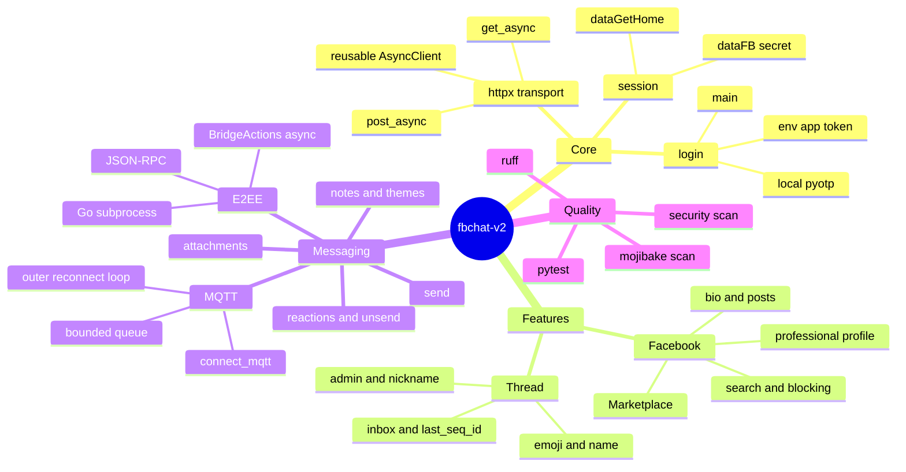

# fbchat-v2 — async architecture mind map

```mermaid
mindmap
  root((fbchat-v2))
    Core
      httpx transport
        post_async
        get_async
        reusable AsyncClient
      session
        dataGetHome
        dataFB secret
      login
        main
        local pyotp
        env app token
    Features
      Facebook
        bio and posts
        search and blocking
        professional profile
        Marketplace
      Thread
        inbox and last_seq_id
        admin and nickname
        emoji and name
    Messaging
      send
      attachments
      reactions and unsend
      notes and themes
      MQTT
        connect_mqtt
        bounded queue
        outer reconnect loop
      E2EE
        Go subprocess
        JSON-RPC
        BridgeActions async
    Quality
      pytest
      ruff
      mojibake scan
      security scan
```
