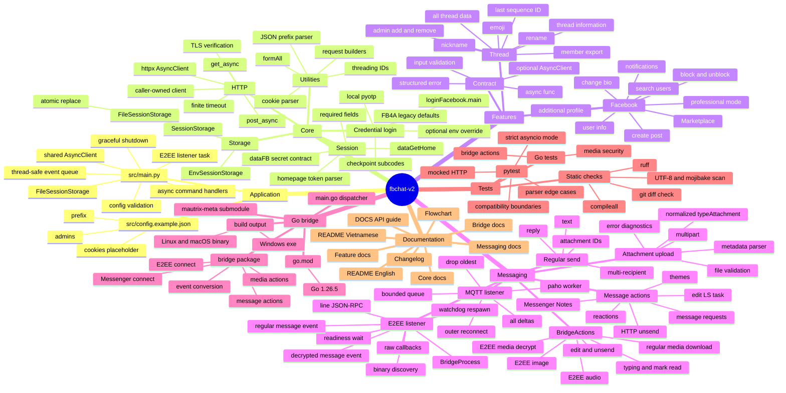

# fbchat-v2 - Mindmap kiến trúc async

[README](README.md) | [Tài liệu API](DOCS.md) | [Flowchart](FLOWCHART.md)

Mindmap thể hiện ownership, không phải call graph chính xác. Xem [FLOWCHART.md](FLOWCHART.md) để theo dõi trình tự runtime và [DOCS.md](DOCS.md) để xem chữ ký API.
