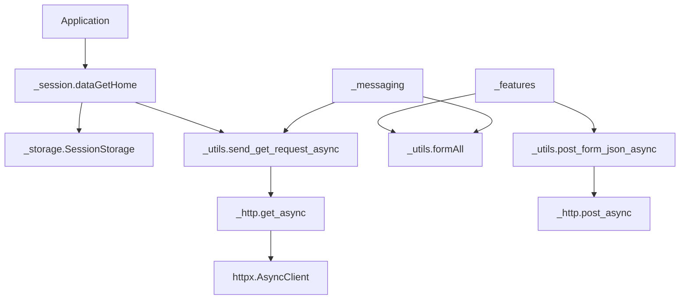

# `_core` - Async foundation layer

> Sessions, HTTP transport, storage, credential login, and shared utilities for `fbchat-v2`.

[Main README](../../README_EN.md) | [Tiếng Việt](README.md) | [API guide](../../DOCS.md)

## Contents

- [Responsibilities](#responsibilities)
- [Directory layout](#directory-layout)
- [Public API](#public-api)
- [`dataFB` contract](#datafb-contract)
- [`_session.py`](#_sessionpy)
- [`_storage.py`](#_storagepy)
- [`_http.py`](#_httppy)
- [`_utils.py`](#_utilspy)
- [`_facebookLogin.py`](#_facebookloginpy)
- [Dependency map](#dependency-map)
- [Development rules](#development-rules)
- [Troubleshooting](#troubleshooting)

---

## Responsibilities

`_core` is the foundation of the codebase:

- Build a Facebook session from a cookie.
- Normalize HTTP requests through `httpx`.
- Build GraphQL and regular form payloads.
- Parse cookies, `for (;;);` JSON, and HTML tokens.
- Store cookies behind a storage abstraction.
- Support credential login and two-factor authentication.
- Generate IDs used by Messenger requests.

Modules in `_features` and `_messaging` should not bootstrap their own sessions, disable TLS, or create unrelated ad-hoc transports.

---

## Directory layout

```text
src/_core/
├── __init__.py          # Version and module exports
├── _http.py             # httpx Client/AsyncClient transport
├── _session.py          # Cookie -> dataFB
├── _storage.py          # SessionStorage implementations
├── _utils.py            # Forms, parsers, cookies, and IDs
├── _facebookLogin.py    # FB4A credential login and 2FA
├── _types.py            # Shared types
├── README.md
└── README_EN.md
```

---

## Public API

`src/_core/__init__.py` exports:

```python
__all__ = ["_session", "_utils", "_facebookLogin", "__version__"]
```

Storage and low-level HTTP transports are imported directly:

```python
from _core._http import get_async, post_async
from _core._session import dataGetHome
from _core._storage import EnvSessionStorage, FileSessionStorage
```

Application code usually needs only `dataGetHome`, a storage implementation, and a public feature. Low-level helpers are intended for new modules or special integrations.

---

## `dataFB` contract

`dataFB` is the shared session dictionary:

```python
{
    "fb_dtsg": "...",
    "fb_dtsg_ag": "...",
    "jazoest": "...",
    "hash": "...",
    "sessionID": "...",
    "FacebookID": "100012345678",
    "clientRevision": "...",
    "cookieFacebook": "c_user=...; xs=...; fr=...; datr=...;",
}
```

Fields required by `_session.REQUIRED_SESSION_FIELDS`:

- `fb_dtsg`
- `jazoest`
- `sessionID`
- `FacebookID`
- `clientRevision`

`cookieFacebook` is added after parsing and is required by most HTTP features and the bridge.

> [!WARNING]
> Treat the whole dictionary as a secret. The cookie and CSRF values may be enough to perform account actions. Never log it, send it to analytics, or expose it through a public exception.

---

## `_session.py`

### `dataGetHome`

```python
async def dataGetHome(
    setCookies: str | None = None,
    storage: SessionStorage | None = None,
) -> dict[str, Any] | None:
    ...
```

Flow:

1. Use `setCookies` when provided.
2. Otherwise call `storage.load()`.
3. Parse the cookie string into an HTTP cookie jar.
4. GET `https://www.facebook.com/` through the async transport.
5. Call `raise_for_status()`.
6. Parse required tokens from HTML.
7. Validate the fields and numeric `FacebookID`.
8. Return `dataFB` or `None`.

```python
import asyncio

from _core._session import dataGetHome


async def main() -> None:
    data_fb = await dataGetHome("c_user=...; xs=...; fr=...; datr=...;")
    if data_fb is None:
        raise RuntimeError("The Facebook session is invalid.")
    print(data_fb["FacebookID"])


asyncio.run(main())
```

The function returns `None` for an empty cookie, request errors, HTTP status errors, or missing tokens. Those are ordinary authentication failures that the caller is expected to handle.

---

## `_storage.py`

### `SessionStorage`

```python
class SessionStorage(ABC):
    def load(self) -> str | None: ...
    def save(self, cookies: str) -> None: ...
    def clear(self) -> None: ...
```

### `FileSessionStorage`

```python
storage = FileSessionStorage("src/config.json", key="cookies")
storage.save("c_user=...; xs=...;")
cookie = storage.load()
storage.clear()
```

Behavior:

- Preserves unrelated JSON keys when updating a cookie.
- Returns `None` for a missing file, invalid JSON, or a non-string value.
- Rejects an empty cookie with `ValueError`.
- Writes a temporary file in the same directory and replaces atomically.
- Applies mode `0600` to the temporary file on Unix systems.

Atomic writes reduce corruption risk but do not encrypt the cookie. Configure appropriate file permissions or ACLs.

### `EnvSessionStorage`

```python
storage = EnvSessionStorage("FB_COOKIES")
data_fb = await dataGetHome(storage=storage)
```

`save()` changes only the current process environment. It does not persist a system environment variable.

---

## `_http.py`

Shared transports:

| Function | Client type | Purpose |
|---|---|---|
| `post_async` | `httpx.AsyncClient` | Non-blocking POST |
| `get_async` | `httpx.AsyncClient` | Non-blocking GET |
| `post_blocking` | `httpx.Client` | Compatibility boundary |
| `get_blocking` | `httpx.Client` | Compatibility boundary |

```python
request = {
    "url": "https://www.facebook.com/api/graphql/",
    "headers": {"Cookie": data_fb["cookieFacebook"]},
    "data": {"fb_dtsg": data_fb["fb_dtsg"]},
    "timeout": 30,
    "verify": True,
}

response = await post_async(request)
response.raise_for_status()
```

The transport:

- Copies kwargs before normalization.
- Extracts `url`, `verify`, and `timeout`.
- Removes the old `requests`-style `proxies` key.
- Creates and closes a temporary client when no client is injected.
- Never disables TLS implicitly.

When the caller injects a client, TLS configuration belongs to that client. A request dictionary cannot reconfigure an already-created client.

---

## `_utils.py`

### HTTP and JSON helpers

| Function | Description |
|---|---|
| `mainRequests(url, dataForm, setCookies)` | Build regular POST kwargs |
| `send_request_async(req_kwargs, client=None)` | Send POST and return `httpx.Response` |
| `send_get_request_async(req_kwargs, client=None)` | Send GET and return a response |
| `post_form_json_async(...)` | POST form, validate status, parse JSON |
| `parse_json_response(text, strip_for_loop_prefix=False)` | Parse optional-prefixed JSON |

```python
from _core._utils import formAll, post_form_json_async

form = formAll(
    data_fb,
    FBApiReqFriendlyName="ExampleQuery",
    docID="123456789",
)
payload = await post_form_json_async(
    "https://www.facebook.com/api/graphql/",
    form,
    data_fb["cookieFacebook"],
    strip_for_loop_prefix=True,
)
```

### Form builder

`formAll(dataFB, friendlyName, docID, requireGraphql=True)` adds common session tokens and Facebook metadata. Pass `requireGraphql=False` for non-GraphQL form endpoints.

Never mutate a shared request form between concurrent coroutines. Build a new dictionary for every call.

### Cookie, parser, and ID helpers

| Function | Description |
|---|---|
| `parse_cookie_string` | Convert a cookie string to a dictionary |
| `dataSplit` | Parse legacy HTML tokens |
| `clearHTML` | Clean selected HTML markup/entities |
| `formatResults` | Build a simple success/error result |
| `gen_threading_id` | Messenger offline/threading ID |
| `generate_session_id` | Random session ID |
| `generate_client_id` | Client mutation/session ID |
| `str_base` | Convert an integer to another base |

These IDs are protocol values, not cryptographic tokens or database identifiers.

---

## `_facebookLogin.py`

### API

```python
login = loginFacebook(
    username,
    password,
    AuthenticationGoogleCode=None,
    proxies=None,
)
result = await login.main()
```

`main()` moves `main_blocking()` to a worker thread. The underlying legacy FB4A flow still uses `requests`.

### Two-factor authentication

`AuthenticationGoogleCode` accepts:

- A current 6 to 8 digit OTP.
- A TOTP shared secret processed locally with `pyotp`.

The module never sends a shared secret to an external OTP service. Invalid base32 input returns a safe error without logging the secret.

### Configuration

Legacy FB4A API key and app access token defaults are built into the module. Optional overrides:

```powershell
$env:FBCHAT_API_KEY = "<override>"
$env:FBCHAT_APP_ACCESS_TOKEN = "<override>"
```

Do not hardcode real overrides in source. `proxies` exists for the legacy login path; async features use the proxy configuration of their `httpx.AsyncClient`.

### Checkpoint failures

Credential login may encounter a 2FA continuation, a device checkpoint, a new error subcode, or a malformed response such as code `-1`. Read the sanitized description and prefer a cookie session when the private login endpoint is unstable. Mocked validation is not proof that a live account flow works.

---

## Dependency map



`_core` does not import `_features` or `_messaging`. Keep dependencies one-directional to avoid circular imports.

---

## Development rules

- New public I/O APIs are async-first.
- Async HTTP uses `httpx.AsyncClient`; do not add new thread-wrapped `requests` code without a protocol-specific reason.
- Accept `client=` when callers can benefit from connection-pool reuse.
- Use finite timeouts and call `raise_for_status()`.
- Separate request building, transport, and parsing for unit tests.
- Do not mutate caller dictionaries or global per-request state.
- Keep TLS verification enabled.
- Never log cookies, passwords, OTP values, access tokens, or full `dataFB` objects.
- Blocking helpers use `_blocking`; do not add redundant `_sync` or `_async` aliases.

---

## Troubleshooting

| Symptom | Common cause | Check |
|---|---|---|
| `dataGetHome()` returns `None` | Expired cookie or changed HTML tokens | Inspect missing field names, never values |
| HTTP 401/403 | Invalid session or CSRF token | Refresh cookie and inspect account checkpoint |
| HTTP timeout | Network, proxy, or slow endpoint | Apply explicit timeouts and bounded application retries |
| JSON parse error | Prefix or response schema changed | Inspect a sanitized excerpt and prefix handling |
| Coroutine warning | Async API called like sync code | Add `await` or `create_task` |
| Login code `-1` | Malformed response or transport error | Read description, check overrides, prefer cookie login |
| File storage returns `None` | Invalid JSON or wrong key | Validate UTF-8 JSON and the `cookies` key |

Session diagnostics must stop at safe metadata. Printing the complete cookie is not debugging; it is an account leak with extra steps.
