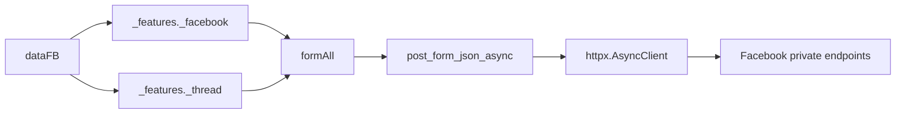

# `_features` - Tầng nghiệp vụ Facebook async

> Các thao tác tài khoản Facebook và quản trị thread được xây trên `dataFB` cùng transport `httpx` của `_core`.

[](README_EN.md)
[](../../DOCS.md)

## 📋 Mục lục

- [Vai trò](#vai-trò)
- [Cấu trúc thư mục](#cấu-trúc-thư-mục)
- [Public API](#public-api)
- [Hợp đồng gọi async](#hợp-đồng-gọi-async)
- [Facebook features](#facebook-features)
- [Thread features](#thread-features)
- [Tái sử dụng HTTP client](#tái-sử-dụng-http-client)
- [Kết quả và lỗi](#kết-quả-và-lỗi)
- [Sơ đồ phụ thuộc](#sơ-đồ-phụ-thuộc)
- [Quy tắc thêm feature](#quy-tắc-thêm-feature)
- [Khắc phục sự cố](#khắc-phục-sự-cố)

---

## 🎯 Vai trò

`_features` chứa nghiệp vụ ngoài send/listen cơ bản:

- Thay đổi profile và bio.
- Tạo bài timeline.
- Tìm kiếm và đọc thông tin user.
- Chặn, bỏ chặn và lấy notification.
- Professional mode, additional profile và Marketplace.
- Lấy inbox/thread metadata.
- Đổi tên, emoji, nickname và admin của group.

Tầng này nhận `dataFB` đã được `_core._session.dataGetHome()` tạo. Nó không tự đọc cookie từ config và không sở hữu lifecycle bot.

---

## 🏗️ Cấu trúc thư mục

```text
src/_features/
├── _facebook/
│   ├── _archivePost.py          # Lưu trữ bài timeline
│   ├── _blocking.py             # Block/unblock user
│   ├── _changeBio.py            # Đổi bio
│   ├── _createPost.py           # Tạo bài timeline
│   ├── _deletePost.py           # Xóa bài timeline
│   ├── _get_user_info.py        # Profile info
│   ├── _marketplace.py          # Marketplace create/read
│   ├── _notification.py         # Notification
│   ├── _professional.py         # Professional mode
│   ├── _registerOnProfile.py    # Additional profile
│   └── _search.py               # User search
├── _thread/
│   ├── _addAdmin.py
│   ├── _all_thread_data.py
│   ├── _changeEmoji.py
│   ├── _changeNameThread.py
│   └── _changeNickname.py
├── README.md
└── README_EN.md
```

---

## 🌐 Public API

`_features._facebook.__all__`:

```python
[
    "_archivePost",
    "_changeBio",
    "_createPost",
    "_deletePost",
    "_professional",
    "_search",
    "_blocking",
    "_registerOnProfile",
    "_notification",
    "_marketplace",
    "_get_user_info",
]
```

`_features._thread.__all__`:

```python
[
    "_changeNickname",
    "_addAdmin",
    "_changeEmoji",
    "_changeNameThread",
    "_all_thread_data",
]
```

Import theo module giúp giữ tên `func` nhất quán:

```python
from _features._facebook import _search
from _features._thread import _changeEmoji

users = await _search.func(data_fb, "Minh")
changed = await _changeEmoji.func(data_fb, "thread-id", "🔥")
```

---

## 📝 Hợp đồng gọi async

Mọi feature mạng trong thư mục này là coroutine. Chữ ký thường có dạng:

```python
async def func(
    dataFB: dict[str, Any],
    feature_value: str,
    *,
    client: httpx.AsyncClient | None = None,
) -> dict[str, Any]:
    ...
```

Quy tắc:

- Luôn dùng `await`.
- Truyền `client=` bằng keyword.
- Caller tạo client thì caller đóng client.
- Input invalid có thể raise `ValueError` hoặc `NotImplementedError` trước I/O.
- Lỗi HTTP/parser thường được chuyển thành dict `{"error": 1, ...}` tại boundary feature.

---

## ✨ Facebook features

### `_changeBio.py`

```python
result = await _changeBio.func(
    data_fb,
    "Đang xây bot async",
    uploadPost=False,
    client=client,
)
```

| Tham số | Ý nghĩa |
|---|---|
| `newContents` | Nội dung bio mới |
| `uploadPost` | Có yêu cầu chia sẻ thay đổi hay không |

Success trả `{"success": 1, "messages": "..."}`. Error từ GraphQL hoặc transport trả `{"error": 1, ...}`.

### `_createPost.py`

```python
result = await _createPost.func(
    data_fb,
    "Bài viết từ fbchat-v2",
    client=client,
)
```

Nội dung rỗng bị reject. `attachmentID` có trong chữ ký để giữ hướng phát triển, nhưng Composer schema attachment chưa ổn định. Truyền giá trị sẽ raise `NotImplementedError` thay vì âm thầm đăng bài text-only.

Success:

```python
{
    "success": 1,
    "messages": "Tạo bài viết thành công!",
    "urlPost": "https://www.facebook.com/...",
}
```

### `_archivePost.py`

```python
result = await _archivePost.func(
    data_fb,
    "1234567890",
    typePost="my_post",
    client=client,
)
```

Sử dụng `useCometArchivePostMutation` để lưu trữ bài viết. Cơ chế hoạt động giống `_deletePost`.

### `_deletePost.py`

```python
result = await _deletePost.func(
    data_fb,
    "1234567890",
    typePost="my_post",
    client=client,
)
```

Sử dụng `useCometTrashPostMutation` để chuyển bài viết vào thùng rác. 
- `postID`: ID của bài viết cần xoá.
- `typePost`: Loại bài viết (`"my_post"` cho bài tự đăng, `"others"` cho bài share/bài của người khác). Trả về `success` nếu thành công.

### `_professional.py`

```python
enabled = await _professional.func(data_fb, True, client=client)
disabled = await _professional.func(data_fb, "off", client=client)
```

`statusBusiness` hỗ trợ bool và chuỗi normalize như `on`, `off`, `bật`, `tắt`. Giá trị khác raise `ValueError`.

### `_search.py`

```python
result = await _search.func(data_fb, "m008v", client=client)
```

Success:

```python
{
    "success": 1,
    "searchResults": "Tìm kiếm Facebook: ...",
    "searchResultsDict": [
        {"name": "...", "id": "...", "url": "..."},
    ],
}
```

Parser loại trùng theo ID và lấy tối đa 5 kết quả. Keyword rỗng raise `ValueError`.

### `_blocking.py`

```python
blocked = await _blocking.func(
    data_fb,
    "100012345678",
    "block",
    client=client,
)
unblocked = await _blocking.func(
    data_fb,
    "100012345678",
    "unblock",
    client=client,
)
```

`choiceInteract` chỉ nhận `block` hoặc `unblock`, không dùng truthy/falsy mơ hồ.

### `_registerOnProfile.py`

```python
result = await _registerOnProfile.func(
    data_fb,
    newName="Tên profile",
    newUsername="username-mới",
    client=client,
)
```

Endpoint tạo profile bổ sung có thể bị giới hạn theo tài khoản và rollout của Facebook. Caller phải kiểm tra `result.get("error")` dù HTTP status là 200.

### `_notification.py`

```python
result = await _notification.func(data_fb, client=client)
items = result.get("NotificationResults", [])
for item in items[:5]:
    print(item)
```

Kết quả là dict, không phải list. Slice trực tiếp `result[:2]` sẽ gây lỗi `slice(None, 2, None)`.

### `_get_user_info.py`

```python
profile = await _get_user_info.func(
    data_fb,
    "100012345678",
    client=client,
)
```

Kết quả có thể chứa:

```python
{
    "idUser": "...",
    "nameUser": "...",
    "firstName": "...",
    "Username": "...",
    "thumbSrc": "...",
    "urlProfile": "...",
    "genderUser": "Male (Nam)",
    "alternateName": None,
    "chatWithUSerIsNonFriend": False,
}
```

Nếu profile không có trong payload, module trả error dict thay vì index mù vào `profiles[userID]`.

### `_marketplace.py`

Tạo item:

```python
result = await _marketplace.createItem(
    data_fb,
    nameItem="Bàn phím cơ",
    brandItem="Custom",
    priceItem=1200000,
    currencyItem="VND",
    decriptionItem="Tình trạng tốt",
    hashtagList=["keyboard", "mechanical"],
    typeItem="ELECTRONICS",
    photoIDList=["photo-id"],
    locationSeller={"latitude": 10.776, "longitude": 106.700},
    client=client,
)
```

Đọc item:

```python
details = await _marketplace.getInformationProductItemMarketPlace(
    data_fb,
    "product-id",
    client=client,
)
```

Validation trước request:

- Tên sản phẩm không rỗng.
- Có ít nhất một photo ID.
- Giá chuyển được sang số và không âm.
- Tọa độ nằm trong phạm vi latitude/longitude hợp lệ.
- Category/type nằm trong tập module hỗ trợ.

---

## ✨ Thread features

### `_all_thread_data.py`

```python
threads = await _all_thread_data.func(data_fb, client=client)
```

Success:

```python
{
    "dataGet": "{...}",
    "ProcessingTime": 0.42,
    "last_seq_id": "...",
    "dataAllThread": {
        "threadIDList": ["..."],
        "threadNameList": ["..."],
        "countThread": 1,
    },
}
```

`dataGet` là JSON string của GraphQL batch đã parse. Không dùng `result[0]`; đây là dict có key rõ ràng.

Parse một thread đã tải:

```python
info = await _all_thread_data.features(
    threads["dataGet"],
    "thread-id",
    "threadInfomation",
)
```

`commandUse` hỗ trợ:

| Lệnh | Kết quả |
|---|---|
| `getAdmin` | `adminThreadList` |
| `threadInfomation` | Tên, emoji, count, approval, join link |
| `exportMemberListToJson` | Danh sách JSON member |

Tên `threadInfomation` giữ nguyên chính tả legacy để tương thích. Lệnh khác trả error dict.

### `_changeNameThread.py`

```python
result = await _changeNameThread.func(
    data_fb,
    "thread-id",
    "Tên nhóm mới",
    client=client,
)
```

Tên rỗng raise `ValueError`. Module phân biệt thread không tồn tại, không có quyền và error server.

### `_changeEmoji.py`

```python
result = await _changeEmoji.func(
    data_fb,
    "thread-id",
    "🔥",
    client=client,
)
```

Emoji rỗng bị reject trước request.

### `_changeNickname.py`

```python
result = await _changeNickname.func(
    data_fb,
    "thread-id",
    "user-id",
    "Biệt danh",
    client=client,
)
```

Response phân biệt user không nằm trong thread và thread không tồn tại.

### `_addAdmin.py`

```python
added = await _addAdmin.func(
    data_fb,
    "thread-id",
    "user-id",
    statusChoice=True,
    client=client,
)
removed = await _addAdmin.func(
    data_fb,
    "thread-id",
    "user-id",
    statusChoice=False,
    client=client,
)
```

`False` là gỡ admin thật, không phải chỉ đổi message success. Caller hiện tại phải là admin và target phải thuộc group hợp lệ.

---

## 🌍 Tái sử dụng HTTP client

Một workflow nhiều request nên dùng một client:

```python
import asyncio
import httpx

from _features._facebook import _notification, _search
from _features._thread import _all_thread_data

async with httpx.AsyncClient(
    timeout=httpx.Timeout(30, connect=10),
) as client:
    notifications, users, threads = await asyncio.gather(
        _notification.func(data_fb, client=client),
        _search.func(data_fb, "Minh", client=client),
        _all_thread_data.func(data_fb, client=client),
    )
```

Chỉ chạy song song các action độc lập. Không `gather()` hai mutation có thứ tự phụ thuộc, ví dụ xóa note rồi tạo note hoặc thêm admin rồi đổi quyền dựa trên kết quả trước.

---

## 🩺 Kết quả và lỗi

Module cũ chưa dùng một model kết quả thống nhất. Các dạng phổ biến:

```python
{"success": 1, "messages": "..."}
{"error": 1, "messages": "..."}
```

Feature đọc dữ liệu có key domain-specific. Caller an toàn:

```python
result = await _search.func(data_fb, query)
if not isinstance(result, dict):
    raise TypeError("Feature không trả dict.")
if result.get("error"):
    logger.warning("Search failed: %s", result.get("messages"))
else:
    users = result.get("searchResultsDict", [])
```

Không coi HTTP 200 là success. Facebook thường đặt error trong GraphQL `errors`, payload nested hoặc field null.

---

## 🔗 Sơ đồ phụ thuộc



`_features` phụ thuộc `_core`; `_core` không import ngược lại `_features`.

---

## 📏 Quy tắc thêm feature

1. Validate input trước I/O.
2. Tách `_build_request`, transport call và `_parse_response`.
3. Public I/O function dùng async và tên ngắn theo convention module.
4. Nhận keyword-only `client: httpx.AsyncClient | None = None`.
5. Dùng helper `_core` thay vì dựng HTTP transport riêng.
6. Đặt timeout hữu hạn và giữ TLS verification.
7. Không giả success khi response thiếu `data` hoặc có `errors`.
8. Không âm thầm bỏ tham số chưa hỗ trợ.
9. Test input rỗng, response thiếu field, GraphQL error và success.
10. Cập nhật cả README Việt, Anh và `DOCS.md`.

---

## 🩺 Khắc phục sự cố

| Hiện tượng | Nguyên nhân | Xử lý |
|---|---|---|
| `slice(None, 2, None)` ở notification | Slice dict như list | Lấy `NotificationResults` trước |
| `All Thread Data: 0` | Index response dict bằng số | Dùng `dataAllThread` hoặc `dataGet` |
| `Không tìm thấy object o0` | GraphQL batch schema đổi/error | Kiểm tra error payload đã sanitize |
| Search trả rỗng | GraphQL result strategy đổi hoặc không có match | Kiểm tra `error`, không chỉ list length |
| Create post attachment fail | Chưa hỗ trợ Composer attachment schema | Không truyền `attachmentID` hoặc implement schema + test |
| Professional mode ValueError | Giá trị state không hợp lệ | Truyền bool, `on/off` hoặc `bật/tắt` |
| HTTP call chậm khi lặp | Mỗi call tạo client riêng | Inject một `httpx.AsyncClient` dùng chung |
| Response có HTTP 200 nhưng action fail | Error nằm trong JSON | Kiểm tra `error`, `errors` và field bắt buộc |

Đừng chữa parser bằng một dãy `try/except Exception: return {}`. Kiểu đó chỉ biến lỗi rõ ràng thành đống rác im lặng khó debug hơn.
