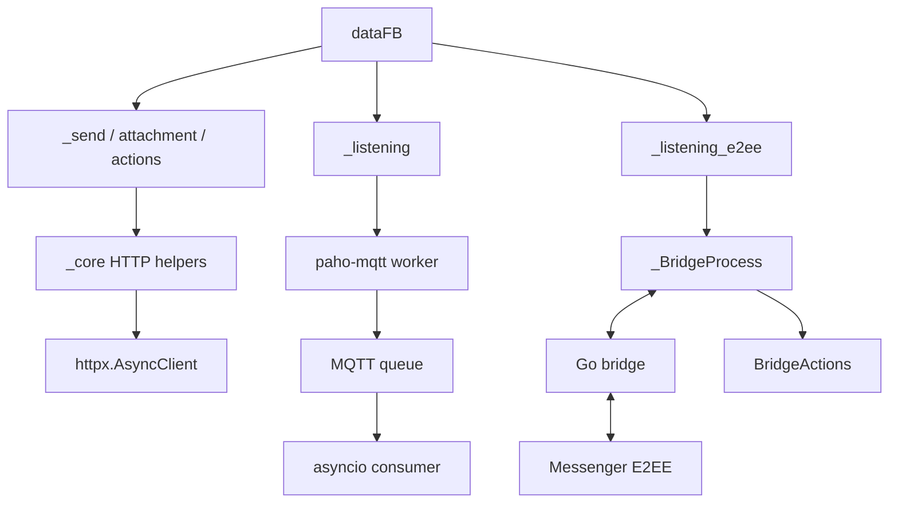

# `_messaging` - Tầng nhắn tin async

> Gửi, nhận, attachment, reaction, thu hồi, sửa tin, theme, notes và bridge E2EE cho Messenger.

[README chính](../../README.md) | [English](README_EN.md) | [Tài liệu API](../../DOCS.md) | [Bridge E2EE](../../bridge-e2ee/README.md)

## Mục lục

- [Vai trò](#vai-trò)
- [Cấu trúc thư mục](#cấu-trúc-thư-mục)
- [Cài đặt](#cài-đặt)
- [Public API](#public-api)
- [Hợp đồng `dataFB`](#hợp-đồng-datafb)
- [Gửi tin thường](#gửi-tin-thường)
- [Upload attachment](#upload-attachment)
- [Listener MQTT thường](#listener-mqtt-thường)
- [Listener E2EE](#listener-e2ee)
- [Bridge actions](#bridge-actions)
- [Standalone E2EE sender](#standalone-e2ee-sender)
- [Reaction, sửa và thu hồi](#reaction-sửa-và-thu-hồi)
- [Theme và Messenger Notes](#theme-và-messenger-notes)
- [Message requests](#message-requests)
- [Sơ đồ phụ thuộc](#sơ-đồ-phụ-thuộc)
- [Workflow hoàn chỉnh](#workflow-hoàn-chỉnh)
- [Quy tắc phát triển](#quy-tắc-phát-triển)
- [Khắc phục sự cố](#khắc-phục-sự-cố)

---

## Vai trò

`_messaging` đóng gói các workflow Messenger:

- Gửi text và attachment qua endpoint HTTP thường.
- Nhận realtime event thường qua MQTT over WebSocket.
- Nhận và gửi chat cá nhân E2EE qua bridge Go.
- Sửa tin, reaction, thu hồi, typing và mark-read.
- Gửi/nhận media thường hoặc E2EE.
- Đổi theme và quản lý Messenger Notes.
- Lấy message requests.

Module nhận `dataFB` từ `_core`. Nó không tự lưu cookie hoặc quản lý credential của application.

---

## Cấu trúc thư mục

```text
src/_messaging/
├── __init__.py
├── _send.py                  # Gửi text/attachment thường
├── _attachments.py           # Upload file -> attachment ID
├── _listening.py             # MQTT listener thường
├── _listening_e2ee.py        # Bridge process và listener E2EE
├── _bridge_actions.py        # Action async qua JSON-RPC
├── _send_e2ee.py             # Standalone compatibility sender
├── _editMessage.py           # Sửa tin qua LS task
├── _reactions.py             # Add/remove reaction
├── _unsend.py                # Thu hồi tin thường qua HTTP
├── _changeTheme.py           # Theme query và LS task
├── _createNotes.py           # Messenger Notes 24 giờ
├── _message_requests.py      # Pending inbox
├── README.md
└── README_EN.md
```

---

## Cài đặt

Python package:

```bash
python -m pip install -e .
```

Dependency chính:

| Package | Dùng cho |
|---|---|
| `httpx` | Send, upload có injected client, reaction, unsend và message requests |
| `paho-mqtt` | Listener thường và LS task |
| `requests` | Compatibility upload boundary khi không inject async client |

### Bridge E2EE

`bridge-e2ee/go.mod` yêu cầu Go 1.26.5.

```bash
git submodule update --init --recursive bridge-e2ee/meta
cd bridge-e2ee
go mod download
mkdir -p ../build
go build -ldflags="-s -w" -o ../build/fbchat-bridge-e2ee .
```

Windows dùng output `..\build\fbchat-bridge-e2ee.exe`.

Python tìm binary theo `binary_path=`, `FBCHAT_E2EE_BIN`, path mặc định trong `build/`, rồi mới auto-download release asset khi path mặc định thiếu.

---

## Public API

`src/_messaging/__init__.py`:

```python
__all__ = [
    "_attachments",
    "_changeTheme",
    "_createNotes",
    "_editMessage",
    "_listening",
    "_listening_e2ee",
    "_reactions",
    "_send",
    "_send_e2ee",
    "_unsend",
    "_message_requests",
]
```

`_bridge_actions` có thể import trực tiếp:

```python
from _messaging._bridge_actions import BridgeActions
```

Tóm tắt async API:

| Module | API chính |
|---|---|
| `_send.py` | `await api().send(...)` |
| `_attachments.py` | `await func(...)` |
| `_listening.py` | `await connect_mqtt()`, `get_message()`, `disconnect()` |
| `_listening_e2ee.py` | `await connect_mqtt()`, `send_message()`, `send_e2ee_message()` |
| `_bridge_actions.py` | Các method async không hậu tố |
| `_editMessage.py` | `await editMessage(...)` hoặc `func(...)` |
| `_reactions.py` | `await func(...)` |
| `_unsend.py` | `await func(...)` |
| `_changeTheme.py` | `await listThemes/findTheme/changeTheme/func` |
| `_createNotes.py` | `await checkNote/createNote/deleteNote/recreateNote/func` |
| `_message_requests.py` | `await func(...)` |

Helper blocking có hậu tố `_blocking`. Không có alias `func_async` hoặc `func_sync`.

---

## Hợp đồng `dataFB`

Field thường dùng:

```python
{
    "fb_dtsg": "...",
    "jazoest": "...",
    "sessionID": "...",
    "FacebookID": "1000...",
    "clientRevision": "...",
    "cookieFacebook": "c_user=...; xs=...; fr=...; datr=...;",
}
```

Tạo bằng:

```python
from _core._session import dataGetHome

data_fb = await dataGetHome(cookie)
if data_fb is None:
    raise RuntimeError("Session không hợp lệ.")
```

Bridge E2EE cần cookie `c_user`, `xs`, `datr`, `fr`. Không log tên kèm giá trị cookie khi thiếu; chỉ log danh sách tên field.

---

## Gửi tin thường

### Chữ ký

```python
await api().send(
    dataFB,
    contentSend,
    threadID,
    typeAttachment=None,
    attachmentID=None,
    typeChat=None,
    replyMessage=None,
    messageID=None,
    client=None,
)
```

### Tham số

| Tham số | Mô tả |
|---|---|
| `contentSend` | Text; có thể rỗng nếu có attachment |
| `threadID` | User ID, group thread ID hoặc list user ID |
| `typeChat` | `"user"` cho direct recipient, `None` cho group thread |
| `typeAttachment` | `gif`, `image`, `video`, `file`, `audio` |
| `attachmentID` | Một ID hoặc list ID từ upload |
| `replyMessage` | Bật reply metadata |
| `messageID` | Message gốc, bắt buộc khi reply |
| `client` | Optional `httpx.AsyncClient` dùng chung |

### Gửi text

```python
from _messaging._send import api as SendAPI

sender = SendAPI()
result = await sender.send(
    data_fb,
    "Xin chào",
    threadID="100012345678",
    typeChat="user",
)
```

### Gửi group

```python
result = await sender.send(
    data_fb,
    "Thông báo nhóm",
    threadID="group-thread-id",
    typeChat=None,
)
```

### Gửi nhiều user

```python
result = await sender.send(
    data_fb,
    "Thông báo riêng",
    threadID=["10001", "10002"],
    typeChat="user",
)
```

### Reply

```python
result = await sender.send(
    data_fb,
    "Nội dung trả lời",
    threadID="100012345678",
    typeChat="user",
    replyMessage=True,
    messageID="mid.$original",
)
```

### Kết quả

Success:

```python
{
    "success": 1,
    "payload": {
        "messageID": "mid.$...",
        "timestamp": 1710000000000,
    },
}
```

Error parse/server:

```python
{
    "error": 1,
    "payload": {
        "error-description": "...",
        "error-code": 123,
    },
}
```

Input sai raise `ValueError` trước request. Mỗi call build form riêng và an toàn khi nhiều coroutine dùng chung một `SendAPI` instance; `sender.results` chỉ là snapshot call hoàn tất gần nhất.

---

## Upload attachment

### Chữ ký

```python
await _attachments.func(
    filenames,
    dataFB,
    client=None,
    include_error=False,
)
```

`filenames` nhận `str` hoặc `list[str]`. List rỗng raise `ValueError`; path thiếu raise `FileNotFoundError`.

Parser hiện chỉ trả metadata item đầu tiên. Với nhiều file, workflow đáng tin cậy là gọi upload cho từng path, kiểm tra từng `attachmentID`, rồi truyền list ID vào sender; truyền list path không làm result trở thành list.

```python
from _messaging import _attachments

uploaded = await _attachments.func(
    "photo.jpg",
    data_fb,
    include_error=True,
)
```

Success:

```python
{
    "attachmentID": "123...",
    "attachmentUrl": "https://...",
    "videoDuration": None,
    "attachmentType": "image/jpeg",
    "typeAttachment": "image",
}
```

Khi gửi, dùng `typeAttachment`, không dùng MIME trong `attachmentType`:

```python
if not uploaded or not uploaded.get("attachmentID"):
    raise RuntimeError(f"Upload thất bại: {uploaded}")

result = await sender.send(
    data_fb,
    "Ảnh đính kèm",
    threadID="100012345678",
    typeChat="user",
    typeAttachment=uploaded["typeAttachment"],
    attachmentID=uploaded["attachmentID"],
)
```

### Error diagnostics

`include_error=True` trả payload có giới hạn:

```python
{
    "error": 1,
    "payload": {
        "error-code": 1357054,
        "error-summary": "...",
        "error-description": "...",
        "upload-id": None,
        "metadata": None,
        "file-rejected": False,
        "raw-excerpt": "...",
    },
}
```

`uploadID` không phải `attachmentID`. `metadata["0"] is None` không phải success. File handle luôn được đóng trong `finally`, kể cả khi request hoặc parser lỗi.

Khi caller không truyền async client, wrapper dùng compatibility upload trong worker thread. Khi truyền `httpx.AsyncClient`, request multipart chạy native async.

---

## Listener MQTT thường

### Khởi tạo

```python
from _messaging._listening import listeningEvent

listener = listeningEvent(
    data_fb,
    message_queue_maxsize=1000,
)
```

### Lifecycle

```python
import asyncio

task = asyncio.create_task(listener.connect_mqtt())
try:
    while True:
        if task.done():
            task.result()
        event = await listener.get_message(timeout=30)
        if event is not None:
            print(event)
finally:
    await listener.disconnect()
    await task
```

| Method | Mô tả |
|---|---|
| `get_last_seq_id()` | Async lấy sequence ID ban đầu |
| `connect_mqtt()` | Đưa vòng lặp `paho-mqtt` blocking sang worker thread |
| `get_message(timeout=None)` | Consume event từ queue hoặc `None` khi timeout |
| `disconnect()` | Dừng client và reconnect loop |

Event normalized:

```python
{
    "body": "ping",
    "timestamp": 1710000000000,
    "userID": "1000...",
    "messageID": "mid.$...",
    "replyToID": "thread-id",
    "type": "thread",
    "attachments": {"id": 0, "url": None},
    "mentions": [],
}
```

Listener parse toàn bộ delta, dùng TLS verification và queue bounded. Queue đầy sẽ bỏ event cũ nhất, tăng `droppedMessages` và giữ RAM có giới hạn.

`bodyResults` chỉ là snapshot compatibility. Bot mới phải dùng `get_message()` để không mất burst.

Reconnect được quản lý ở vòng ngoài, không gọi đệ quy `connect_mqtt()` trong callback. Đệ quy reconnect dễ tạo nhiều client và stack vô tận, kiểu bug nhìn hiền mà ăn RAM như buffet.

---

## Listener E2EE

### Khởi tạo

```python
from _messaging._listening_e2ee import listeningE2EEEvent

listener = listeningE2EEEvent(
    data_fb,
    log_level="none",
    device_path=None,
    e2ee_memory_only=True,
    enable_e2ee=True,
    binary_path=None,
)
```

### Public API

| Method | Loại | Mô tả |
|---|---|---|
| `on_message(fn)` | sync registration | Đăng ký callback raw event |
| `wait_until_connected(timeout, require_e2ee=False)` | blocking wait | Chờ handshake, gọi qua `to_thread` |
| `connect_mqtt()` | async | Spawn bridge, connect và poll event |
| `send_message(...)` | async | Gửi tin thường qua bridge |
| `send_e2ee_message(...)` | async | Gửi text E2EE |
| `stop()` | sync signal | Dừng listener và bridge |

### Callback thread-safe

Callback bridge không chạy trong asyncio event loop. Chuyển event về queue:

```python
import asyncio

loop = asyncio.get_running_loop()
events: asyncio.Queue[dict] = asyncio.Queue(maxsize=1000)


def enqueue(event: dict) -> None:
    if events.full():
        events.get_nowait()
    events.put_nowait(event)


listener.on_message(
    lambda event: loop.call_soon_threadsafe(enqueue, event)
)
task = asyncio.create_task(listener.connect_mqtt())
```

Không viết:

```python
threading.Thread(target=listener.connect_mqtt).start()
```

`connect_mqtt` là coroutine; truyền nó làm thread target sẽ tạo coroutine nhưng không await, sinh `RuntimeWarning` và listener không chạy.

### Đợi ready

```python
ready = await asyncio.to_thread(
    listener.wait_until_connected,
    90,
    require_e2ee=True,
)
if not ready:
    raise TimeoutError("E2EE listener chưa sẵn sàng.")
```

### Event raw

```python
{
    "type": "e2eeMessage",
    "data": {
        "id": "...",
        "text": "ping",
        "timestampMs": 1710000000000,
        "senderId": "1000...",
        "threadId": "...",
        "chatJid": "1000...@msgr",
        "senderJid": "1000...@msgr",
        "attachments": [],
        "mentions": [],
    },
}
```

Event types thường gặp:

| Type | Ý nghĩa |
|---|---|
| `ready` | Client bridge sẵn sàng |
| `e2eeConnected` | E2EE handshake xong |
| `message` | Tin thường |
| `e2eeMessage` | Tin direct đã giải mã |
| `reconnected` | Transport nối lại |
| `disconnected` | Mất kết nối |
| `error` | Bridge/transport error |
| `bridge_fatal` | Watchdog vượt retry limit |

### Send text và reply

```python
result = await listener.send_e2ee_message(
    "100012345678@msgr",
    "Xin chào E2EE",
)
```

Reply raw event:

```python
data = event["data"]
result = await listener.send_e2ee_message(
    data["chatJid"],
    "pong",
    reply_to_id=data["id"],
    reply_to_sender_jid=data["senderJid"],
)
```

### Shutdown

```python
try:
    ...
finally:
    listener.stop()
    await task
```

Watchdog tự respawn bridge tối đa 5 lần với backoff. Application vẫn phải giám sát listener task và event `bridge_fatal`.

---

## Bridge actions

```python
from _messaging._bridge_actions import BridgeActions

if listener._bridge is None:
    raise RuntimeError("Bridge chưa sẵn sàng.")
actions = BridgeActions(listener._bridge)
```

### Message actions

```python
await actions.edit_message("mid.$...", "Text mới")
await actions.unsend_message("mid.$...")

await actions.edit_e2ee_message(
    "100012345678@msgr",
    "message-id",
    "Text E2EE mới",
)
await actions.unsend_e2ee_message(
    "100012345678@msgr",
    "message-id",
)
```

### Presence actions

```python
await actions.send_typing_indicator(
    thread_id=123456789,
    is_typing=True,
    is_group=False,
)
await actions.mark_read(
    thread_id=123456789,
    watermark_ts=1710000000000,
)
await actions.send_e2ee_typing(
    "100012345678@msgr",
    True,
)
```

### E2EE image và audio

```python
from pathlib import Path
import asyncio

image = await asyncio.to_thread(Path("photo.jpg").read_bytes)
await actions.send_e2ee_image(
    "100012345678@msgr",
    image,
    mime_type="image/jpeg",
    caption="Ảnh test",
    width=0,
    height=0,
)

audio = await asyncio.to_thread(Path("voice.ogg").read_bytes)
await actions.send_e2ee_audio(
    "100012345678@msgr",
    audio,
    mime_type="audio/ogg; codecs=opus",
    duration=3200,
    ptt=True,
)
```

Binary data được base64 khi đi qua JSON-RPC. `_BridgeProcess` giới hạn request JSON-RPC ở 150 MiB; base64 làm payload tăng khoảng một phần ba, vì vậy file nguồn phải nhỏ hơn giới hạn đáng kể.

### Download media

```python
content: bytes = await actions.download_media(url)
```

E2EE media cần metadata đầy đủ từ attachment event:

```python
result = await actions.download_e2ee_media(
    direct_path=attachment["directPath"],
    media_key=attachment["mediaKey"],
    media_sha256=attachment["mediaSha256"],
    media_enc_sha256=attachment["mediaEncSha256"],
    media_type=attachment["mediaType"],
    mime_type=attachment["mimeType"],
    file_size=int(attachment["fileSize"]),
)
content = result["data"]
```

Wrapper decode base64 thành bytes và giữ metadata còn lại trong dict.

---

## Standalone E2EE sender

`_send_e2ee.api` là sender compatibility blocking. Nó hỗ trợ:

1. Reuse bridge của listener.
2. Spawn bridge standalone và tự connect.

```python
from _messaging._send_e2ee import api as E2EESender

sender = E2EESender(listener=listener)
result = await asyncio.to_thread(
    sender.send,
    "100012345678",
    "Hello",
)
```

Standalone:

```python
sender = E2EESender(dataFB=data_fb)
try:
    await asyncio.to_thread(sender.connect)
    result = await asyncio.to_thread(
        sender.send_to_user,
        "100012345678",
        "Hello",
    )
finally:
    await asyncio.to_thread(sender.close)
```

Application async mới nên dùng `listener.send_e2ee_message()` trực tiếp. Standalone sender có pairing/lifecycle riêng và dễ tạo thêm bridge process nếu dùng tùy tiện.

`normalize_chat_jid()` chuyển numeric Facebook ID thành `<id>@msgr`, giữ nguyên JID đầy đủ và reject text không phải ID/JID.

---

## Reaction, sửa và thu hồi

### Reaction

```python
from _messaging import _reactions

response = await _reactions.func(
    data_fb,
    "add",
    "mid.$message",
    "🔥",
    client=client,
)
payload = response.json()
```

`typeAdded` nhận `add`, `ADD_REACTION`, `remove`, `REMOVE_REACTION` không phân biệt hoa thường sau normalize. Hàm trả `httpx.Response` thô và đã gọi `raise_for_status()`; GraphQL error trong JSON vẫn do caller kiểm tra.

### Sửa tin thường bằng LS task

```python
from _messaging import _editMessage

result = await _editMessage.func(
    data_fb,
    "mid.$message",
    "Nội dung mới",
    timeout=20,
)
```

`editMessage()` và `func()` cùng hợp đồng async. Success chỉ xác nhận publish task, server có thể từ chối message cũ hoặc không thuộc tài khoản.

### Thu hồi qua HTTP

```python
from _messaging import _unsend

result = await _unsend.func(
    "mid.$message",
    data_fb,
    client=client,
)
```

Message ID rỗng raise `ValueError`. Response không phải JSON hợp lệ hoặc có error trả error dict.

---

## Theme và Messenger Notes

### Theme

```python
from _messaging import _changeTheme

themes = await _changeTheme.listThemes(data_fb)
match = await _changeTheme.findTheme(data_fb, "love")
changed = await _changeTheme.changeTheme(
    data_fb,
    "thread-id",
    "love",
)
```

Entry point:

```python
await _changeTheme.func(data_fb, action="list")
await _changeTheme.func(data_fb, themeName="love", action="find")
await _changeTheme.func(
    data_fb,
    threadID="thread-id",
    themeName="love",
    action="set",
)
```

`findTheme` match ID, tên exact rồi keyword. `changeTheme` publish các LS task theme cần thiết. Success publish không bảo đảm server đã apply.

### Notes

```python
from _messaging import _createNotes

current = await _createNotes.checkNote(data_fb)
created = await _createNotes.createNote(
    data_fb,
    "Đang code fbchat-v2",
    privacy="FRIENDS",
)
deleted = await _createNotes.deleteNote(data_fb, "note-id")
replaced = await _createNotes.recreateNote(
    data_fb,
    "old-note-id",
    "Note mới",
)
```

Entry point `func` hỗ trợ `check`, `create`, `delete`, `recreate`. Text hoặc note ID rỗng trả error. Note mặc định có lifetime 24 giờ theo workflow module.

`recreateNote` là delete rồi create; không có rollback server-side nếu bước tạo mới fail.

---

## Message requests

```python
from _messaging import _message_requests

result = await _message_requests.func(data_fb, client=client)
if result.get("success"):
    pending = result["data"]
    print(pending["total_count"])
```

Success:

```python
{
    "success": 1,
    "messages": "Lấy danh sách message requests thành công.",
    "data": {
        0: {
            "senderID": "...",
            "snippet": "...",
            "timestamp_precise": "...",
        },
        "total_count": 1,
    },
}
```

Parser đọc GraphQL batch có nhiều JSON object liên tiếp và tìm object `o0`. Response lỗi hoặc không parse được trả error dict.

---

## Sơ đồ phụ thuộc



---

## Workflow hoàn chỉnh

### Bot nhận và reply E2EE

```python
import asyncio

from _messaging._listening_e2ee import listeningE2EEEvent


async def run(data_fb: dict) -> None:
    listener = listeningE2EEEvent(data_fb)
    loop = asyncio.get_running_loop()
    queue: asyncio.Queue[dict] = asyncio.Queue(maxsize=1000)

    def enqueue(event: dict) -> None:
        if queue.full():
            queue.get_nowait()
        queue.put_nowait(event)

    listener.on_message(
        lambda event: loop.call_soon_threadsafe(enqueue, event)
    )
    listener_task = asyncio.create_task(listener.connect_mqtt())

    try:
        ready = await asyncio.to_thread(
            listener.wait_until_connected,
            90,
            require_e2ee=True,
        )
        if not ready:
            raise TimeoutError("Bridge chưa sẵn sàng.")

        while True:
            if listener_task.done():
                listener_task.result()
            event = await queue.get()
            if event.get("type") != "e2eeMessage":
                continue
            data = event.get("data") or {}
            if data.get("text") != "/ping":
                continue
            await listener.send_e2ee_message(
                data["chatJid"],
                "pong",
                reply_to_id=data["id"],
                reply_to_sender_jid=data["senderJid"],
            )
    finally:
        listener.stop()
        await listener_task
```

Workflow production nên thêm dedupe message ID, bỏ self-message, structured logging, backpressure policy, cancellation và metric cho listener task.

---

## Quy tắc phát triển

- Public I/O API mới dùng async và tên không có hậu tố `_async`.
- Helper blocking phải có `_blocking` và chỉ được gọi tại boundary rõ ràng.
- HTTP async dùng `httpx.AsyncClient` và optional `client=`.
- Không mutate form dùng chung giữa nhiều coroutine.
- Listener callback không chạy coroutine trực tiếp; dùng queue/thread-safe bridge vào event loop.
- Queue phải có giới hạn và policy khi đầy.
- Luôn stop/disconnect rồi await listener task khi shutdown.
- Validate ID, enum, file và attachment metadata trước request tiếp theo.
- Không coi publish LS task là server-confirmed mutation.
- Không log cookie, `dataFB`, device state hoặc media key E2EE.
- Khi thêm bridge RPC, cập nhật Go dispatcher, Python wrapper, test và README cùng lúc.

---

## Khắc phục sự cố

| Hiện tượng | Nguyên nhân thường gặp | Cách xử lý |
|---|---|---|
| `coroutine connect_mqtt was never awaited` | Đưa coroutine vào `threading.Thread` | Dùng `create_task` và `await` |
| `'coroutine' object has no attribute 'get'` | Gọi async bridge method như sync | `await call()` hoặc nội bộ dùng `call_blocking()` |
| Listener không nhận tin | Callback đăng ký muộn, handshake chưa ready, task đã chết | Đăng ký trước start, wait ready, giám sát task |
| Mất tin khi burst | Poll `bodyResults` snapshot | Consume queue bằng `get_message()` hoặc app queue |
| Queue drop event | Consumer chậm | Tối ưu handler, tăng giới hạn có kiểm soát, theo dõi metric |
| Upload trả `None` | Response không có metadata hợp lệ | Bật `include_error=True`, kiểm tra session/file/endpoint |
| Upload có `uploadID` nhưng thiếu attachment ID | Server không chấp nhận file | Không dùng `uploadID` để send |
| Send báo invalid attachment type | Truyền MIME thay vì normalized type | Dùng `uploaded["typeAttachment"]` |
| E2EE send chạy trước connect | Race với handshake | Chờ `wait_until_connected(..., require_e2ee=True)` |
| Bridge binary missing | Chưa build/submodule hoặc override path sai | Build đúng Go version, kiểm tra `FBCHAT_E2EE_BIN` |
| Bridge respawn liên tục | Cookie lỗi, binary crash, version mismatch | Đọc stderr, kiểm tra build và event `bridge_fatal` |
| Edit/theme success nhưng UI không đổi | Chỉ publish LS task | Server có thể từ chối; kiểm tra bằng event/UI sau đó |
| Reaction HTTP 200 nhưng không đổi | GraphQL body chứa error | Parse `response.json()` và kiểm tra `errors` |

Nếu fix listener bằng cách start thêm vài thread cho “chắc ăn”, dừng tay. Đó không phải redundancy, đó là nhân bản bug và pairing process.
