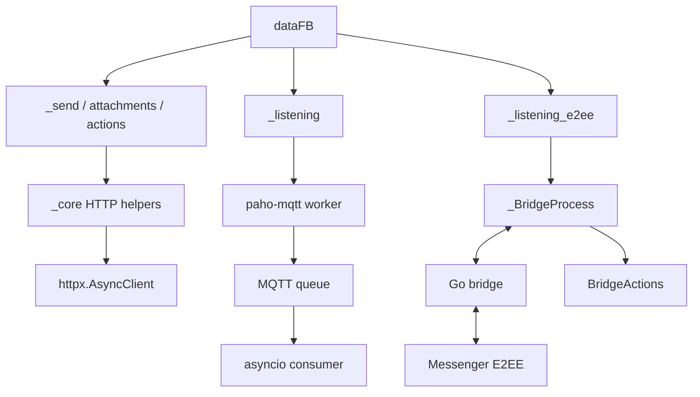

# `_messaging` - Async messaging layer

> Send, receive, attachments, reactions, unsend, editing, themes, notes, and the Messenger E2EE bridge.

[](README.md)
[](../../DOCS.md)
[](../../bridge-e2ee/README.md)

## Contents

- [Responsibilities](#responsibilities)
- [Directory layout](#directory-layout)
- [Installation](#installation)
- [Public API](#public-api)
- [`dataFB` contract](#datafb-contract)
- [Regular sending](#regular-sending)
- [Attachment uploads](#attachment-uploads)
- [Regular MQTT listener](#regular-mqtt-listener)
- [E2EE listener](#e2ee-listener)
- [Bridge actions](#bridge-actions)
- [Standalone E2EE sender](#standalone-e2ee-sender)
- [Reactions, editing, and unsend](#reactions-editing-and-unsend)
- [Themes and Messenger Notes](#themes-and-messenger-notes)
- [Message requests](#message-requests)
- [Dependency map](#dependency-map)
- [Complete workflow](#complete-workflow)
- [Development rules](#development-rules)
- [Troubleshooting](#troubleshooting)

---

## Responsibilities

`_messaging` implements Messenger workflows:

- Send text and attachments through regular HTTP endpoints.
- Receive regular realtime events through MQTT over WebSocket.
- Receive and send direct E2EE chats through the Go bridge.
- Edit, react, unsend, type, and mark messages as read.
- Send and download regular or encrypted media.
- Change themes and manage Messenger Notes.
- Fetch pending message requests.

The package receives `dataFB` from `_core`. It does not own application cookie storage or credential management.

---

## Directory layout

```text
src/_messaging/
├── __init__.py
├── _send.py                  # Regular text/attachment sending
├── _attachments.py           # File upload -> attachment ID
├── _listening.py             # Regular MQTT listener
├── _listening_e2ee.py        # Bridge process and E2EE listener
├── _bridge_actions.py        # Async JSON-RPC actions
├── _send_e2ee.py             # Standalone compatibility sender
├── _editMessage.py           # Edit through an LS task
├── _reactions.py             # Add/remove reaction
├── _unsend.py                # Regular HTTP unsend
├── _changeTheme.py           # Theme query and LS tasks
├── _createNotes.py           # 24-hour Messenger Notes
├── _message_requests.py      # Pending inbox
├── README.md
└── README_EN.md
```

---

## Installation

Install the Python package:

```bash
python -m pip install -e .
```

Main dependencies:

| Package | Used for |
|---|---|
| `httpx` | Send, injected-client uploads, reactions, unsend, and requests |
| `paho-mqtt` | Regular listener and LS tasks |
| `requests` | Compatibility upload boundary without an injected async client |

### E2EE bridge

`bridge-e2ee/go.mod` requires Go 1.26.5.

```bash
git submodule update --init --recursive bridge-e2ee/meta
cd bridge-e2ee
go mod download
mkdir -p ../build
go build -ldflags="-s -w" -o ../build/fbchat-bridge-e2ee .
```

Use `..\build\fbchat-bridge-e2ee.exe` on Windows.

Python resolves the binary from `binary_path=`, `FBCHAT_E2EE_BIN`, the default `build/` path, and finally a release auto-download when the default file is missing.

---

## Public API

`src/_messaging/__init__.py`:

```python
__all__ = [
    "_attachments",
    "_changeTheme",
    "_createNotes",
    "_editMessage",
    "_listening",
    "_listening_e2ee",
    "_reactions",
    "_send",
    "_send_e2ee",
    "_unsend",
    "_message_requests",
]
```

Import bridge actions directly:

```python
from _messaging._bridge_actions import BridgeActions
```

Async API summary:

| Module | Main API |
|---|---|
| `_send.py` | `await api().send(...)` |
| `_attachments.py` | `await func(...)` |
| `_listening.py` | `await connect_mqtt()`, `get_message()`, `disconnect()` |
| `_listening_e2ee.py` | `await connect_mqtt()`, `send_message()`, `send_e2ee_message()` |
| `_bridge_actions.py` | Suffix-free async methods |
| `_editMessage.py` | `await editMessage(...)` or `func(...)` |
| `_reactions.py` | `await func(...)` |
| `_unsend.py` | `await func(...)` |
| `_changeTheme.py` | `await listThemes/findTheme/changeTheme/func` |
| `_createNotes.py` | `await checkNote/createNote/deleteNote/recreateNote/func` |
| `_message_requests.py` | `await func(...)` |

Blocking helpers have an explicit `_blocking` suffix. There are no redundant `func_async` or `func_sync` aliases.

---

## `dataFB` contract

Common fields:

```python
{
    "fb_dtsg": "...",
    "jazoest": "...",
    "sessionID": "...",
    "FacebookID": "1000...",
    "clientRevision": "...",
    "cookieFacebook": "c_user=...; xs=...; fr=...; datr=...;",
}
```

Create it with:

```python
from _core._session import dataGetHome

data_fb = await dataGetHome(cookie)
if data_fb is None:
    raise RuntimeError("The Facebook session is invalid.")
```

The E2EE bridge requires `c_user`, `xs`, `datr`, and `fr`. Log only missing cookie names, never their values.

---

## Regular sending

### Signature

```python
await api().send(
    dataFB,
    contentSend,
    threadID,
    typeAttachment=None,
    attachmentID=None,
    typeChat=None,
    replyMessage=None,
    messageID=None,
    client=None,
)
```

| Parameter | Description |
|---|---|
| `contentSend` | Text, possibly empty when an attachment exists |
| `threadID` | User ID, group thread ID, or list of user IDs |
| `typeChat` | `"user"` for direct recipients, `None` for a group thread |
| `typeAttachment` | `gif`, `image`, `video`, `file`, or `audio` |
| `attachmentID` | One ID or a list of uploaded IDs |
| `replyMessage` | Enable reply metadata |
| `messageID` | Original message, required for a reply |
| `client` | Optional reusable `httpx.AsyncClient` |

### Examples

```python
from _messaging._send import api as SendAPI

sender = SendAPI()
direct = await sender.send(
    data_fb,
    "Hello",
    threadID="100012345678",
    typeChat="user",
)

group = await sender.send(
    data_fb,
    "Group announcement",
    threadID="group-thread-id",
    typeChat=None,
)

multiple = await sender.send(
    data_fb,
    "Private announcement",
    threadID=["10001", "10002"],
    typeChat="user",
)

reply = await sender.send(
    data_fb,
    "Reply text",
    threadID="100012345678",
    typeChat="user",
    replyMessage=True,
    messageID="mid.$original",
)
```

Success:

```python
{
    "success": 1,
    "payload": {
        "messageID": "mid.$...",
        "timestamp": 1710000000000,
    },
}
```

Server or parser error:

```python
{
    "error": 1,
    "payload": {
        "error-description": "...",
        "error-code": 123,
    },
}
```

Invalid input raises `ValueError` before a request. Every call builds an isolated form, so concurrent calls can share one sender. `sender.results` is only a latest-completion snapshot; application logic must use the returned dictionary.

---

## Attachment uploads

```python
await _attachments.func(
    filenames,
    dataFB,
    client=None,
    include_error=False,
)
```

`filenames` accepts a string or list of strings. An empty list raises `ValueError`; a missing path raises `FileNotFoundError`.

The parser currently returns only the first metadata item. For deterministic multi-file sending, upload every path separately, validate every `attachmentID`, and pass the collected IDs to the sender; a list of paths does not produce a list result.

```python
from _messaging import _attachments

uploaded = await _attachments.func(
    "photo.jpg",
    data_fb,
    include_error=True,
)
```

Success:

```python
{
    "attachmentID": "123...",
    "attachmentUrl": "https://...",
    "videoDuration": None,
    "attachmentType": "image/jpeg",
    "typeAttachment": "image",
}
```

Use normalized `typeAttachment` when sending, not the MIME-like `attachmentType`:

```python
if not uploaded or not uploaded.get("attachmentID"):
    raise RuntimeError(f"Upload failed: {uploaded}")

result = await sender.send(
    data_fb,
    "Attached image",
    threadID="100012345678",
    typeChat="user",
    typeAttachment=uploaded["typeAttachment"],
    attachmentID=uploaded["attachmentID"],
)
```

With `include_error=True`, diagnostics include error code, summary, description, upload ID, metadata, file rejection state, and a bounded raw excerpt. An `uploadID` is not an `attachmentID`, and `metadata["0"] is None` is not success.

File handles are closed in `finally`. Without an injected async client, the compatibility upload runs in a worker thread. With `httpx.AsyncClient`, the multipart request is native async.

---

## Regular MQTT listener

```python
from _messaging._listening import listeningEvent

listener = listeningEvent(data_fb, message_queue_maxsize=1000)
```

Lifecycle:

```python
import asyncio

task = asyncio.create_task(listener.connect_mqtt())
try:
    while True:
        if task.done():
            task.result()
        event = await listener.get_message(timeout=30)
        if event is not None:
            print(event)
finally:
    await listener.disconnect()
    await task
```

| Method | Description |
|---|---|
| `get_last_seq_id()` | Asynchronously fetch the initial sequence ID |
| `connect_mqtt()` | Move the blocking `paho-mqtt` loop to a worker thread |
| `get_message(timeout=None)` | Consume the next event or return `None` |
| `disconnect()` | Stop the client and reconnect loop |

Normalized event:

```python
{
    "body": "ping",
    "timestamp": 1710000000000,
    "userID": "1000...",
    "messageID": "mid.$...",
    "replyToID": "thread-id",
    "type": "thread",
    "attachments": {"id": 0, "url": None},
    "mentions": [],
}
```

The listener parses all deltas, verifies TLS, and uses a bounded queue. A full queue drops the oldest event and increments `droppedMessages`.

`bodyResults` is a compatibility snapshot. New bots must consume `get_message()` to survive event bursts. Reconnect is controlled by an outer loop, never recursively from an MQTT callback.

---

## E2EE listener

```python
from _messaging._listening_e2ee import listeningE2EEEvent

listener = listeningE2EEEvent(
    data_fb,
    log_level="none",
    device_path=None,
    e2ee_memory_only=True,
    enable_e2ee=True,
    binary_path=None,
)
```

| Method | Kind | Description |
|---|---|---|
| `on_message(fn)` | Sync registration | Register a raw event callback |
| `wait_until_connected(...)` | Blocking wait | Wait for handshake through `to_thread` |
| `connect_mqtt()` | Async | Launch, connect, and poll the bridge |
| `send_message(...)` | Async | Send a regular message through the bridge |
| `send_e2ee_message(...)` | Async | Send encrypted text |
| `stop()` | Sync signal | Stop the listener and bridge |

### Thread-safe callback handoff

Bridge callbacks do not run on the asyncio event loop:

```python
import asyncio

loop = asyncio.get_running_loop()
events: asyncio.Queue[dict] = asyncio.Queue(maxsize=1000)


def enqueue(event: dict) -> None:
    if events.full():
        events.get_nowait()
    events.put_nowait(event)


listener.on_message(
    lambda event: loop.call_soon_threadsafe(enqueue, event)
)
task = asyncio.create_task(listener.connect_mqtt())
```

Do not pass `listener.connect_mqtt` to `threading.Thread`; it is a coroutine and will never be awaited.

### Wait for readiness

```python
ready = await asyncio.to_thread(
    listener.wait_until_connected,
    90,
    require_e2ee=True,
)
if not ready:
    raise TimeoutError("The E2EE listener is not ready.")
```

### Raw event

```python
{
    "type": "e2eeMessage",
    "data": {
        "id": "...",
        "text": "ping",
        "timestampMs": 1710000000000,
        "senderId": "1000...",
        "threadId": "...",
        "chatJid": "1000...@msgr",
        "senderJid": "1000...@msgr",
        "attachments": [],
        "mentions": [],
    },
}
```

Common event types include `ready`, `e2eeConnected`, `message`, `e2eeMessage`, `reconnected`, `disconnected`, `error`, and `bridge_fatal`.

### Send and reply

```python
result = await listener.send_e2ee_message(
    "100012345678@msgr",
    "Encrypted hello",
)

data = event["data"]
reply = await listener.send_e2ee_message(
    data["chatJid"],
    "pong",
    reply_to_id=data["id"],
    reply_to_sender_jid=data["senderJid"],
)
```

### Shutdown

```python
try:
    ...
finally:
    listener.stop()
    await task
```

The watchdog respawns a crashed bridge up to five times with backoff. The application must still monitor the listener task and `bridge_fatal` events.

---

## Bridge actions

```python
from _messaging._bridge_actions import BridgeActions

if listener._bridge is None:
    raise RuntimeError("The bridge is not ready.")
actions = BridgeActions(listener._bridge)
```

### Message and presence actions

```python
await actions.edit_message("mid.$...", "New text")
await actions.unsend_message("mid.$...")

await actions.edit_e2ee_message(
    "100012345678@msgr",
    "message-id",
    "New encrypted text",
)
await actions.unsend_e2ee_message(
    "100012345678@msgr",
    "message-id",
)

await actions.send_typing_indicator(123456789, True)
await actions.mark_read(123456789, 1710000000000)
await actions.send_e2ee_typing("100012345678@msgr", True)
```

### Encrypted image and audio

```python
from pathlib import Path
import asyncio

image = await asyncio.to_thread(Path("photo.jpg").read_bytes)
await actions.send_e2ee_image(
    "100012345678@msgr",
    image,
    mime_type="image/jpeg",
    caption="Test image",
)

audio = await asyncio.to_thread(Path("voice.ogg").read_bytes)
await actions.send_e2ee_audio(
    "100012345678@msgr",
    audio,
    mime_type="audio/ogg; codecs=opus",
    duration=3200,
    ptt=True,
)
```

Binary data is base64-encoded at the JSON-RPC boundary. `_BridgeProcess` limits a JSON-RPC request to 150 MiB, and base64 increases size by roughly one third.

### Media download

```python
content: bytes = await actions.download_media(url)

result = await actions.download_e2ee_media(
    direct_path=attachment["directPath"],
    media_key=attachment["mediaKey"],
    media_sha256=attachment["mediaSha256"],
    media_enc_sha256=attachment["mediaEncSha256"],
    media_type=attachment["mediaType"],
    mime_type=attachment["mimeType"],
    file_size=int(attachment["fileSize"]),
)
content = result["data"]
```

The wrapper decodes base64 into bytes and preserves other metadata.

---

## Standalone E2EE sender

`_send_e2ee.api` is a blocking compatibility sender. It can reuse a listener bridge or launch its own bridge.

```python
from _messaging._send_e2ee import api as E2EESender

sender = E2EESender(listener=listener)
result = await asyncio.to_thread(
    sender.send,
    "100012345678",
    "Hello",
)
```

Standalone:

```python
sender = E2EESender(dataFB=data_fb)
try:
    await asyncio.to_thread(sender.connect)
    result = await asyncio.to_thread(
        sender.send_to_user,
        "100012345678",
        "Hello",
    )
finally:
    await asyncio.to_thread(sender.close)
```

New async applications should use `listener.send_e2ee_message()` directly. A standalone sender owns separate pairing state and another subprocess.

`normalize_chat_jid()` converts a numeric Facebook ID to `<id>@msgr`, preserves a full JID, and rejects arbitrary non-ID text.

---

## Reactions, editing, and unsend

### Reactions

```python
from _messaging import _reactions

response = await _reactions.func(
    data_fb,
    "add",
    "mid.$message",
    "🔥",
    client=client,
)
payload = response.json()
```

`typeAdded` accepts case-insensitive `add`, `ADD_REACTION`, `remove`, and `REMOVE_REACTION`. The function returns a raw `httpx.Response` after `raise_for_status()`; callers must still inspect GraphQL errors in JSON.

### Edit through an LS task

```python
from _messaging import _editMessage

result = await _editMessage.func(
    data_fb,
    "mid.$message",
    "New text",
    timeout=20,
)
```

`editMessage()` and `func()` share the same async contract. Success confirms publication of the LS task, not server application.

### HTTP unsend

```python
from _messaging import _unsend

result = await _unsend.func(
    "mid.$message",
    data_fb,
    client=client,
)
```

An empty ID raises `ValueError`. Invalid JSON or a Facebook error becomes an error dictionary.

---

## Themes and Messenger Notes

### Themes

```python
from _messaging import _changeTheme

themes = await _changeTheme.listThemes(data_fb)
match = await _changeTheme.findTheme(data_fb, "love")
changed = await _changeTheme.changeTheme(data_fb, "thread-id", "love")

await _changeTheme.func(data_fb, action="list")
await _changeTheme.func(data_fb, themeName="love", action="find")
await _changeTheme.func(
    data_fb,
    threadID="thread-id",
    themeName="love",
    action="set",
)
```

`findTheme` matches by ID, exact name, and then keyword. `changeTheme` publishes required LS tasks; publication is not server confirmation.

### Notes

```python
from _messaging import _createNotes

current = await _createNotes.checkNote(data_fb)
created = await _createNotes.createNote(
    data_fb,
    "Coding fbchat-v2",
    privacy="FRIENDS",
)
deleted = await _createNotes.deleteNote(data_fb, "note-id")
replaced = await _createNotes.recreateNote(
    data_fb,
    "old-note-id",
    "New note",
)
```

The unified `func` supports `check`, `create`, `delete`, and `recreate`. Empty text or note IDs produce an error. Notes use the module's 24-hour workflow.

`recreateNote` deletes and then creates; it has no server-side rollback if creation fails.

---

## Message requests

```python
from _messaging import _message_requests

result = await _message_requests.func(data_fb, client=client)
if result.get("success"):
    pending = result["data"]
    print(pending["total_count"])
```

```python
{
    "success": 1,
    "messages": "Lấy danh sách message requests thành công.",
    "data": {
        0: {
            "senderID": "...",
            "snippet": "...",
            "timestamp_precise": "...",
        },
        "total_count": 1,
    },
}
```

The parser handles a GraphQL batch containing consecutive JSON objects and finds `o0`. Invalid or error responses produce an error dictionary.

---

## Dependency map



---

## Complete workflow

```python
import asyncio

from _messaging._listening_e2ee import listeningE2EEEvent


async def run(data_fb: dict) -> None:
    listener = listeningE2EEEvent(data_fb)
    loop = asyncio.get_running_loop()
    queue: asyncio.Queue[dict] = asyncio.Queue(maxsize=1000)

    def enqueue(event: dict) -> None:
        if queue.full():
            queue.get_nowait()
        queue.put_nowait(event)

    listener.on_message(
        lambda event: loop.call_soon_threadsafe(enqueue, event)
    )
    listener_task = asyncio.create_task(listener.connect_mqtt())

    try:
        ready = await asyncio.to_thread(
            listener.wait_until_connected,
            90,
            require_e2ee=True,
        )
        if not ready:
            raise TimeoutError("The bridge is not ready.")

        while True:
            if listener_task.done():
                listener_task.result()
            event = await queue.get()
            if event.get("type") != "e2eeMessage":
                continue
            data = event.get("data") or {}
            if data.get("text") != "/ping":
                continue
            await listener.send_e2ee_message(
                data["chatJid"],
                "pong",
                reply_to_id=data["id"],
                reply_to_sender_jid=data["senderJid"],
            )
    finally:
        listener.stop()
        await listener_task
```

A production workflow should add message ID deduplication, self-message filtering, structured logs, a documented backpressure policy, cancellation, and listener task metrics.

---

## Development rules

- New public I/O APIs are async and have no `_async` suffix.
- Blocking helpers use `_blocking` and stay behind explicit boundaries.
- Async HTTP uses `httpx.AsyncClient` and optional `client=` injection.
- Never mutate a form shared by concurrent coroutines.
- Listener callbacks hand events to the loop through a thread-safe queue.
- Queues require a finite size and an explicit overflow policy.
- Stop or disconnect, then await the listener task during shutdown.
- Validate IDs, enums, files, and attachment metadata before the next request.
- LS task publication is not server-confirmed mutation.
- Never log cookies, `dataFB`, E2EE device state, or media keys.
- A new bridge RPC requires Go dispatch, Python wrapper, tests, and documentation together.

---

## Troubleshooting

| Symptom | Common cause | Fix |
|---|---|---|
| `connect_mqtt was never awaited` | A coroutine was passed to `threading.Thread` | Use `create_task` and `await` |
| `'coroutine' object has no attribute 'get'` | Async bridge call used like sync code | Await `call()` or use internal `call_blocking()` |
| Listener receives nothing | Late callback, handshake race, or dead task | Register first, wait for readiness, monitor task |
| Events disappear during bursts | `bodyResults` snapshot was polled | Consume `get_message()` or an application queue |
| Queue drops events | Consumer is too slow | Optimize handlers, set a controlled limit, monitor metrics |
| Upload returns `None` | No valid metadata in response | Enable `include_error`, inspect session/file/endpoint |
| Upload has `uploadID` only | Server rejected or did not finalize the file | Never use it as `attachmentID` |
| Invalid attachment type | MIME was passed to send | Use `uploaded["typeAttachment"]` |
| E2EE send races connection | Send called before handshake | Wait with `require_e2ee=True` |
| Missing bridge binary | Submodule/build missing or bad override | Build with the declared Go version and check path |
| Bridge keeps respawning | Cookie, binary, or version failure | Read stderr and monitor `bridge_fatal` |
| Edit/theme reports success but UI does not change | Only the LS task was published | Verify the later event or UI state |
| Reaction HTTP 200 but no change | GraphQL body contains an error | Parse JSON and inspect `errors` |

Starting extra listener threads to make a broken listener "more reliable" only multiplies processes, pairing state, and the original bug.
