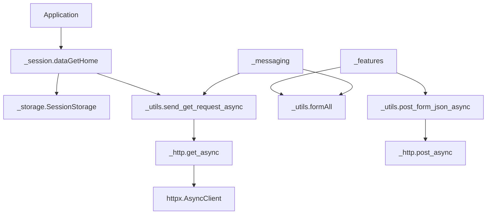

# `_core` - Tầng nền tảng async

> Session, HTTP transport, storage, login credential và utility dùng chung cho toàn bộ `fbchat-v2`.

[README chính](../../README.md) | [English](README_EN.md) | [Tài liệu API](../../DOCS.md)

## Mục lục

- [Vai trò](#vai-trò)
- [Cấu trúc thư mục](#cấu-trúc-thư-mục)
- [Public API](#public-api)
- [Hợp đồng `dataFB`](#hợp-đồng-datafb)
- [`_session.py`](#_sessionpy)
- [`_storage.py`](#_storagepy)
- [`_http.py`](#_httppy)
- [`_utils.py`](#_utilspy)
- [`_facebookLogin.py`](#_facebookloginpy)
- [Sơ đồ phụ thuộc](#sơ-đồ-phụ-thuộc)
- [Quy tắc phát triển](#quy-tắc-phát-triển)
- [Khắc phục sự cố](#khắc-phục-sự-cố)

---

## Vai trò

`_core` là nền móng của codebase:

- Tạo session Facebook từ cookie.
- Chuẩn hóa HTTP request bằng `httpx`.
- Build form GraphQL và request form thường.
- Parse cookie, JSON có prefix `for (;;);` và token HTML.
- Lưu cookie qua abstraction storage.
- Hỗ trợ credential login và 2FA.
- Sinh ID dùng cho Messenger request.

Feature trong `_features` và `_messaging` không nên tự dựng session, tự tắt TLS hoặc tạo một transport ad-hoc khác.

---

## Cấu trúc thư mục

```text
src/_core/
├── __init__.py          # Version và module exports
├── _http.py             # httpx Client/AsyncClient transport
├── _session.py          # Cookie -> dataFB
├── _storage.py          # SessionStorage implementations
├── _utils.py            # Facebook forms, parser, cookie và ID helper
├── _facebookLogin.py    # FB4A credential login và 2FA
├── _types.py            # Type dùng chung
├── README.md
└── README_EN.md
```

---

## Public API

`src/_core/__init__.py` công bố:

```python
__all__ = ["_session", "_utils", "_facebookLogin", "__version__"]
```

Storage và HTTP transport vẫn import trực tiếp từ module:

```python
from fbchat_v2._core._http import get_async, post_async
from fbchat_v2._core._session import dataGetHome
from fbchat_v2._core._storage import EnvSessionStorage, FileSessionStorage
```

Application code thường chỉ cần `dataGetHome`, storage và public feature. Helper cấp thấp phù hợp khi viết module mới hoặc integration đặc biệt.

---

## Hợp đồng `dataFB`

`dataFB` là dict session chung giữa ba tầng:

```python
{
    "fb_dtsg": "...",
    "fb_dtsg_ag": "...",
    "jazoest": "...",
    "hash": "...",
    "sessionID": "...",
    "FacebookID": "100012345678",
    "clientRevision": "...",
    "cookieFacebook": "c_user=...; xs=...; fr=...; datr=...;",
}
```

Field bắt buộc do `_session.REQUIRED_SESSION_FIELDS` quy định:

- `fb_dtsg`
- `jazoest`
- `sessionID`
- `FacebookID`
- `clientRevision`

`cookieFacebook` được thêm vào sau khi parse. Hầu hết feature HTTP và bridge đều cần nó.

> [!WARNING]
> Toàn bộ dict là secret. `fb_dtsg` và cookie có thể đủ để thực hiện action trên tài khoản. Không log, serialize ra analytics hoặc đưa vào exception public.

---

## `_session.py`

### `dataGetHome`

```python
async def dataGetHome(
    setCookies: str | None = None,
    storage: SessionStorage | None = None,
) -> dict[str, Any] | None:
    ...
```

Workflow:

1. Dùng `setCookies` nếu được truyền.
2. Nếu không, gọi `storage.load()`.
3. Parse cookie string thành cookie jar.
4. GET `https://www.facebook.com/` bằng transport async.
5. Gọi `raise_for_status()`.
6. Parse token cần thiết từ HTML.
7. Validate field và `FacebookID` dạng số.
8. Trả `dataFB` hoặc `None`.

Ví dụ:

```python
import asyncio

from fbchat_v2._core._session import dataGetHome


async def main() -> None:
    data_fb = await dataGetHome("c_user=...; xs=...; fr=...; datr=...;")
    if data_fb is None:
        raise RuntimeError("Session không hợp lệ.")
    print(data_fb["FacebookID"])


asyncio.run(main())
```

Hàm trả `None` cho cookie rỗng, request lỗi, HTTP status lỗi hoặc thiếu token. Nó không raise cho các lỗi session thông thường để caller có thể xử lý như một bước xác thực.

---

## `_storage.py`

### `SessionStorage`

Abstract interface:

```python
class SessionStorage(ABC):
    def load(self) -> str | None: ...
    def save(self, cookies: str) -> None: ...
    def clear(self) -> None: ...
```

### `FileSessionStorage`

```python
storage = FileSessionStorage("src/config.json", key="cookies")
storage.save("c_user=...; xs=...;")
cookie = storage.load()
storage.clear()
```

Đặc điểm:

- Giữ lại các key JSON khác khi update cookie.
- Trả `None` nếu file thiếu, JSON lỗi hoặc key không phải chuỗi hợp lệ.
- Reject cookie rỗng bằng `ValueError`.
- Ghi file tạm trong cùng thư mục rồi `os.replace()`.
- Đặt mode `0600` trên hệ Unix sau khi tạo file tạm.

Atomic write giảm nguy cơ file hỏng nhưng không phải encryption. Trên máy nhiều user, vẫn phải đặt ACL phù hợp.

### `EnvSessionStorage`

```python
storage = EnvSessionStorage("FB_COOKIES")
data_fb = await dataGetHome(storage=storage)
```

`save()` chỉ thay đổi environment của process hiện tại; nó không ghi vĩnh viễn vào system environment.

---

## `_http.py`

Transport dùng chung:

| Hàm | Loại client | Mục đích |
|---|---|---|
| `post_async` | `httpx.AsyncClient` | POST không block event loop |
| `get_async` | `httpx.AsyncClient` | GET không block event loop |
| `post_blocking` | `httpx.Client` | Compatibility boundary |
| `get_blocking` | `httpx.Client` | Compatibility boundary |

```python
request = {
    "url": "https://www.facebook.com/api/graphql/",
    "headers": {"Cookie": data_fb["cookieFacebook"]},
    "data": {"fb_dtsg": data_fb["fb_dtsg"]},
    "timeout": 30,
    "verify": True,
}

response = await post_async(request)
response.raise_for_status()
```

Transport:

- Copy kwargs trước khi normalize.
- Tách `url`, `verify`, `timeout` khỏi kwargs gửi cho method.
- Loại key `proxies` kiểu cũ của `requests`.
- Tạo client tạm nếu caller không inject client.
- Không tự tắt TLS.

Khi truyền client do caller sở hữu, config `verify` thuộc về client. Không kỳ vọng `verify` trong request dict có thể thay đổi một client đã tạo.

---

## `_utils.py`

### HTTP và JSON helper

| Hàm | Mô tả |
|---|---|
| `mainRequests(url, dataForm, setCookies)` | Tạo kwargs POST form chuẩn |
| `send_request_async(req_kwargs, client=None)` | Gửi POST và trả `httpx.Response` |
| `send_get_request_async(req_kwargs, client=None)` | Gửi GET và trả response |
| `post_form_json_async(...)` | POST form, `raise_for_status`, parse JSON |
| `parse_json_response(text, strip_for_loop_prefix=False)` | Parse JSON có optional prefix |

```python
from fbchat_v2._core._utils import formAll, post_form_json_async

form = formAll(
    data_fb,
    FBApiReqFriendlyName="ExampleQuery",
    docID="123456789",
)
payload = await post_form_json_async(
    "https://www.facebook.com/api/graphql/",
    form,
    data_fb["cookieFacebook"],
    strip_for_loop_prefix=True,
)
```

### Form builder

`formAll(dataFB, friendlyName, docID, requireGraphql=True)` thêm token session và metadata Facebook thường dùng. Với endpoint form không phải GraphQL, truyền `requireGraphql=False`.

Không mutate dict form dùng chung giữa nhiều coroutine. Tạo dict mới cho mỗi request.

### Cookie và parser

| Hàm | Mô tả |
|---|---|
| `parse_cookie_string(cookie_str)` | Chuyển chuỗi cookie thành dict |
| `dataSplit(...)` | Parse token từ HTML legacy |
| `clearHTML(text)` | Làm sạch một số HTML entity/markup |
| `formatResults(type, text)` | Kết quả success/error đơn giản |

### ID helper

| Hàm | Mục đích |
|---|---|
| `gen_threading_id()` | Offline/message threading ID |
| `generate_session_id()` | Session ID random |
| `generate_client_id()` | Client mutation/session ID |
| `str_base(number, base)` | Đổi số sang base tùy chọn |
| `digitToChar(digit)` | Ký tự cho digit base |

Các ID này chỉ phục vụ protocol client; không dùng làm security token hoặc unique database key.

---

## `_facebookLogin.py`

### API

```python
login = loginFacebook(
    username,
    password,
    AuthenticationGoogleCode=None,
    proxies=None,
)
result = await login.main()
```

`main()` bọc `main_blocking()` bằng worker thread. Luồng login bên dưới vẫn dùng FB4A form legacy và `requests`.

### 2FA

`AuthenticationGoogleCode` hỗ trợ:

- OTP trực tiếp 6 đến 8 chữ số.
- TOTP secret được tính local bằng `pyotp`.

Không gửi TOTP secret sang API ngoài. Nếu secret có khoảng trắng hoặc định dạng base32 sai, module trả lỗi thay vì log secret.

### Cấu hình

FB4A API key và app access token mặc định có sẵn trong module. Override tùy chọn:

```powershell
$env:FBCHAT_API_KEY = "<override>"
$env:FBCHAT_APP_ACCESS_TOKEN = "<override>"
```

Không hardcode override vào source. `proxies` là compatibility input cho flow login cũ; feature async dùng proxy config của `httpx.AsyncClient` thay vì dict `requests` này.

### Lỗi checkpoint

Credential login có thể gặp:

- Yêu cầu 2FA.
- Checkpoint xác nhận thiết bị.
- Error subcode mới.
- Response thiếu field hoặc code `-1`.

Đọc error description đã sanitize và ưu tiên cookie session khi endpoint login không còn ổn định. Không tuyên bố login live hoạt động chỉ dựa trên mocked test.

---

## Sơ đồ phụ thuộc



`_core` không import `_features` hoặc `_messaging`. Giữ dependency một chiều để tránh circular import.

---

## Quy tắc phát triển

- Public API có I/O mới phải async-first.
- HTTP async phải dùng `httpx.AsyncClient`, không bọc `requests` mới bằng `to_thread` nếu không có lý do protocol cụ thể.
- Chấp nhận `client=` khi workflow có thể tái sử dụng connection pool.
- Đặt timeout hữu hạn và gọi `raise_for_status()`.
- Tách build request, transport và parser để test riêng.
- Không mutate input dict hoặc state module global cho mỗi request.
- Không tắt TLS verification.
- Không log cookie, password, OTP, access token hoặc toàn bộ `dataFB`.
- Helper blocking phải có hậu tố `_blocking`; không tạo alias `_sync` hoặc `_async` dư thừa.

---

## Khắc phục sự cố

| Hiện tượng | Nguyên nhân thường gặp | Cách kiểm tra |
|---|---|---|
| `dataGetHome()` trả `None` | Cookie hết hạn hoặc token HTML đổi | Kiểm tra tên cookie và field thiếu, không log giá trị |
| HTTP 401/403 | Session hoặc token không hợp lệ | Làm mới cookie, kiểm tra checkpoint |
| HTTP timeout | Mạng, proxy hoặc endpoint chậm | Dùng timeout rõ ràng và retry có giới hạn ở application |
| JSON parse lỗi | Prefix hoặc schema đổi | Giữ excerpt đã sanitize, kiểm tra `for (;;);` |
| `coroutine was never awaited` | Gọi API async như sync | Thêm `await` hoặc `create_task` |
| Login code `-1` | Response không chuẩn hoặc transport lỗi | Đọc description, kiểm tra env override, thử cookie |
| File storage trả `None` | JSON lỗi hoặc key sai | Validate file UTF-8 và key `cookies` |

Chẩn đoán session phải dừng ở metadata an toàn. Đừng sửa lỗi bằng cách in cả cookie ra terminal, kiểu đó không debug mà là tự leak tài khoản.
