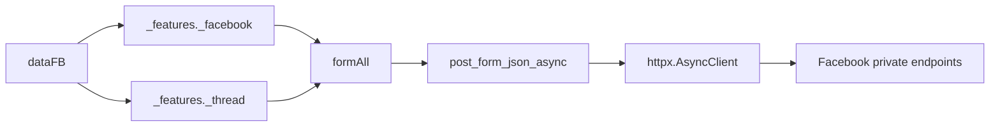

# `_features` - Async Facebook feature layer

> Facebook account actions and thread administration built on `_core`'s `dataFB` contract and `httpx` transport.

[Main README](../../README_EN.md) | [Tiếng Việt](README.md) | [API guide](../../DOCS.md)

## Contents

- [Responsibilities](#responsibilities)
- [Directory layout](#directory-layout)
- [Public API](#public-api)
- [Async call contract](#async-call-contract)
- [Facebook features](#facebook-features)
- [Thread features](#thread-features)
- [Reusing an HTTP client](#reusing-an-http-client)
- [Results and errors](#results-and-errors)
- [Dependency map](#dependency-map)
- [Adding a feature](#adding-a-feature)
- [Troubleshooting](#troubleshooting)

---

## Responsibilities

`_features` contains business operations beyond basic send and receive:

- Update profiles and bios.
- Create timeline posts.
- Search users and fetch profile information.
- Block or unblock users and read notifications.
- Manage Professional mode, additional profiles, and Marketplace items.
- Fetch inbox and thread metadata.
- Change group names, emojis, nicknames, and administrators.

The layer receives `dataFB` from `_core._session.dataGetHome()`. It does not read cookies from application configuration or own the bot lifecycle.

---

## Directory layout

```text
src/_features/
├── _facebook/
│   ├── _blocking.py             # Block/unblock a user
│   ├── _changeBio.py            # Update bio
│   ├── _createPost.py           # Create a timeline post
│   ├── _get_user_info.py        # Profile information
│   ├── _marketplace.py          # Marketplace create/read
│   ├── _notification.py         # Notifications
│   ├── _professional.py         # Professional mode
│   ├── _registerOnProfile.py    # Additional profile
│   └── _search.py               # User search
├── _thread/
│   ├── _addAdmin.py
│   ├── _all_thread_data.py
│   ├── _changeEmoji.py
│   ├── _changeNameThread.py
│   └── _changeNickname.py
├── README.md
└── README_EN.md
```

---

## Public API

`_features._facebook.__all__`:

```python
[
    "_changeBio",
    "_createPost",
    "_professional",
    "_search",
    "_blocking",
    "_registerOnProfile",
    "_notification",
    "_marketplace",
    "_get_user_info",
]
```

`_features._thread.__all__`:

```python
[
    "_changeNickname",
    "_addAdmin",
    "_changeEmoji",
    "_changeNameThread",
    "_all_thread_data",
]
```

Import modules to keep the common `func` name unambiguous:

```python
from fbchat_v2._features._facebook import _search
from fbchat_v2._features._thread import _changeEmoji

users = await _search.func(data_fb, "Minh")
changed = await _changeEmoji.func(data_fb, "thread-id", "🔥")
```

---

## Async call contract

Every network feature in this directory is a coroutine. Signatures generally follow:

```python
async def func(
    dataFB: dict[str, Any],
    feature_value: str,
    *,
    client: httpx.AsyncClient | None = None,
) -> dict[str, Any]:
    ...
```

Rules:

- Always use `await`.
- Pass `client=` by keyword.
- The caller closes a caller-created client.
- Invalid input may raise `ValueError` or `NotImplementedError` before I/O.
- HTTP and parser failures are normally converted into `{"error": 1, ...}` at the feature boundary.

---

## Facebook features

### `_changeBio.py`

```python
result = await _changeBio.func(
    data_fb,
    "Building an async bot",
    uploadPost=False,
    client=client,
)
```

| Parameter | Meaning |
|---|---|
| `newContents` | New bio text |
| `uploadPost` | Whether to request sharing the update |

Success returns `{"success": 1, "messages": "..."}`. GraphQL or transport failures return an error dictionary.

### `_createPost.py`

```python
result = await _createPost.func(
    data_fb,
    "A post from fbchat-v2",
    client=client,
)
```

Empty text is rejected. `attachmentID` remains in the signature for planned support, but the Composer attachment schema is not stable. Passing it raises `NotImplementedError` rather than silently creating a text-only post.

```python
{
    "success": 1,
    "messages": "Tạo bài viết thành công!",
    "urlPost": "https://www.facebook.com/...",
}
```

### `_professional.py`

```python
enabled = await _professional.func(data_fb, True, client=client)
disabled = await _professional.func(data_fb, "off", client=client)
```

`statusBusiness` accepts booleans and normalized strings such as `on`, `off`, `bật`, and `tắt`. Other values raise `ValueError`.

### `_search.py`

```python
result = await _search.func(data_fb, "m008v", client=client)
```

```python
{
    "success": 1,
    "searchResults": "Tìm kiếm Facebook: ...",
    "searchResultsDict": [
        {"name": "...", "id": "...", "url": "..."},
    ],
}
```

The parser deduplicates by ID and returns at most five users. An empty keyword raises `ValueError`.

### `_blocking.py`

```python
blocked = await _blocking.func(
    data_fb,
    "100012345678",
    "block",
    client=client,
)
unblocked = await _blocking.func(
    data_fb,
    "100012345678",
    "unblock",
    client=client,
)
```

`choiceInteract` accepts only `block` or `unblock`; it does not rely on ambiguous truthy values.

### `_registerOnProfile.py`

```python
result = await _registerOnProfile.func(
    data_fb,
    newName="Additional profile",
    newUsername="new-username",
    client=client,
)
```

Availability depends on account eligibility and Facebook rollouts. Always inspect `result.get("error")` even when the HTTP status is 200.

### `_notification.py`

```python
result = await _notification.func(data_fb, client=client)
items = result.get("NotificationResults", [])
for item in items[:5]:
    print(item)
```

The result is a dictionary, not a list. Slicing `result[:2]` raises an error involving `slice(None, 2, None)`.

### `_get_user_info.py`

```python
profile = await _get_user_info.func(
    data_fb,
    "100012345678",
    client=client,
)
```

Possible result fields:

```python
{
    "idUser": "...",
    "nameUser": "...",
    "firstName": "...",
    "Username": "...",
    "thumbSrc": "...",
    "urlProfile": "...",
    "genderUser": "Male (Nam)",
    "alternateName": None,
    "chatWithUSerIsNonFriend": False,
}
```

A missing profile produces an error dictionary rather than an unchecked `profiles[userID]` lookup.

### `_marketplace.py`

Create an item:

```python
result = await _marketplace.createItem(
    data_fb,
    nameItem="Mechanical keyboard",
    brandItem="Custom",
    priceItem=1200000,
    currencyItem="VND",
    decriptionItem="Good condition",
    hashtagList=["keyboard", "mechanical"],
    typeItem="ELECTRONICS",
    photoIDList=["photo-id"],
    locationSeller={"latitude": 10.776, "longitude": 106.700},
    client=client,
)
```

Read an item:

```python
details = await _marketplace.getInformationProductItemMarketPlace(
    data_fb,
    "product-id",
    client=client,
)
```

Pre-request validation includes a non-empty name, at least one photo, numeric non-negative price, valid coordinates, and a supported item category.

---

## Thread features

### `_all_thread_data.py`

```python
threads = await _all_thread_data.func(data_fb, client=client)
```

```python
{
    "dataGet": "{...}",
    "ProcessingTime": 0.42,
    "last_seq_id": "...",
    "dataAllThread": {
        "threadIDList": ["..."],
        "threadNameList": ["..."],
        "countThread": 1,
    },
}
```

`dataGet` is the serialized parsed GraphQL batch. Do not index the result with `result[0]`; it is a dictionary with named fields.

Parse a loaded thread:

```python
info = await _all_thread_data.features(
    threads["dataGet"],
    "thread-id",
    "threadInfomation",
)
```

Supported `commandUse` values:

| Command | Result |
|---|---|
| `getAdmin` | `adminThreadList` |
| `threadInfomation` | Name, emoji, counts, approval, and join link |
| `exportMemberListToJson` | JSON-formatted member records |

The legacy spelling `threadInfomation` is preserved for compatibility. Unsupported commands return an error dictionary.

### Thread mutations

```python
renamed = await _changeNameThread.func(
    data_fb,
    "thread-id",
    "New group name",
    client=client,
)

emoji = await _changeEmoji.func(
    data_fb,
    "thread-id",
    "🔥",
    client=client,
)

nickname = await _changeNickname.func(
    data_fb,
    "thread-id",
    "user-id",
    "Nickname",
    client=client,
)

added = await _addAdmin.func(
    data_fb,
    "thread-id",
    "user-id",
    statusChoice=True,
    client=client,
)
removed = await _addAdmin.func(
    data_fb,
    "thread-id",
    "user-id",
    statusChoice=False,
    client=client,
)
```

Empty names and emojis are rejected before I/O. `statusChoice=False` performs a real administrator removal. The current account must have permission and the target must belong to a valid group.

---

## Reusing an HTTP client

Use one client for a multi-request workflow:

```python
import asyncio
import httpx

from fbchat_v2._features._facebook import _notification, _search
from fbchat_v2._features._thread import _all_thread_data

async with httpx.AsyncClient(
    timeout=httpx.Timeout(30, connect=10),
) as client:
    notifications, users, threads = await asyncio.gather(
        _notification.func(data_fb, client=client),
        _search.func(data_fb, "Minh", client=client),
        _all_thread_data.func(data_fb, client=client),
    )
```

Run only independent actions concurrently. Do not gather mutations whose order matters.

---

## Results and errors

Legacy modules do not yet share one result model. Common shapes:

```python
{"success": 1, "messages": "..."}
{"error": 1, "messages": "..."}
```

Read features use domain-specific keys. Defensive caller example:

```python
result = await _search.func(data_fb, query)
if not isinstance(result, dict):
    raise TypeError("The feature did not return a dictionary.")
if result.get("error"):
    logger.warning("Search failed: %s", result.get("messages"))
else:
    users = result.get("searchResultsDict", [])
```

HTTP 200 is not sufficient. Facebook frequently embeds errors in GraphQL `errors`, nested payloads, or null fields.

---

## Dependency map



`_features` depends on `_core`; `_core` never imports `_features` back.

---

## Adding a feature

1. Validate input before I/O.
2. Separate `_build_request`, transport, and `_parse_response`.
3. Expose an async-first function using the module naming convention.
4. Accept keyword-only `client: httpx.AsyncClient | None = None`.
5. Reuse `_core` helpers instead of creating another transport.
6. Use finite timeouts and TLS verification.
7. Do not report success when `data` is missing or `errors` exists.
8. Do not silently ignore unsupported arguments.
9. Test empty input, missing fields, GraphQL errors, and success.
10. Update Vietnamese, English, and `DOCS.md` documentation.

---

## Troubleshooting

| Symptom | Cause | Fix |
|---|---|---|
| `slice(None, 2, None)` in notifications | A dictionary was sliced like a list | Read `NotificationResults` first |
| `All Thread Data: 0` | A response dictionary was indexed numerically | Use `dataAllThread` or `dataGet` |
| Missing GraphQL batch object `o0` | Schema changed or the batch returned an error | Inspect a sanitized error payload |
| Empty search result | No match or rendering strategy changed | Check `error`, not just list length |
| Post attachment failure | Composer attachment schema is unsupported | Omit `attachmentID` or implement and test the schema |
| Professional mode `ValueError` | Invalid state | Pass bool, `on/off`, or `bật/tắt` |
| Slow repeated HTTP calls | Every call creates a temporary client | Inject one reusable `httpx.AsyncClient` |
| HTTP 200 but action failed | Error is embedded in JSON | Validate `error`, `errors`, and required fields |

Do not fix a parser with `except Exception: return {}`. That only converts an actionable failure into silent garbage that is harder to debug.
